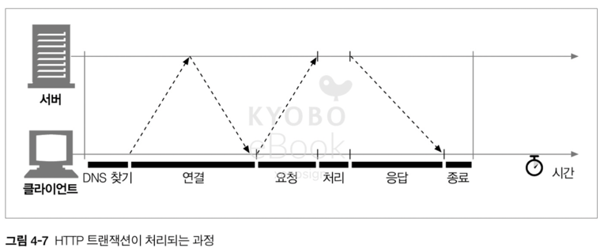

# 04. 커넥션 관리

- HTTP 는 어떻게 TCP 커넥션을 사용하는가
- TCP 커넥션의 지연, 병목, 막힘
- 병렬 커넥션, keep-alive 커넥션, 커넥션 파이프 라인을 활용한 HTTP 의 최적화
- 커넥션 관리를 위해 따라야 할 규칙들

## 4.1 TCP 커넥션

- HTTP 통신은 패킷 교환 네트워크 프로토콜들의 계층화 집합인 TCP/IP 를 통해 이루어 진다
- TCP/IP 커넥션이 수립되면 메시지들은 손실 혹은 손상되거나 순서가 바뀌지 않고 안전하게 전달

#### 커넥션 흐름 정리

1. 브라우저가 특정 호스트 명을 호출
2. 브라우저가 해당 호스트 명에 대한 IP 주소를 찾는다
3. 브라우저가 포트 번호(80)를 얻는다
4. 브라우저가 찾은 IP 주소와 포트 번호를 바탕으로 TCP 커넥션을 생성
5. TCP 커넥션 위에서 HTTP 통신을 수행

### 4.1.1 신뢰할 수 있는 데이터 전송 통로인 TCP

- HTTP 커넥션은 몇몇 규칙을 제외하고 TCP 커넥션에 불과, HTTP 의 신뢰성은 TCP 의 신뢰성에 기반

### 4.1.2 TCP 스트림은 세그먼트로 나뉘어 IP 패킷을 통해 전송된다

- TCP 는 IP 패킷(or 데이터그램)이라 불리는 작은 조각으로 데이터를 전송
- HTTP 가 메시지를 전송하고자 할 때, TCP 커넥션을 통해 메시지의 데이터를 순서대로 전달
- TCP 는 세그먼트 단위로 데이터 스트림을 자르고 세그먼트를 IP 패킷이라는 봉투에 담에서 전달

#### IP 패킷의 구성 요소
- IP 패킷 헤더 (보통 20 Byte) : IP 주소, 크기, 기타 플래그
- TCP 세그먼트 헤더 (보통 20 Byte) : TCP 포트 번호(8 Byte), TCP 제어 플래그(2 Byte), 데이터 순서 및 무결성을 위한 검사 데이터(6 Byte), 기타(4 Byte) 
- TCP 데이터 조각 (0 ~ 65,535 Byte)

### 4.1.3 TCP 커넥션 유지하기

- 컴퓨터는 항상 여러 TCP 커넥션을 포트 번호를 통해서 유지
- TCP 커넥션은 `<발신지 IP 주소, 발신지 포트, 수신지 IP 주소, 수신지 포트>` 로 식별

| 커넥션 |  발신지 IP 주소  | 발신지 포트 |   목적지 IP 주소    | 목적지 포트  |
|:----|:-----------:|:------:|:--------------:|:-------:|
| A   | 209.1.32.34 |  2034  | 204.62.128.58  |  4133   |

### 4.1.4 TCP 소켓 프로그래밍

- 소켓 API 를 통해 TCP 종단의 데이터 구조를 생성 및 데이터 구조를 연결하여 직접 데이터 스트림을 읽고 쓸 수 있다
- 보통 소켓 API 는 저 수준의 OS 인터페이스로서 HTTP 프로그래머로는 언어에서 제공하는 고수준 API 를 사용, 따라서 TCP 와 IP 의 세부사항을 숨기는 역할을 제공
- `ex) 우리는 fetch 를 쓰지만 실제적으로 해당 기능의 내부에는 소켓 API 가 사용`

## 4.2 TCP 의 성능에 대한 고려

- HTTP 의 트랜잭션은 TCP 위에 성립 되므로, TCP 의 성능에 영향을 받음

### 4.2.1 HTTP 트랙잭션 지연

- 트랜잭션을 지연 시키는 원인들
  - 방문한 적 없는 URI 접근 시, DNS 에서 IP 주소를 알아내는데 걸리는 시간
  - HTTP 트랜잭션에서 매번 발생하는 TCP 커넥션 요청을 보내고 응답을 회신하는 커넥션 설정 시간
  - 요청 메시지가 물리적 네트워크를 통해 전달되는 시간
  - 서버에서 응답을 처리하는 시간

### 4.2.2 성능 관련 중요 요소

- TCP 커넥션의 핸드셰이크 설정
- 인터넷 혼잡을 제어하기 위한 TCP 의 느린 시작(slow-start)
- 데이터를 한데 모아 한 번에 전송하기 위한 네이글(nagle) 알고리즘
- TCP 의 편승(piggyback) 확인 응답(acknowledgment)을 위한 확인 응답 지연 알고리즘
- TIME_WAIT 지연과 포트 고갈

