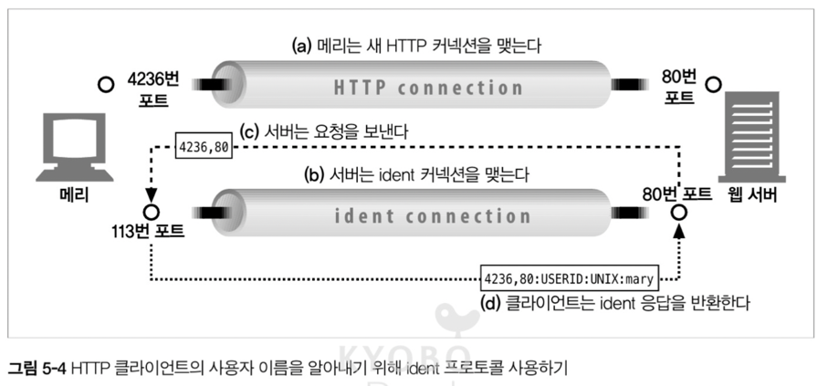
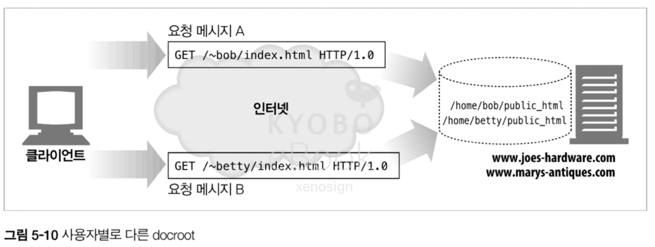

# 05. 웹 서버

- 여러 종류의 소프트웨어 및 하드웨어 웹 서버에 대해 조사한다
- HTTP 통신을 진단해주는 간단한 웹 서버를 펄(Perl)로 작성해본다
- 어떻게 웹 서버가 HTTP 트랜잭션을 처리하는지 단꼐별로 설명한다

## 5.1 다채로운 웹 서버

- 웹 서버는 HTTP 요청을 처리하고 응답을 제공

### 5.1.1 웹 서버 구현

- 웹 서버는 HTTP 프로토콜을 구현하고, 웹 리소스를 관리하고, 웹 서버의 관리 기능을 제공
- 웹 서버는 TCP 커넥션 관리에 대한 책임을 운영체제와 나눠 가진다

### 5.1.2 다목적 소프트웨어 웹 서버

### 5.1.3 임베디드 웹 서버

- 소비자용 제품에 내장 될 목적으로 만들어진 작은 웹 서버

## 5.2 간단한 Perl 웹 서버

- 간단한 type-o-serve 유틸리티는 간단한 형태로 서버 응답 메시지를 생성 할 수 있도록 한다

*perl 코드*
```perl
#!/user/bin/perl

use Socket;
use Carp;
use FileHandle;

# 8080 포트가 기본
$port = (@ARGV ? $ARGV[0] : 8080)

# 로컬 TCP 소켓을 생성하고 커넥션을 대기(listen)
$proto = getprotobyname('tcp')
socket(S, PF_INET, SOCK_STREAM, $proto) || die;
setsockopt(S, SOL_SOCKET, SO_REUSEADDR, pack("l", 1)) || die;
bind(S, sockaddr_in($port, INADDR_ANY)) || die;
listen(S, SOMAXCONN) || die;

# 시작 메시지 출력
printf("    <<<Type-O-Serve Accepting on Port %d>>>\n\n", $port);

while (1)
{
    # 커넥션 대기
    $cport_caddr = accept(C, S);
    ($cport, $caddr) = sockaddr_in($cport_caddr);
    C -> autoflush(1);
    
    # 커넥션 출처 출력
    $cname = gethostbyaddr($caddr, AF_INET);
    printf("    <<<Request From '%s'>>>\n" $cname);
    
    # 빈 줄이 나올 때까지 요청 메시지를 읽어서 출력
    while ($line = <C>)
    {
        print $line;
        if ($line =~ /^\r/) { last; }
    }
    
    # 응답 메시지를 위한 프롬프트를 만들고, '.' 하나만 있는 응답이 입력 될 때 까지 응답 줄 입력 받기
    printf("    <<<Type Response Followed by '.'>>>\n");
    
    while ($line = <STDIN>)
    {
        $line =~ s/\r//;
        $line =~ s/\n//;
        if ($line =~ /^\./) { last; }
        print C $line . "\r\n";
    }
    close(C);
}
```

*js 코드*
```javascript
const net = require('net');
const readline = require('readline');

// 8080 포트가 기본
const port = process.argv[2] ? parseInt(process.argv[2]) : 8080;

// TCP 서버 생성
const server = net.createServer((socket) => {
    // 커넥션 출처 출력
    const clientAddress = socket.remoteAddress;
    const clientPort = socket.remotePort;
    console.log(`    <<<Request From '${clientAddress}:${clientPort}'>>>\n`);

    let requestData = '';

    // 클라이언트로부터 데이터 수신
    socket.on('data', (data) => {
        const lines = data.toString().split('\n');

        for (let line of lines) {
            console.log(line);
            requestData += line + '\n';

            // 빈 줄이 나오면 요청 종료
            if (line.match(/^\r?$/)) {
                handleResponse(socket);
                break;
            }
        }
    });

    socket.on('error', (err) => {
        console.error('Socket error:', err);
    });
});

// 응답 처리 함수
function handleResponse(socket) {
    console.log("    <<<Type Response Followed by '.'>>>");

    const rl = readline.createInterface({
        input: process.stdin,
        output: process.stdout
    });

    rl.on('line', (line) => {
        // '.'만 입력되면 종료
        if (line.trim() === '.') {
            rl.close();
            socket.end();
            return;
        }

        // 응답을 클라이언트에게 전송
        socket.write(line + '\r\n');
    });

    rl.on('close', () => {
        socket.end();
    });
}

// 서버 시작
server.listen(port, () => {
    console.log(`    <<<Type-O-Serve Accepting on Port ${port}>>>\n`);
});

server.on('error', (err) => {
    console.error('Server error:', err);
    process.exit(1);
});
```


- 실행 명렁어 `ex) type-o-serve.pl 8080` 로 8080 번 포트에서 type-o-serve 서버가 시작
- type-o-serve 서버는 브라우저에서 HTTP 요청 메세지를 받고 그 내용을 화면의 출력한 뒤, 관리자가 "." 마침표 하나로 끝나는 간단한 응답 메세지를 입력할 때 까지 대기
- 관리자의 응답 메시지를 브라우저에 돌려주고, 브라우저는 응답 메세지의 본문을 화면에 출력

## 5.3 진짜 웹 서버가 하는 일

1. 커넥션을 맺는다 - 클라이언트의 접속을 받거나 원치 않으면 닫는다
2. 요청을 받는다 - HTTP 요청 메시지를 읽어 들인다
3. 요청을 처리한다 - 요청 메시지를 해석하고 행동 한다
4. 리소스에 접근한다 - 메시지에서 지정한 리소스에 접근
5. 응답을 만든다 - 올바른 헤더를 포함한 HTTP 응답 메시지를 생성
6. 응답을 보낸다 - 응답을 클라이언트로 전송
7. 트랜잭션 로그를 남긴다 - 로그에 트랜잭션 완료에 대한 기록을 남긴다

## 5.4 단계 1: 클라이언트 커넥션 수락

### 5.4.1 새 커넥션 다루기

- 클라이언트가 웹 서버에 TCP 커넥션을 요청하면 TCP 커넥션의 IP 패킷에서 IP 주소를 추출하여 클라이언트를 확인
- 커넥션이 맺어지면 서버는 커넥션 목록에 추가하고 준비를 마친다
- 서버는 마음대로 커넥션을 거절하거나 닫을 수 있다

### 5.4.3 ident 를 통해 클라이언트 사용자 알아내기

- 몇몇 웹 서버는 IETF ident 프로토콜을 지원, ident 프로토콜은 서버에 어떤 사용자 이름이 HTTP 커넥션을 초기화 했는지 찾을 수 있게 해준다
- 클라이언트가 ident 프로토콜을 지원하면 113번 포트를 listen 한 후, 서버는 해당 포트를 통해 사용자 이름을 붇는 간단한 요청을 보낸다
- 해당 정보는 서버 로깅에 유용하기 때문에 일반 로그 포맷의 2번째 필드는 HTTP 요청의 ident 사용자 이름을 담는다



#### ident 프로토콜이 공공 인터넷에서는 잘 쓰이지 않는 이유
- 많은 클라이언트가 identd 신원 확인 프로토콜 데몬을 실행 X
- ident 프로토콜을 HTTP 트랜잭션을 유의미하게 지연
- ident 프로토콜은 안전하지 않고 조작이 쉬우며, 클라이언트 사용자 이름의 노출의 가능성이 높다 방화벽이 막는 경우가 많다
- 가상 IP 주소를 잘 지원하지 않는다

## 5.5 단계 2: 요청 메시지 수신

- 요청 메시지가 들어 왔을 때 웹 서버가 하는 일의 순서
  - 요청 줄을 파싱하여 요청 메서드, 리소스 식별자(URL), 버전 번호를 찾는다
  - 메시지 헤더들을 읽는다
  - 요청 본문이 있다면 읽어 들인다
- 웹 서버는 입력 데이터를 네트워크로 부터 불규칙하게 받으므로 데이터를 일부분 메모리에 임시로 저장할 필요가 있다

### 5.5.1 메시지의 내부 표현

- 몇몇 웹 서버는 요청 메시지를 쉽게 다룰 수 있도록 내부의 자료 구조에 저장
- 자료 구조는 요청 메세지의 각 조각에 대한 포인터 또는 길이를 담고, 헤더는 룩업 테이블에 저장되어 빠른 접근을 가능하게 한다

### 5.5.2 커넥션 입력/출력 처리 아키텍쳐


#### 단일 스레드 웹 서버
- 한 번에 하나씩 요청을 처리, 구현은 간단하지만 심각한 성능 문제를 야기하므로 간단한 형태에만 사용

#### 멀티프로세스와 멀티스레드 웹 서버
- 여러 요청을 동시에 처리하기 위해 여러개의 프로세스 혹은 스레드를 할당. 다만 동시 커넥션이 너무 많아지면 메모리 및 리소스 과부하가 걸리므로 최대 개수에 제한을 둔다

#### 다중 I/O 서버
- 대량 커넥션을 처리하기 위해 다중 아키텍쳐를 사용하며, 하나의 프로세스 또는 스레드가 여러 개의 커넥션의 활동 상태를 감시하고 해당 상황에 맞는 작은 양의 처리를 수행

#### 다중, 멀티스레드 I/O 아키텍쳐
- 여러 CPU 를 기반으로 멀티스레딩와 다중 I/O 의 개념을 결합

## 5.6 단계 3: 요청 처리

- 웹 서버는 요청을 받으면 요청으로 부터 메서드, 리소스, 레더, 본문을 확인하여 처리

## 5.7 단계 4: 리소스의 매핑과 접근

- 웹 서버는 리소스 서버로, 미리 만들어진 컨텐츠(HTML, JPEG 등등) 및 서버 위에 동작하는 동적 컨텐츠도 제공

### 5.7.1 Docroot

- 가장 단순한 리소스 매핑은 웹 서버 내부의 파일 이름을 사용하는 것이므로, 서버는 파일 시스템의 특별할 폴더를 웹 컨텐츠를 위해 예약하여 이를 Docroot 로 부른다
- 단, 상대적인 url 이 docroot 를 벗어나서 파일 시스템 이외의 부분이 노출되는 일은 주의 해야 한다

#### 가상 호스팅 된 docroot
- 가상 호스팅 웹 서버는 하나의 웹 서버에서 여러 개의 웹 사이트를 호스팅
- 따라서, 각기 웹 사이트에 맞는 분리된 docroot 설정이 필요

#### 사용자 홈 디렉터리 docroots
- 한 대의 웹 서버에서 여러명의 사용자에게 웹 사이트를 만들 수 있도록 해주는 것
- 보통 빗금 `/`과 물결표 `~` 다음에 사용자 이름이오는 것으로 시작하는 URI 는 개인 문서 루트를 가르킨다



### 5.7.2 디렉터리 목록
