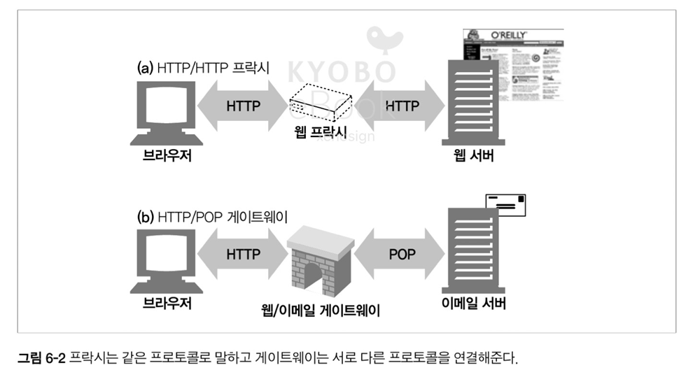
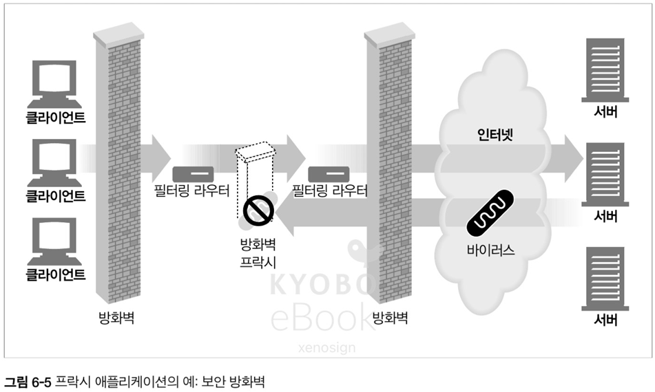
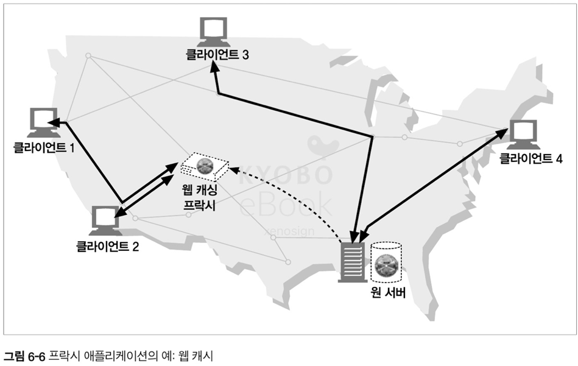
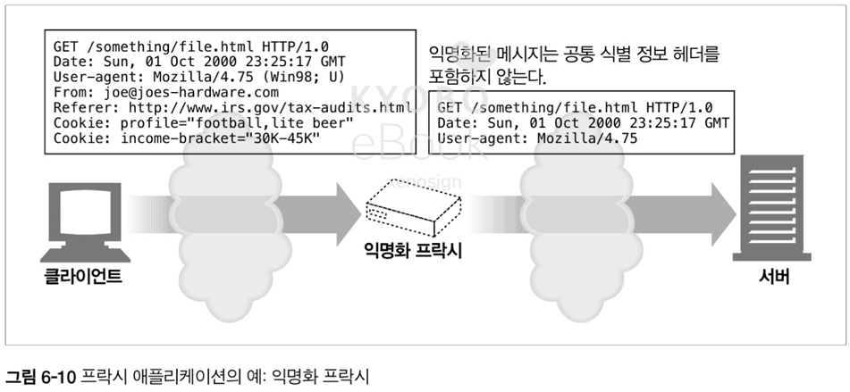
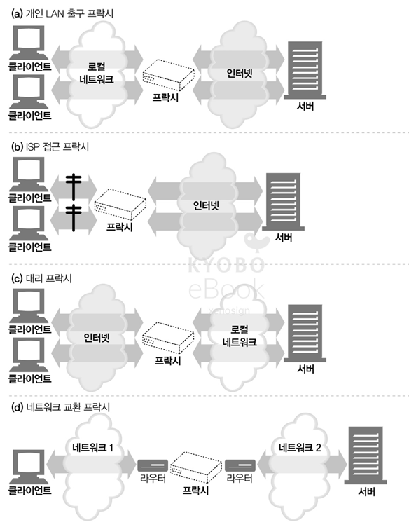
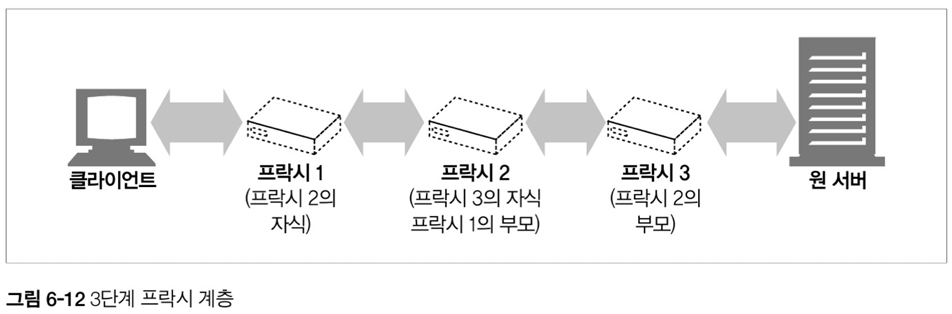
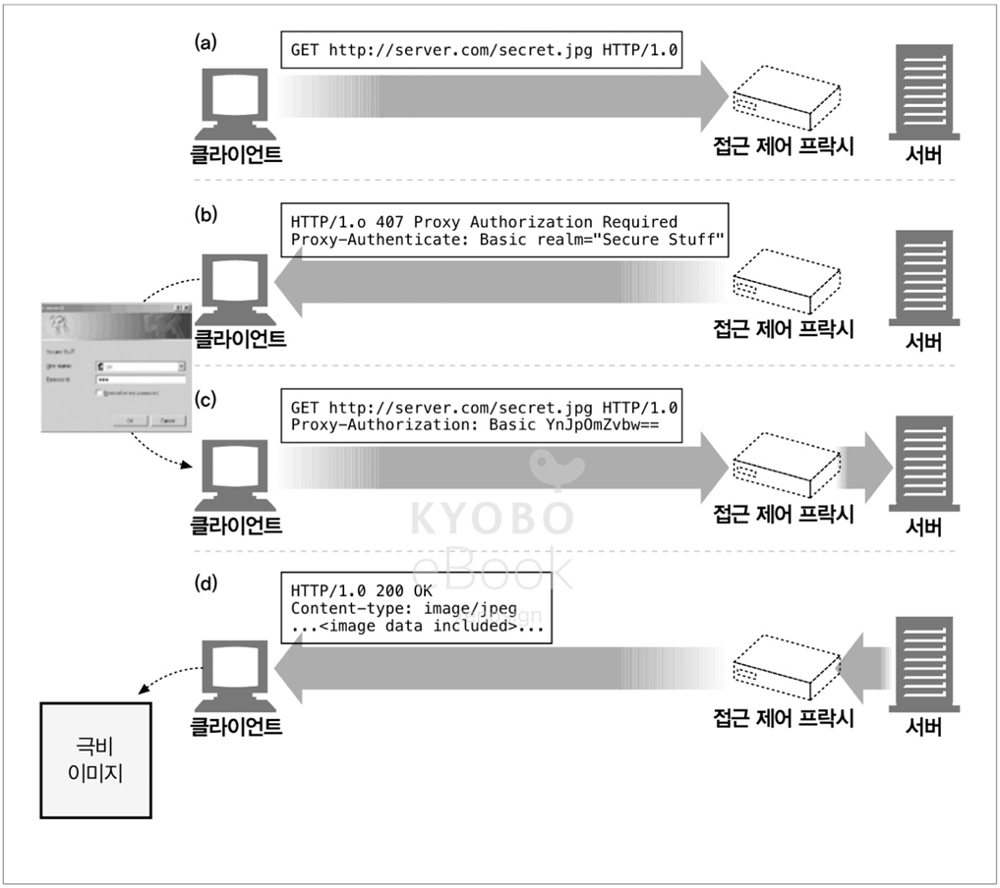

# 06. 프락시

- HTTP 프락시와 웹 게이트웨이를 비교하고 HTTP 프락시가 어떻게 배치 되는지
- 몇 가지 유용한 활용 방법
- 프락시가 실제 네트워크에 어떻게 배치되어 있는지 그리고 트래픽이 어떻게 프락시 서버로 가는지
- 브라우저에게 프락시를 사용하려면 어떻게 설정해야 하는지
- HTTP 프락시 요청이 서버 요청과 어떻게 다른지, 그리고 프락시가 어떻게 브라우저의 동작을 미묘하게 바꾸는지
- 일련의 프락시 서버들을 통과하는 메시지의 경로를 Via 헤더와 TRACE 메서드를 이용해 기록하는 방법
- 프락시에 기반한 HTTP 접근 제어 설명
- 어떻게 프락시가 클라이언트와 서버 사이에서 각각의 다른 기능과 버전들을 지원하면서 상호 작용 하는지

## 6.1 웹 중계자

- 웹 프락시 서버는 클라이언트의 입장에서 트랜잭션을 수행하는 중개인
- 프락시가 없다면 클라이언트는 서버와 직접 이야기하지만, 있다면 클라이언트는 자신의 입장에서 서버와 대화해주는 프락시와 이야기 한다
- 프랜잭션을 완료하는 것은 결국 클라이언트지만, 프락시 서버가 제공하는 좋은 서비스 이용이 가능
- 프락시는 서버이면서 동시에 클라이언트의 입장을 가진다


### 6.1.1 개인 프락시와 공유 프락시

#### 공용 프락시
- 대부분의 크락시는 공용이며 공유된 프락시이며, 여러 사용자가 공통된 요청에서 이득을 취할 수 있기 때문에 사용자가 많을 수록 유리하다

#### 개인 프락시
- 주로 클라이언트 컴퓨터에서 직접 실행되는 형태로 사용되며, ISP(Internet Service Provider) 서비스 등을 위해서 사용 된다

### 6.1.2 프락시 vs 게이트웨이

- 프락시는 같은 프로토콜을 사용하는 어플리케이션을 연결, 게이트웨이는 서로 다른 프로토콜을 연결



## 6.2 왜 프락시를 사용하는가?

- 프락시 서버는 보안 개선 / 성능 개선 / 비용 절약 등의 유용한 일을 한다
- 프락시 서버는 모든 HTTP 트래픽에 관여할 수 있기 때문에 부가적인 가치를 주는 여러 유용한 웹 서비스를 구현 가능

#### 어린이 필터
- 어린이들에게 성인 컨텐츠를 차단하는 필터링 프락시


#### 문서 접근 제어자
- 웹 서버와 리소스에 대한 접근 제어를 중앙 프락시 서버를 통해 구현


#### 보안 방화벽
- 프락시 서버가 조직 안에 들어오거나 나가는 응용 레벨 프로토콜의 흐름을 프락시 서버를 통해 한 지점에서 통제 가능



> 프락시를 통한 방화벽 개념과 서브넷을 활용한 물리적 분리 비교

> | 구분        | 프록시 서버를 통한 보안                       | 퍼블릭/프라이빗 서브넷 전략 (VPC)            |
> |:----------|:------------------------------------|:---------------------------------|
> | 주요 보호 계층  | 애플리케이션 계층 (L7)                      | 네트워크 계층 (L3/L4)                  |
> | 작동 위치     | 클라이언트와 서버 사이의 중개자                   | 클라우드 내 논리적 네트워크 경계               |
> | 보안 목표     | HTTP/HTTPS 요청 콘텐츠 검사 및 필터링, 익명성 제공  | 민감 자원(DB)의 인터넷 노출 원천 차단 및 격리     |
> | 주요 위협 대응  | 웹 애플리케이션 공격 (SQL 인젝션, XSS, 봇 트래픽)   | 무단 IP 접근, 포트 스캐닝, 인프라 침투         |
> | 보호 대상     | 요청/응답 데이터의 내용                       | 내부 서버의 IP 주소와 존재 자체              |
> | 예시 컴포넌트   | 리버스 프록시 (Nginx), WAF (웹 방화벽)        | VPC, 보안 그룹, 라우팅 테이블, NAT 게이트웨이   |

#### 웹 캐시
- 프락시 캐시는 인기 있는 문서의 로컬 사본을 관리하고, 해당 문서에 대한 요청을 빠르게 제공



> 웹 캐시와 CDN 의 차

> | 구분         | 웹 캐시 프록시 (Web Cache Proxy)          | CDN (Content Delivery Network)  |
> |:-----------|:------------------------------------|:--------------------------------|
> | **설치 목적**  | **네트워크 대역폭 절약** 및 내부망 접근 속도 개선      | 최종 사용자에게 **지연 시간(Latency) 최소화** |
> | **주요 사용자** | **내부 네트워크**의 클라이언트 그룹 (회사, ISP 가입자) | 전 세계 모든 **최종 사용자**              |
> | **위치/제어**  | 클라이언트 측 (사용 조직/ISP가 제어)             | 서버 측 (콘텐츠 제공자가 제어)              |
> | **캐시 방향**  | **Outbound** (외부 리소스를 내부망으로 당겨옴)    | **Inbound** (콘텐츠를 사용자에게 제공)     |
> | **분산 정도**  | 보통 **단일 지점** 또는 지역적                 | 전 세계 **수많은 엣지 서버(POP)**에 분산     |
> | **트래픽 절감** | 외부망으로 나가는 트래픽 비용 절감                 | 원본 서버(Origin)의 부하 절감            |

#### 대리 프락시(Surrogate)
- 웹 서버인 것 처럼 위장하는 기능을 통해 리버스 프락시라고 불리우며, 실제 웹 서버 요청을 받지만 요청 받은 컨텐츠의 처리는 다른 서버와 커뮤니케이션을 통해 처리 한다

> 포워드 프락시 vs 리버스 프록시 <br>
> - 포워드 프록시 : 클라이언트(사용자)를 대신하여 외부에 요청. 내부망의 노출을 막고, 특정 사이트의에 대한 접근 제어, 캐싱을 통해 성능 개선 등을 목적
> - 리버스 프록시 : 서버를 대신하여 클라이언트의 요청을 받음. 보안, 로드 밸런싱, 캐싱 등 서버 보호와 성능 최적화 목적 사용

```shell
# Upstream (백엔드 서버 그룹 정의)
upstream backend_servers {    
    # 로드 밸런싱 정책: 기본값 Round-Robin
    # weight=n: 가중치 설정 (이 서버가 n배 더 많은 트래픽 처리)
    # max_fails=3, fail_timeout=30s: 30초 동안 3번 실패하면 잠시 트래픽에서 제외
    server 192.168.1.10:8080 max_fails=3 fail_timeout=30s;
    server 192.168.1.11:8080 weight=2 max_fails=3 fail_timeout=30s;
    server 192.168.1.12:8081;
}

# HTTP (80 포트) 설정: HTTPS로 강제 리다이렉션
server {
    listen 80;
    server_name www.우리가 사용할 도메인.com;
    
    # 301 Moved Permanently 코드로 모든 HTTP 요청을 HTTPS로 전환
    return 301 https://$host$request_uri;
}

# HTTPS (443 포트) 설정: SSL 종료 및 로드 밸런싱
server {
    # 443 포트로 수신하며 SSL/TLS 사용을 명시
    listen 443 ssl http2;
    server_name www.우리가 사용할 도메인.com;

    # 인증서 파일과 키를 통한 SSL/TLS 설정    
    ssl_certificate /etc/nginx/ssl/your_domain.crt;
    ssl_certificate_key /etc/nginx/ssl/your_domain.key;
    
    # 보안 강화를 위한 권장 프로토콜 및 암호화 설정
    ssl_protocols TLSv1.2 TLSv1.3;
    ssl_ciphers HIGH:!aNULL:!MD5:!kEDH;
    ssl_prefer_server_ciphers on;    
    
    # 모든 요청(루트 요청, /)에 대한 프록시 설정
    location / {
        # upstream backend_servers 로 정의된 로드 밸런싱 그룹으로 전달
        proxy_pass http://backend_servers;

        # 필수 헤더 설정, 클라이언트의 실제 IP 주소 전달
        proxy_set_header X-Real-IP $remote_addr; 
        # 최초 요청 호스트명 전달
        proxy_set_header Host $host; 
        # NGINX가 SSL을 종료했음을 백엔드에 알림
        proxy_set_header X-Forwarded-Proto $scheme; 
        proxy_set_header X-Forwarded-For $proxy_add_x_forwarded_for;
        
        # Nginx 서버와 실제 어플리케이션 서버 사이의 내부 커넥션 유지 설정
        proxy_http_version 1.1; 
        proxy_set_header Connection ""; # 커넥션 헤더를 제거하여 내부 커넥션 재사용 유도
    }
}
```

#### 콘텐츠 라우터
- 트래픽의 조건과 콘텐츠의 종류에 따라 상황에 맞는 웹 서버로 트래픽을 유도하는 콘텐츠 라우터로 동작 가능


#### 트랜스코더
- 콘텐츠를 클라이언트에게 전달하기 전에 본문 포맷을 수정하는 프락시 서버
- 용량이 큰 이미지 포맷을 작은 이미지로 변환, 텍스트 압축, 언어 변환 등의 기능 제공


#### 익명화 프락시(Anonymizer)
- HTTP 메시지에서 신원을 특정할 수 있는 특성(IP 주소, From 헤더, Referer 헤더, 쿠키, URI 세션 아이디 등)을 제거하여 익명성을 보장해 주는 프락시



## 6.3 프락시는 어디에 있는가?

### 6.3.1 프락시 서버 배치

#### 출구(Egress) 프락시
- 로컬 네트워크와 외부 인터넷 사이를 오가는 트래픽 제어를 위해 프락시를 로컬 네트워크 출구에 위치
- 방화벽 기능 및 어린이 필터, 성능 및 요금 절약의 용도로 사용

#### 접근(입구) 프락시
- 고객으로부터 모든 요청을 종합적으로 처리하기 위해 ISP 접근 지점에 위치
- 다룬로드 속도 개선 및 인터넷 대역폭 비용을 위해 캐시 프락시 사용 등

#### 대리 프락시
- 웹 서버로 향하는 모든 요청을 처리하고 필요할 때만 웹 서버에게 요청을 보내거나, 성능 개선등을 위해 사용

#### 네트워크 교환 프락시
- 캐시를 이용 인터넷 혼잡을 완화 및 트래픽 흐름을 감시하기 위한 프락시



### 6.3.2 프락시 계층

- 프락시들은 프락시 계층이라 불리는 연쇄 구성이 가능
- 프락시들은 부모와 자식 관계를 가지며, 서버에 가까운 쪽이 부모이며 클라이언트에 가까운 쪽이 자식이다



#### 프락시 계층 콘텐츠 라우팅
- 프락시 계층은 정적으로 구성되나, 요청 메시지에 의해서 다음 프락시 또는 원 서버등 유동적으로 처리가 가능하며 이를 `동적 부모 선택` 이라 한다
- 동적 부모 선택의 예
    - 부하 균형 : 자식 프락시는 원 서버의 부하 분산을 위해 현재 부모들의 작업량을 바탕으로 선택
    - 지리적 인접성에 근거한 라우팅 : 자신 프락시는 지역을 담당하는 부모를 선택
    - 프로토콜 / 타입 라우팅 : URI 에 따라 프락시를 선택
    - 유료 서비스 가입자를 위한 라우팅 : 비용 지불을 한 클라이언트에 한해서 성능 개선을 위한 캐시 프락시 등으로 선택

### 6.3.3 어떻게 프락시가 트래픽을 처리하는가

- 클라이언트 트래픽이 프락시로 가도록 만드는 방법은 아래의 4가지가 있다

#### 클라이언트를 수정한다
- 클라이언트가 프락시를 사용하도록 설정 되어있다면 클라이언트느 HTTP 요청을 바로 프락시로 보낸다

#### 네트워크를 수정한다
- 클라이언트가 아닌 네트워크 인프라를 가로채는 방법으로 트래픽을 프락시로 보내는 방법 (= 인터넷트 프락시)

#### DNS 이름 공간을 수정한다
- DNS 이름 테이블을 수동으로 편집하거나, 동적 DNS 서버를 이용하여 조절하여 모든 요청을 프락시 서버로 보내는 방법

#### 웹 서버를 수정한다
- 클라이언트 요청을 웹 서버에서 305 코드로 응답하여 프락시 서버로 리다이렉트 하는 방법


## 6.4 클라이언트 프락시 설정

#### 수동 설정
- 프락시를 사용하겠다고 명시적으로 설정

#### 브라우저 기본 설정
- 브라우저에서 프락시를 미리 설정하여 사용

#### 프락시 자동 설정(Proxy auto-configuration, PAC)
- JS 로 구성된 자동 설정(PAC) 파일에 대한 URI 를 제공하여, 클라리언트에게 언제 어떤 프락시를 쓸지 설정 가능

#### WPAD(Web Proxy Autodiscovery Protocol, WPAD) 프락시 발견
- 대부분의 브라우저는 자동 설정 파일을 다운 받을 수 있는 '설정 서버'를 자동으로 찾는 WPAD 를 제공

### 6.4.1 클라이언트 프락시 설정: 수동

- 많은 웹 클라이언트가 프락시를 수동으로 설정 가능. 요즘은 브라우저 별로 상이
    - OS 설정을 따라가는 브라우저 : 크롬 / 엣지 / 사파리
    - 자체 설정을 지원하는 브라우저 : 파이어폭스

### 6.4.2 클라리언트 프락시 설정: PAC 파일

- 수동 프락시는 유연하지 못하는 문제를 해결하기 위해 PAC 파일을 사용하여 브라우저에게 상황에 맞는 프락시를 설정할 수 있다

| FindProxyForURL 반환 값 | 설명               |
|:---------------------|:-----------------|
| DIRECT               | 프락시 없이 직접 연결     |
| PROXY host:port      | 지정한 프락시를 사용      |
| SOCKS host:port      | 지정한 SOCKS 서버를 사용 |

```js
function FindProxyForURL(url, host) {
    // 1. 내부 네트워크 주소는 프록시 사용 안 함 (Direct Access)    
    // isPlainHostName(): 호스트 이름에 점(.)이 없으면 내부망으로 간주 (예: http://intranet/)
    if (isPlainHostName(host)) {
        return "DIRECT";
    }

    // shExpMatch(): 와일드카드를 사용하여 내부망 IP 대역을 지정 (예: 192.168.x.x)
    // shExpMatch(str, shexp): 문자열(str)이 셸 표현식(shexp) 패턴과 일치하는지 확인
    if (shExpMatch(host, "192.168.*") ||
        shExpMatch(host, "10.0.0.*") ||
        shExpMatch(host, "*.local"))
    {
        return "DIRECT";
    }

    // 2. 특정 도메인에만 프록시 서버 사용    
    // dnsDomainIs(): 특정 도메인과 일치하는지 확인
    if (dnsDomainIs(host, ".external-service.com")) {
        return "PROXY proxy.corp.com:8080";
    }

    // 3. 보안(HTTPS) 트래픽과 일반 트래픽 분리    
    // url.substring(0, 5): URL의 시작 5글자를 확인 (https: 또는 http:)
    if (url.substring(0, 5) == "https") {
        // HTTPS 트래픽은 전용 프록시 사용 (보안 검사 목적)
        return "PROXY secure-proxy.corp.com:8443";
    }

    // 4. 모든 나머지 외부 요청 처리 (기본 규칙)    
    // 모든 HTTP 요청은 일반 프록시 서버를 통해 전송
    return "PROXY proxy.corp.com:8080; DIRECT";
}
```

### 6.4.3 클라이언트 프락시 설정: WPAD

- WPAD 는 브라우저에 알맞은 PAC 파일을 자동으로 찾아 주는 알고리즘 (자세한 정보는 20장에서)

## 6.5 프락시 요청의 미묘한 특징들

- 프락시 요청의 URI 는 서버 요청와 어떻게 다른가
- 인터셉트 프락시와 리버스 프락시는 어떻게 서버 호스트 정보를 알아내기 어렵게 만드는가
- URI 수정에 대한 규칙
- 프락시는 브라우저의 똑똑한 URI 자동 완성이나 호스트 명 확장 기능에 어떻게 영향을 주는가

### 6.5.1 프락시 URI 는 서버 URI 와 다르다

- 클라이언트가 웹 서버가 아닌 프락시 서버로 요청을 보내면 요청 URI 가 달라진다
- 원래의 HTTP 설계에서 클라이언트는 단일 서버와 직접 통신하여, 가상 호스팅이나 프락시가 존재 X
- 서버는 자신의 호스트 명과 포트번호를 알고 있으므로 불필요한 정보 발송을 피하기 위해 스킴과 호스트, 포트번호가 없는 URI 만 전송
    - 웹 서버로 보낼 때 : 스킴, 호스트, 포트번호가 없는 부분 URI, `GET /index.html HTTP/1.0`,
    - 프락시로 보낼 때 : 완전한 URI, `GET http://www.gg.com/index.html HTTP/1.0`


### 6.5.2 가상 호스팅에서 일어나느 같은 문제

- 프락시의 `스킴/호스트/포트번호 누락` 문제는 가상 호스팅 웹 서버도 동일한 문제를 가진다
- 가상 호스팅 웹 서버는 여러 물리적 서버를 공유하므로 생략된 URI(GET /index.html) 로 오면 가상 호스팅 서버는 접근하려는 웹 사이트의 호스팅 명을 알아야 함
- 위에 문제는 아래의 방법으로 해결
    - 명시적 프락시 : 완전한 URI 를 전송
    - 가상 호스팅 : 호스트와 포트 번호가 담긴 Host 헤더를 요구

### 6.5.3 인터셉트 프락시는 부반 URI 를 받는다

- 클라이언트가 항상 프락시와 통신하고 있음을 아는 것으 아니며, 클라이언트의 트래픽은 자신도 모르는 사이에 대리 or 인터셉트 프락시를 지날 수 있다
- 이 때에 대리, 인터셉트 프락시는 부분 URI 를 받게 된다

### 6.5.4 프락시는 프락시 요청과 서버 요청을 모두 다룰 수 있다

- 트래픽이 프락시 서버로 리다이렉트 될 수 있는 방법이 존재하는 만큼, 다목적 프락시 서버는 요청 메세지의 완전한 URI 와 부분 URI 를 모두 지원해야 한다
- 명시적인 프락시 요청은 완전한 URI 를 사용
- 부분 URI 와 Host 헤더가 주어진 경우, 헤더를 사용하여 원 서버의 이름과 포트 번호를 추적
- 부분 URI 만 주어진 경우
    - 대리 프락시의 경우 : 프락시 서버에 실제 서버의 주소와 포트 번호가 설정 되어 있음
    - 이전에 인터셉트 프락시가 가로챈 트래픽을 받은 경우 : 원 서버의 IP 주소와 포트 번호를 사용
    - 위의 경우가 전부 실패 : 에러 메시지(Host 헤더 지원 필요)를 반환

### 6.5.5 전송 중 URI 변경

- 프락시 서브는 요청 URI 변경에 매우 신경 써야 하며, 사소한 변경이라도 다운스트림 서버와 상호 운용성 문제를 일으킬 수 있다
- 명시적 :80 포트 변환 혹은 잘못 사용한 글자를 예약된 글자로 이스케이프 교체하는 무해한 변형 역시도 문제 가능성 보유
- 따라서 프락시 서버는 가능한 관대하도록 설계가 되어야 한다

### 6.5.6 URI 클라이언트 자동 확장과 호스트 명 분석 (Hostname Resolution)

- 브라우저는 사용자가 타이핑한 URI 를 가지고 그에 대응하는 호스트의 IP 를 찾는다
- 호스트가 발견되지 않는 다면 아래와 같은 자동화 된 `확장`을 제공
    - 앞에는 `www` 를 뒤에는 `.com` 을 붙인다
    - 해석 불가능한 URI 를 해석하기 위한 서드파티 사이트로 넘기기
    - 앞부분만 입력했다는 것으로 간주하여, 뒤에 현재의 도메인을 자동으로 입력

### 6.5.7 프락시 없는 URI 분석 (URI Resolution)

- 브라우저는 유용한 호스트 명이 발견될 때 까지 다양한 호스트 명의 가능성을 검색


### 6.5.8 명시적인 프락시를 사용할 때의 URI 분석

- 명시적인 프락시가 있는 경우 부분 호스트 명을 자동 확장하지 않고, 최대한 흉내만 낸다


### 6.5.9 인터셉트 프락시를 이용한 URI 분석

- 인터셉트 프락시가 있는 경우 클라이언트 입장에서는 프락시가 존재하지 않는 것으로 인식되기 때문에 호스트 명 분석 과정이 미묘하게 달라진다
- 브라우저의 URI 자동 확장과 DNS 에서 호스트명을 찾는 과정은 동일하나 프락시가 원 서버와 상호 작용할 준비가 되었을 때 다른점이 발생한다
- 원 서버가 실제로 다운 된 서버일 경우, 프락시 자체에서 호스트 헤더의 호스트 명을 다시 분석하거나 역방향 DNS 룩업등을 통해 실제 운영되는 서버를 찾는 과정이 추가 된다
    - 단, 장에 허용은 프락시의 구현 여부에 달려있다

## 6.6 메시지 추적

- 현대 웹은 대부분 보안 및 비용 절감을 위해 프락시를 사용
- 프락시는 여러 벤더에 의해 개발 되므로, 다양한 기능 및 버그의 가능성이 존재. 따라서 프락시의 흐름을 추적하고 문제점을 찾아낼 필요가 생김

### 6.6.1 Via 헤더

- Via 헤더 필드는 메시지가 지나는 각 중간 노드(프락시, 게이트웨이) 정보를 나열. 메시지가 노드를 지날 때 반드시 Via 목록에 끝에 노드를 추가해야 한다


#### Via 문법
- `,` 로 구분되며 프로토콜(기본 HTTP, 선택), 프로토콜 버전(필수), 노드 이름(필수), 코멘트(선택)로 구성
- 프락시 서버와 캐시 서버를 지난 Via 헤더
    - `ex) Via: 1.1 proxy.gg.com, 1.0 cache.gl.com`

> 프로토콜은 필수인가 선택인가?

#### Via 요청과 응답 경로
- 응답 메시지는 요청 메시지가 지나간 노드를 반대로 지나가므로 요청 Via 헤더의 반대 값을 가진다

#### Via 와 게이트웨이
- 몇몇 프락시는 HTTP 프로토콜 외의 프로토콜을 사용할 수 있는 게이트 웨이 기능을 제공하므로, 해당 상황에는 Via 헤더에 프로토콜이 들어간다
- FTP 게이트 웨이를 지난 응답 메시지의 Via 헤더
    - `ex) Via: FTP/1.0 proxy.gg.com`

#### Server 헤더와 Via 헤더
- Server 응답 헤더 필드는 원 서버에 의해 사용되는 SW 를 알려준다. Server 헤더는 원 서버를 위해 존재하므로 프락시는 해당 헤더를 수정해서는 안되며, 대신 Via 항목을 추가

#### Via 가 개인정보 보호와 보안에 미치는 영향
- Via 헤더에는 보안을 위해 방화벽 뒤의 호스트의 이름과 포트를 전달해서는 안된다
- 이런 경우를 대비해서 가명을 사용하거나 수신 된 노드들의 항목을 하나로 합쳐서 가명을 사용할 수 있다
- `Via: 1.0 foo, 1.1 proxy.secret.com, 1.1 architecture.secret,com` ➡️ `Via: 1.0 foo, 1.1 concealed-stuff`

### 6.6.2 TRACE 메서드

- HTTP/1.1 의 TRACE 메서드는 요청 메시지가 어떤 프락시의 연쇄를 따라가며, 프락시가 요청 메시지를 수정하는지 관찰/추적이 용이하게 해준다

> 단, 요즘에는 안쓴다

#### Max-Forwards
- 지나는 프락시의 홉 개수를 제한하는 헤더, 메시지가 무한 루프에 빠지거나 연쇄 중간의 특정 프락시 서버에 대한 효과를 체크하기 용이
- Max-Forwards 는 전달 되면 반드시 1 감소된 값으로 전달이 되어야 하며, 값이 0 이면 바로 클라이언트에게 값을 돌려줘야 한다

## 6.7 프락시 인증

- 프락시는 요청 메시지에 대한 접근 제어 장치로서 사용이 가능
- 제한된 요청이 프락시에 도착한 경우 프락시 서버는 `407 Proxy Authorization Required` 상태 코드와 함께 자격 제출을 설명해주는 `Proxy-Authenticate` 헤더와 함께 반환
- 클라이언트는 407 응답에 대해 요구되는 자격을 `Proxy-Authenticate` 헤더에 담아 다시 요청
- 자격이 유효하면 요청에 대한 응답을 보내고, 자격 확인이 안된 경우 407 응답을 반환
- 단, 프락시 인증은 인증에 참여하는 프락시가 여러 개인 경우 잘 작동하지 않는다

- 

> 프락시 인증이 여러개면 잘 작동하지 않는 이유는 뭘까요? <br>
> - Proxy-Authorization 헤더는 홉 바이 홉 헤더이기 때문에 오직 다음 프락시에게만 유용하기 때문에 연쇄되는 프락시 인증에 사용이 어려움 <br>
> - Proxy-Authorization 헤더에 여러 인증 정보를 담아 전달하는 경우 어떤 프락시에서 어떤 정보를 사용해야 하는지 선택이 어려움. 또한, 해당 프락시에 과도한 인증 정보가 전달 될 가능성 <br>
> - 프락시는 독립적 세션을 유지하고 관리하기 때문에 세션이 끊어지는 등의 비일관성 문제 및 보안 이슈 발생

## 6.8 프락시 상호 운용성

### 6.8.1 지원하지 않는 헤더와 메서드 다루기

- 프락시 서버는 넘어오는 헤더 필드들을 모두 이해하지 못할 수 있음
- 따라서, 프락시는 이해할 수 없는 헤더 필드는 반드시 그대로 전달 해야 하며, 순서도 유지해야 한다
- 이러한 기능을 제공하지 못하는 프락시의 경우 HTTP/1.1 이 대중화 된 이후 살아남지 못한다

> HTTP/1.1 이후, 왜 살아남지 못할까요? <br>
> - 1.1 버전부터 헤더 사용이 가속화 및 1.1 버전에서만 사용되는 헤더 다수 존재. 따라서, 그대로 전달이 안되면 요청에 대한 정확한 기능을 상실하게 됨

### 6.8.2 OPTIONS: 어떤 기능을 지원하는지 알아보기

- `*` 를 사용하는 경우 서버 전체에서 제공하는 메서드를 묻는 것이며, 특정 URI 면 해당 리소스에 대한 메서드를 묻는 것

### 6.8.3 Allow 헤더

- OPTIONS 와 마찬가지로 요청 URI 에 대해 지원하는 메서드를 열거
- 결국 클라이언트와 원 서버와 통신하는 형태이므로 프락시는 Allow 헤더 필드를 수정해서는 안된다