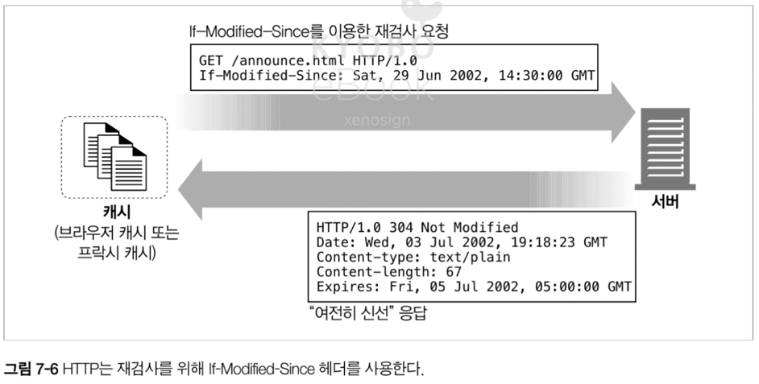
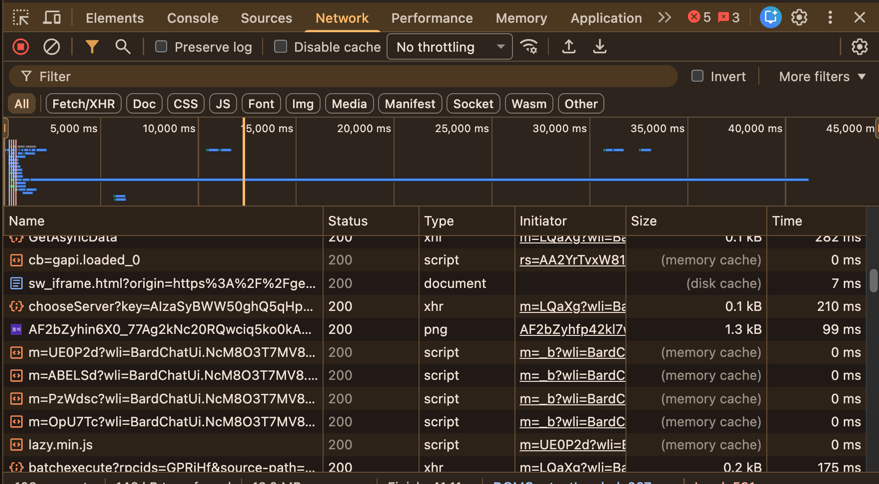
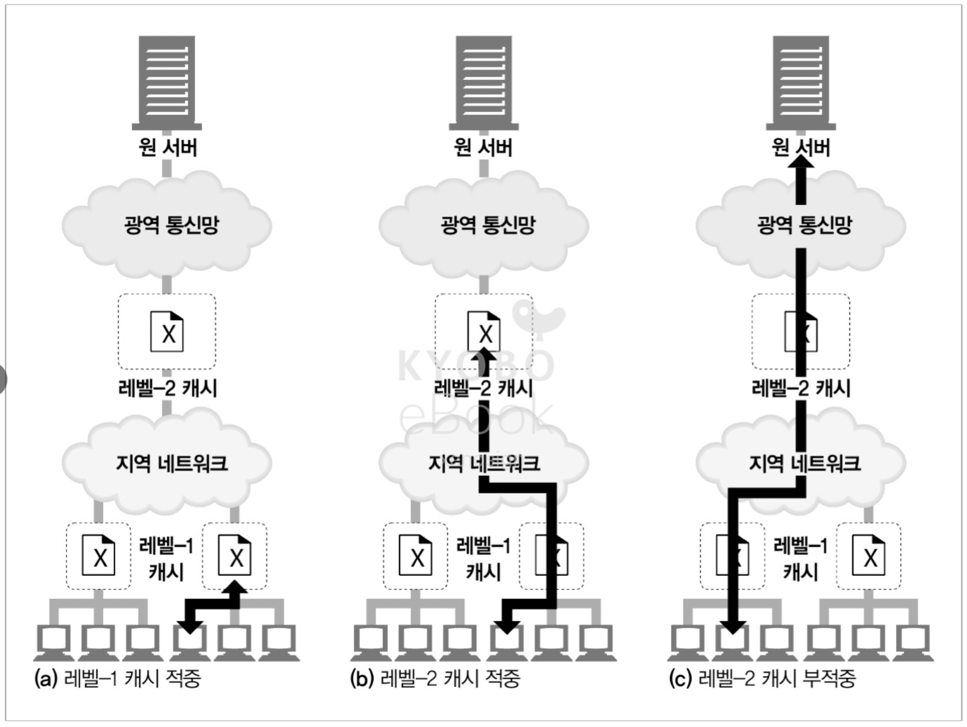
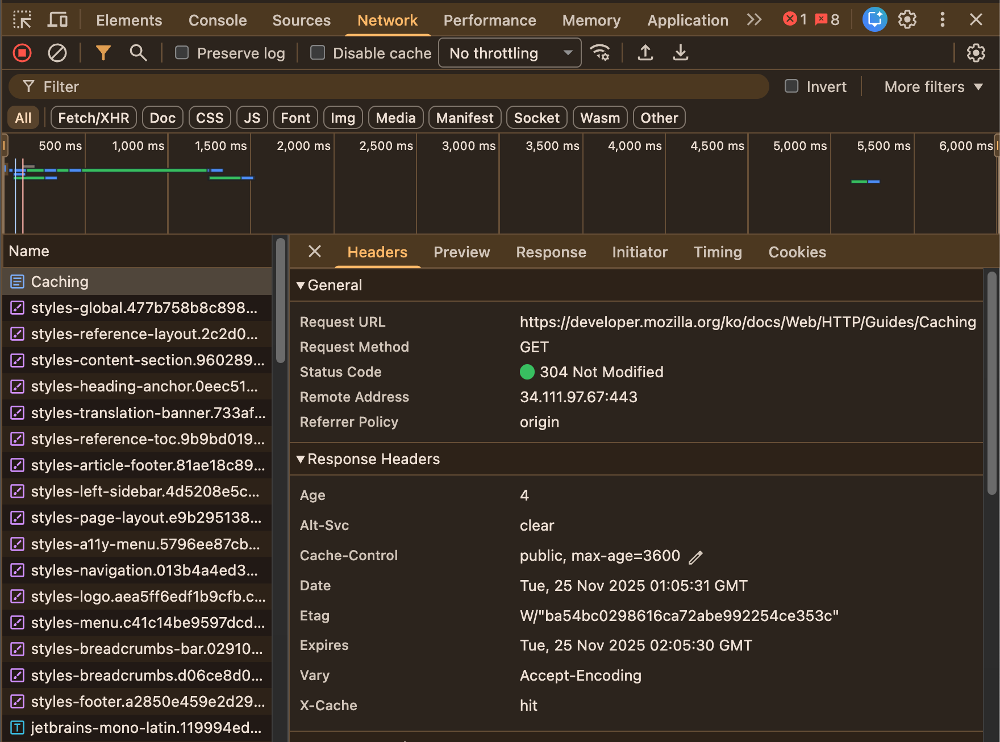
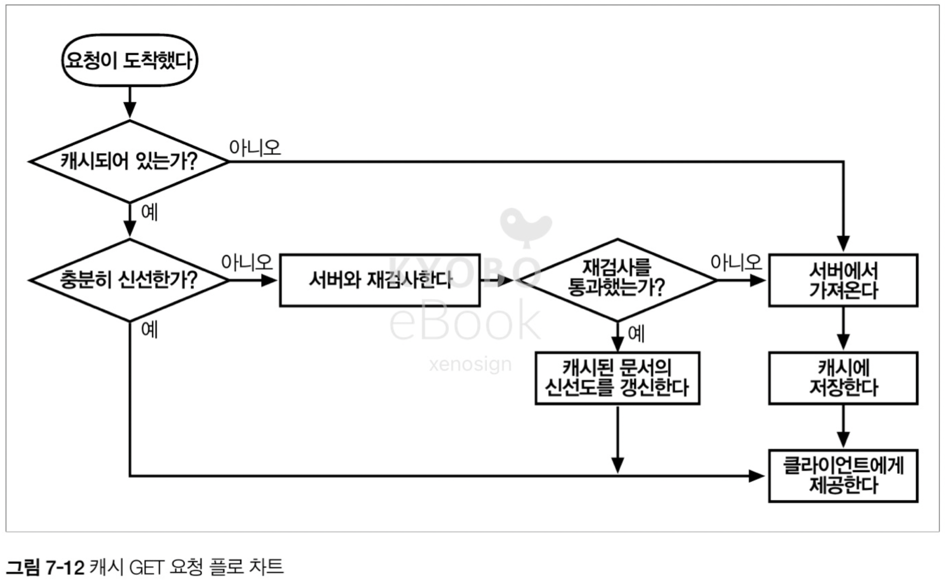
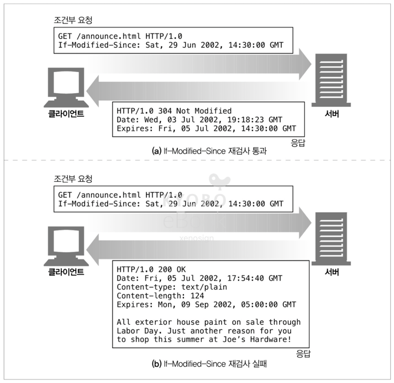
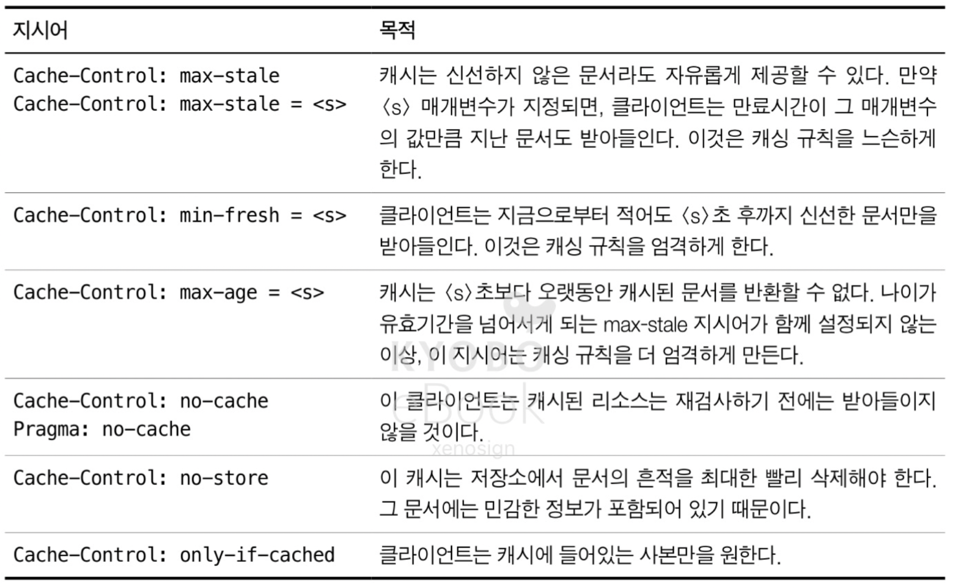

# 07. 캐시

- 캐시는 자주 쓰이는 문서의 사본을 자동으로 보관하는 HTTP 장치
- 웹 요청이 캐시에 도착했을 때, 캐시된 로컬 사본이 존재한다면 문서는 해당 캐시로부터 제공

- 캐시가 주는 혜택
  - 캐시는 불필요한 데이터 전송을 줄여서, 네트워크 요금으로 인한 비용을 줄여준다
  - 캐시는 네트워크 병목을 줄여준다. 대역폭을 늘리지 않고도 페이지를 빨리 불러 올 수 있게 된다
  - 캐시는 원 서버에 대한 요청을 줄여준다. 서버는 부하를 줄일 수 있으며 더 빨리 응답할 수 있게 된다
  - 페이지를 먼 곱에서 불러올수록 시간이 많이 걸리는데, 캐시는 거리로 인한 지연을 줄여준다

## 7.1 불필요한 데이터 전송

- 복수의 클라이언트가 자주 쓰이는 원 서버 페이지에 접근 시, 서버는 클라이언트에 응답을 한 번씩 전송하여 서버 입장에서는 동일한 응답을 반복하여 이로 인한 부하가 발생
- 캐시를 이용하면 첫 번째 서버 응답은 캐시에 보관되고, 캐시된 사본이 다른 클라이언트로 부터 들어온 동일한 요청에 사용되어 트래픽 낭비를 줄일 수 있다

## 7.2 대역폭 병목

- 많은 네트워크가 원격 서버보다 로컬 네트워크에 더 넓은 대역폭을 제공하기 때문에, 클라이언트가 서버로 접근하는 외부 네트워크의 경우 가장 느린 네트워크의 속도와 같다
- 따라서 클라이언트가 빠른 로컬 네트워크(LAN)에 있는 캐시로 부터 사본을 가져온다면, 성능을 대폭 개선할 수 있으며 용량이 큰 문서일 경우 큰 폭의 차이를 발생 시킨다

## 7.3 갑작스런 요청 쇄도(Flash Crowds)

- 갑작스러운 요청 쇄도가 일어나는 경우 캐싱은 좋은 대비책이 된다

> 책에서 나온 것 처럼 갑자기 특정 뉴스에 대해서 요청이 폭증(Traffic Spike)하는 상황에서의 적절한 캐싱 및 서버 전략은 어떤 것이 좋을까요?  
> 1. 해당 뉴스에 대한 문서를 CDN 으로 처리하여 원본 서버에 오기 전에 지역에서 빠르게 처리 (로컬 네트워크에 가까운 개념이겠죠?)
> 2. CDN 에서 처리하지 못한 트래픽은 AWS 의 로드밸런서 혹은 Nginx 등의 리버스 프록시를 사용하여 적절한 트래픽 대응
> 3. 이미 방문한 사용자의 경우 브라우저 캐싱을 통해 처리

## 7.4 거리로 인한 지연

- 아무리 빛의 속도로 통신이 이루어지지만 라우터에 의한 병목과 먼 거리는 지연을 발생 시키고, 이는 가까운 거리에 캐시 서버를 두는 방법으로 해결이 가능하다

## 7.5 적중과 부적중

- 캐시에 요청이 도착했을 때
  - 그에 대응하는 사본이 있는 경우 `캐시 적중(cache hit)`
  - 대응하는 사본이 없는 경우, 요청은 원서버로 전달 `캐시 부적중(cache miss)`

### 7.5.1 재검사(Revalidation)

- 원 서버의 콘텐츠는 변경될 수 있으므로, 캐시는 반드시 그들이 가지고 있는 사본이 여전히 최신인지 점검이 필요
- HTTP 는 해당 과정을 위한 작은 재검사 요청을 정의, 콘텐츠가 변경되지 않았다면 서버는 304(Not Modified) 응답을 제공
- 해당 응답은 원 서버로 부터 콘텐츠 검사 통신이 진행되는 만큼 `캐시 적중` 보다는 느리지만 서버로 부터 문서를 받아올 필요가 없으므로 `캐시 부적중` 보다는 빠르다
- HTTP 는 캐시된 객체를 재확인하기 위해 몇 가지 도구를 제공하는데, 가장 많이 쓰이는 것은 `If-Modified-Since` 헤더가 사용되며 해당 헤더는 캐시된 시간 이후 콘텐츠가 변경된 경우에만 사본을 보내달라는 의미

#### 재검사 적중
- `If-Modified-Since` 헤더 요청을 보냈으나 객체가 변경되지 않은 경우

#### 재검사 부적중
- `If-Modified-Since` 헤더 요청을 보냈을 때, 캐시된 사본과 다르다면 서버는 새로운 콘텐츠에 대한 요청을 처리하는 것과 동일하게 200 OK 응답과 콘텐츠를 클라이언트에 보낸다

#### 객체 삭제
- 컨텐츠가 삭제되었다면 일반적은 응답과 마찬가지로 404 Not Found 응답을 돌려준다

### 7.5.2 적중률
- 캐시 적중률은 0 ~ 1 까지의 값으로 되어 있지만, 흔히 `%` 로 표기
- 적중률은 100% 에 가까울 수록 좋지만 40% 정도면 좋은 편
- 문서 적중률은 대기 시간에 영향을 준다

### 7.5.3 바이트 적중률
- 크기가 큰 객체가 캐시 될 때, 트래픽에는 더 큰 기여를 가져다 주므로 어떤 사람들은 `바이트 적중률` 측정값을 선호
- 바이트 적중률은 `캐시를 통해 제공 된 바이트 / 전체 트래픽의 바이트` 를 의미
- 바이트 적중률은 대역폭(= 트래픽 용량) 절약을 최적화 한다

> 문서 적중률 & 바이트 적중률 이해하기  
> - 문서 적중률은 캐셔가 필요한 물품(크기랑 상관 없이)을 가지고 있는 경우. 계산을 하는데 기다릴 필요가 없음
> - 바이트 적중률은 큰 물건을 미리 물류 센터가 아닌 대리점에 입고 시킨 케이스. 물건을 나르는 비용이 절감

### 7.5.4 적중과 부적중의 구별

- 캐시가 적중 되었는지, 부적중 되었는지를 클라이언트는 항상 200 OK 응답을 받기 때문에 구별이 불가능
- 이를 구별하기 위해서는 `Date 헤더` 를 이용, 응답일의 생성일과 현재 시간을 비교하여 해당 응답이 캐시되었는지 구분이 가능

## 7.6 캐시 토폴로지

- 캐시는 한 명의 사용자에게 할당되는 `개인 전용 캐시(private cache)`와 다수의 사용자에게 공유되는 `공용 캐시(public cache)` 로 구분

### 7.6.1 개인 전용 캐시

- 개인 전용 캐시는 큰 저장 공간을 필요로 하지 않으며, 보통 웹 브라우저에서 개인 전용 캐시를 제공

> 크롬 Network 탭을 통해 캐시 확인

> - memory cache 가 disk cache 에 비해 더 빠른 것 확인 가능. 그럼에도 disk cache 가 네트워크에 의한 통신 보다는 훨씬 빠른 것도 확인 가능

### 7.6.2 공용 프락시 캐시

- 프락시 캐시라고 불리우며 캐시를 제공하기 위한 특별한 종류의 공유된 프락시 서버로 불필요한 트래픽을 줄이고 성능 개선에 도움을 준다

### 7.6.3 프락시 캐시 계층들

- 프락시 캐시는 계층을 가지며 작은 캐시에서 부적중이 발생한 트래픽을 더 큰 부모 캐시가 처리하는 방식으로 구성 된다
- 다만 캐시 계층이 깊어지면 긴 연쇄에 의한 성능 저하로 캐시를 사용하는 목적이 저해될 수 있다

### 7.6.4 캐시 망, 콘텐츠 라우팅, 피어링

- 몇몇 네트워크 아키텍쳐는 단순 캐시 계층이 아닌 복잡한 캐시 망(Cache Peering)을 만들고, 프락시 캐시끼리 복잡한 커뮤니케이션을 통해 캐시를 어떤식으로 사용할지 동적으로 결정을 내린다

> 계층형 캐시 구조 대비 캐시 망(Cache Peering)이 가지는 이점
> - 계층형 구조의 경우 동료 캐시(Sibling)가 데이터를 가지고 있어도, 해당 부분을 확인하지 못하고 데이터가 부모 캐시(Parent)에 없으면 원본 서버에 트래픽이 발생. 캐시 망의 경우 주변 캐시를 확인하여 이와 같은 문제를 해결
> - 계층형 구조의 부모 캐시가 죽으면 결국 모든 요청은 원본 서버를 향하지만, 캐시 망의 경우 다른 캐시 서버를 통해 일부 해결이 가능
> - 원본 서버로 나가는 요청은 외부 회선을 사용하는 만큼 비용이 비싸지만, 캐시 망 내부 회선의 경우 비용이 저렴하여 네트워크 비용 절감 가능
> - 특정 콘텐츠에 부하가 걸리는 경우, 캐시 망은 해당 부하를 분산(Load Balancing)하여 문제 해결이 가능

## 7.7 캐시 처리 단계

1. 요청 받기 - 캐시는 네트워크로 부터 도착한 요청 메시지를 읽는다
2. 파싱 - 캐시는 메시지를 파싱하여 URL 과 헤더들을 추출
3. 검색 - 캐시는 로컬 복사본이 있는지 검사, 사본이 없다면 받아온 뒤 로컬에 저장
4. 신선도 검사 - 캐시는 캐시된 사본의 신선도 검사를 진행하고, 아닐 경우 변경 사항을 서버에 확인
5. 응답 생성 - 캐시는 새로운 헤더와 캐시된 본문으로 응답 메시지를 작성
6. 발송 - 작성된 응답을 클라이언트로 전송
7. 로깅 - 선택적으로 로그를 남긴다

### 7.7.1 단계 1: 요청 받기

- 네트워크 커넥션에서의 활동을 감지하고 데이터를 읽어 들인다

### 7.7.2 단계 2: 파싱

- 요청 메시지를 여러 부분으로 파싱하여 헤더 부분을 조작하기 쉬운 자료 구조에 담는다

> 헤더 파싱에는 어떤 자료 구조가 쓰일까요?  
> Case-Insensitive Hash Map / 왜?

### 7.7.3 단계 3: 검색

- URL 을 알아내고 그에 해당하는 로컬 사본이 있는지 검사. 로컬 캐시에서 가져올 수 없다면 부모 프락시에서 가져온다

### 7.7.4 단계 4: 신선도 검사

- 서버 문서의 사본이 `신선` 한 경우에는 캐시는 서버와의 통신 없이 문서 제공이 가능
- 문서의 사본이 `신선하지 않은` 경우에는 서버에 재검사를 요청하고 해당 결과를 반환

### 7.7.5 단계 5: 응답 생성

- 캐시 응답은 원 서버에서 온 것처럼 보여야 하기 때문에 캐시된 서버 응답 헤더를 토대로 응답 헤더를 생성
- 보통 원 서버의 응답에 맞추어 프로토콜의 버전을 적절히 변환 및 헤더를 번역, 캐시 신성도 정보(Cache-Control, Age, Expires 헤더) 및 Via 헤더를 포함 시킨다

> 캐시 관련 헤더 확인하기
> - https://developer.mozilla.org/ko/docs/Web/HTTP/Guides/Caching
> - 네트워크 탭의 Caching 에서 확인 가능
> - 

### 7.7.6 단계 6: 전송

- 응답 헤더가 준비되면 캐시는 응답을 클라이언트에 전송

### 7.7.7 단계 7: 로깅

- 캐시는 캐시 적중과 부적중에 관련된 로그를 갱신 및 여타 로그를 기록

### 7.7.8 캐시 처리 플로 차트

## 7.8 사본을 신선하게 유지하기

### 7.8.1 문서 만료

- HTTP 는 Cache-Control 과 Expires 라는 특별한 헤더를 이용해서 문서의 유효 기간 설정이 가능

### 7.8.2 유효 기간과 나이

- HTTP/1.0+ 는 `Expires` 로 절대 유효 기간을, HTTP/1.1 은 `Cache-Control: max-age` 헤더를 통해 상대 유효 기간을 설정

|           헤더           |  HTTP 버전   | 설명                                          |
|:----------------------:|:----------:|:--------------------------------------------|
|        Expires         | HTTP/1.0+  | 절대 유효 기간을 명시                                |
| Cache-Control: max-age |  HTTP/1.1  | 문서의 최대 나이를 설정, 처음 캐시되어 생성 된 이후 유효한 시간 단위(초) |

### 7.8.3 서버 재검사

- 캐시된 문서가 만료 되었다는 것은 원 서버의 문서와 캐시 문서가 상이하다는 것이 아니라 검사할 시간이 되었음을 의미
- 콘텐츠가 변경 되었다면, 원 서버의 문서를 가져와서 다시 저장한 다음 클라이언트로 전송
- 콘텐츠가 변경 되지 않았다면, 캐시는 새로운 만료일을 포함한 헤더만 가져와서 캐시 안의 헤더를 갱신

### 7.8.4 조건부 메서드와 재검사

- HTTP 븐 `조건부 GET` 요청을 보낼 수 있으며, 해당 요청은 서버의 문서가 캐시된 문서와 다른 경우에만 객체 본문을 보내 달라고 하는 요청

|            헤더             | 설명                                                                               |
|:-------------------------:|:---------------------------------------------------------------------------------|
| If-Modified-Since: <Date> | 주어진 Date 이후로 수정 되었다면 요청 메서들르 처리. 수정 여부 확인을 위해 서버 응답 헤더 중 `Last-Modified` 와 같이 사용 |
|   If-None-Match: <Tags>   | 날짜 대신, 서버에서 관리하는 일렬 번호와 같은 태그를 비교. 캐시된 태그와 원 서버의 태그가 다를 경우 요청 처리                 |

### 7.8.5 If-Modified-Since(IMS): 날짜 재검사

- `If-Modified-Since` 헤더와 함께 특정 날짜를 보내고 해당 날짜 이후 리소스가 변경 되었는지 여부를 체크
- 리소스가 변경 되었다면 일반적인 GET 요청 처럼 평범하게 `200 OK` 로 성공
- 리소스가 변경 되지 않았다면 `304 Not Modified` 응답 메시지를 보내며, 효율을 위해 본문은 생략. 단, 응답 헤더들 중 갱신이 필요한 부분(새로운 만료 날짜 등)은 수정해서 전달

### 7.8.6 If-None-Match: 엔터티 태그 재검사

- 다음과 같은 이유로 날짜 재검사를 행하기 어려운 상황이 존재
  - 문서는 다시 쓰여졌으나 실제로 내용이 같은 경우
  - 문서가 변경되었으나 변경이 매우 사소한 경우(철자나 주석의 변경)
  - 서버가 페이지에 대한 변경 일시를 정확히 기록하지 못한 경우
  - 1초 이하의 간격으로 갱신되는 문서에 대한 요청 시 (HTTP 날짜 포맷은 초 단위 까지만 기록이 가능하여 1초 이하의 변경을 구분 불가능)
- 위와 같은 경우에 대비하여 `If-None-Match` 헤더를 사용 시간이 아닌 버전 정보를 바탕으로 재검사를 수행할 수 있다
- 버전 정보는 여러개 전달이 가능하며, 해당 응답에 대한 처리는 IMS 와 동일하다

### 7.8.7 약한 검사기와 강한 검사기

- HTTP/1.1 은 콘텐츠가 조금 변경되어 `그 정도면 같은 것` 으로 처리할 수 있는 `약한 검사기(Weak Validator)` 를 지원하며 `If-None-Match` 헤더에 `W/` 접두사를 사용하여 구분
  - `ex) If-None-Match: W/"v2.6"`
- 반면 `강한 검사기(Strong Validator)` 는 콘텐츠가 바뀌면 바뀐다

### 7.8.8 언제 엔터티 태그를 사용하고 언제 Last-Modified 일시를 사용하는가

- HTTP/1.1 클라이언트는 서버가 `버전 정보를 담은 엔터티 태그`를 반환했다면, `반드시` 태그 검사기를 사용해야 한다
- 또한 `Last-Modified` 값만을 반환 했다면, 클라이언트는 `If-Modified-Since` 검사를 사용하여 자신이 가지고 있는 로컬 캐시의 문서의 일자와 비교할 수 있다
- `버전 정보를 담은 엔터티 태그`와 `Last-Modified` 를 모두 사용 가능하다면 HTTP/1.0 과 HTTP/1.1 캐시 모두 적절히 응답할 수 있도록 클라이언트는 두 가지의 재검사 정책을 모두 사용 해야한다

> 왜? 두 가지 재검사 정책을 모두 사용 해야할까요?
> - RFC 9110 표준
> - HTTP/1.0 은 ETag 헤더가 존재하지 않음, Last-Modified 만으로만 유효성을 판단. 따라서 HTTP/1.0 기반의 구형 캐시 서버를 위해서 If-Modified-Since 를 보험처럼 넣어줘야 함
> - HTTP/1.1 은 ETag 를 이해하므로 If-Modified-Since 검사로 해결 가능

## 7.9 캐시 제어

- HTTP 문서 캐시 여부에 영향을 미치는 헤더의 우선 순위는
  - Cache-Control: no-store
  - Cache-Control: no-cache
  - Cache-Control: must-revalidate
  - Cache-Control: max-age
  - Expires
  - 아무런 헤더를 제공하지 않음

### 7.9.1 no-cache 와 no-store 응답 헤더

- `no-store` 은 캐시가 응답의 사본을 만드는 것을 금지. 해당 응답이 클라이언트에 도착하면 클라이언트는 사본을 삭제
- `no-cache (Do not serve from cache without revalidation)` 는 먼저 서버와 재검사를 마친 이후 콘텐츠 변경이 없는 경우에 캐시에서 제공
  - HTTP/1.0 은 `Pragma: no-cache` 만 이해가 가능하므로 해당 헤더를 사용. HTTP/1.1 이후로는 `Cache-Control: no-cache` 사용

### 7.9.2 Max-Age 응답 헤더

- `Cache-Control: max-age` 헤더는 서버로 부터 문서를 받은 이후의 초 단위의 상대적 시간에 기반하여 Cache 처리
- 공유된 캐시에는 `Cache-Control: s-maxage` 값을 사용
- 서버는 Maximum Aging 을 0 으로 설정하여 캐시를 사용하지 않도록 설정이 가능

### 7.9.3 Expires 응답 헤더

- Max-Age 와 달리 절대적 실제 만료 날짜를 명시
- 몇몇 서버는 `Expires: 0` 헤더를 통해 항상 캐시를 만료 처리할 수 있지만 이는 문법 위반이며 문제를 일으킬 수 있다

> Expires: 0 은 왜, 문제를 일으킬 수 있을까요?
> - 브라우저나 프록시 서버가 해당 헤더의 문법적 에러는 무시하는 경우, 캐시를 막기 위한 헤더가 오히려 캐시를 연장 -> 중요 보안 및 실시간 데이터가 갱신되지 않는 문제 발생
> - 엄격한 방화벽 또는 프록시 서버의 경우 해당 문법 에러를 잘못된 응답으로 간주하여 실제 서버의 응답과 달리 500 에러 등으로 처리가 가능 -> 원래 서버의 응답과 상이한 응답이 도착
> - 따라서, 명확한 문법에 따르는 날짜 혹은 Cache-Control 헤더 사용이 필요

### 7.9.4 Must-Revalidate 응답 헤더

- `Cache-Control: must-revalidate` 응답 헤더를 통해 서버와의 신선도 재검사 없이 캐시 제공을 막을 수 있음
- 신선도 재검사가 실패한 경우, 캐시는 반드시 `504 Gateway Timeout error` 반환

### 7.9.5 휴리스틱 만료

- 응답이 `Cache-Control: max-age` 혹은 `Expires` 를 포함하지 않은 경우, 캐시는 경험적인 방법으로 최대 나이를 계산
- 일반적으로 해당 나이 값이 24시간을 초과하는 경우에는 경고의 의미로 `Heuristic Expiration` 헤더가 추가 되어야 함 (단, 현대 브라우저에서는 사용자에게 해당 정보를 노출 시키지 않음)
- 휴리스틱 만료 알고리즘인 LM(Last Modified) 인자 알고리즘은 문서의 마지막 변경 시각과 문서를 가져온 시각의 차이를 계산하고 해당 값에 LM Factor 를 곱해서 캐시 만료 시간을 정한다 
  - 캐시된 문서의 마지막 변경 시간이 오래전이라면 안정적인 문서로 판단하고 오랜 시간동안 캐시 -> LM Factor 의 값이 높음
  - 반대로, 마지막 변경 시간이 최근이라면 자주 변경되는 문서로 간주 서버와 재검사를 하기 전까지 짧은 기간만 캐시 -> LM Factor 의 값이 낮음

### 7.9.6 클라이언트 신선도 제약

- 브라우저는 `Cache-control` 요청 헤더를 추가하여 콘텐츠를 강제로 갱신 시키는 리프레시나 리로드 기능을 제공
- 다만 성능과 신뢰성, 비용에 따라 적절한 사용이 필요

### 7.9.7 주의할 점

- 문서 만료는 완벽한 시스템이 아니므로 주의가 필요하다
  - 퍼블리셔가 유효기간을 무한정의 미래로 설정하면 해당 문서의 변경 값은 볼 수 없는 등의 문제 발생 가능

