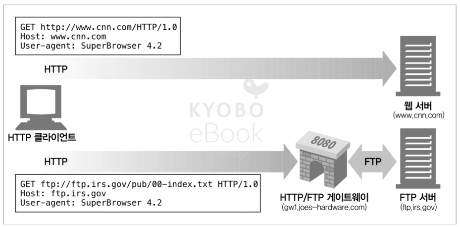
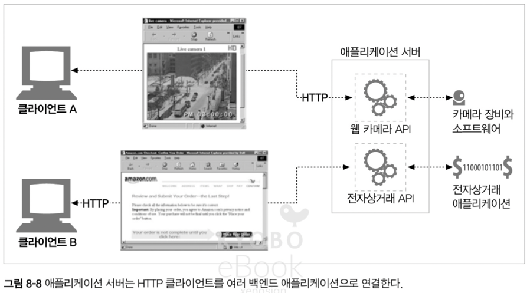
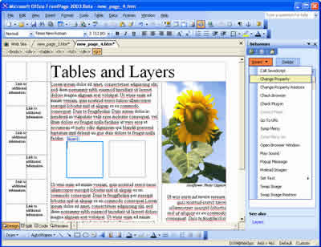
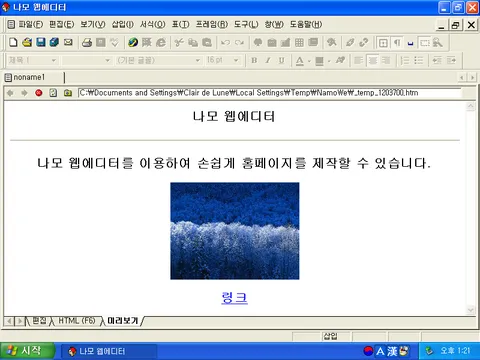
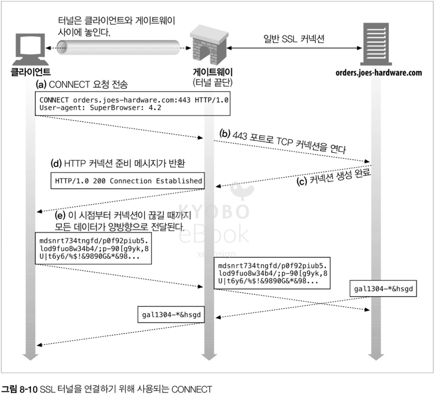
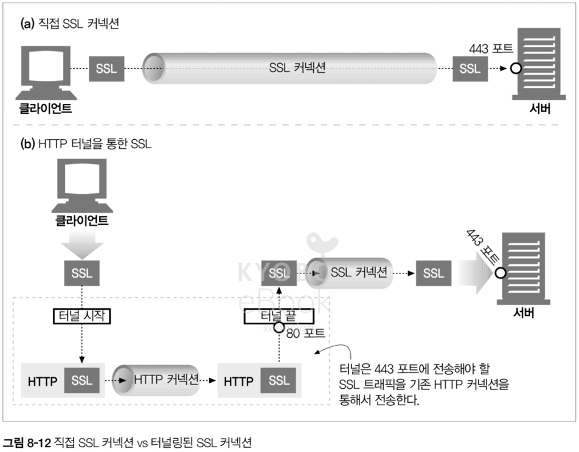
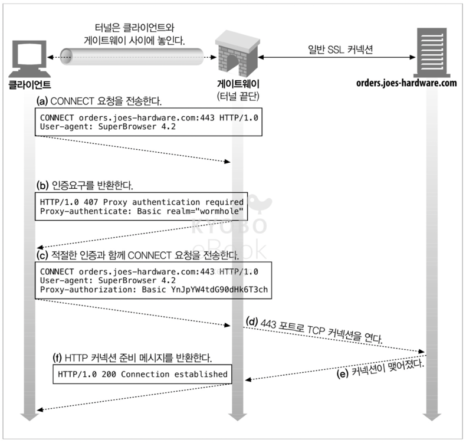
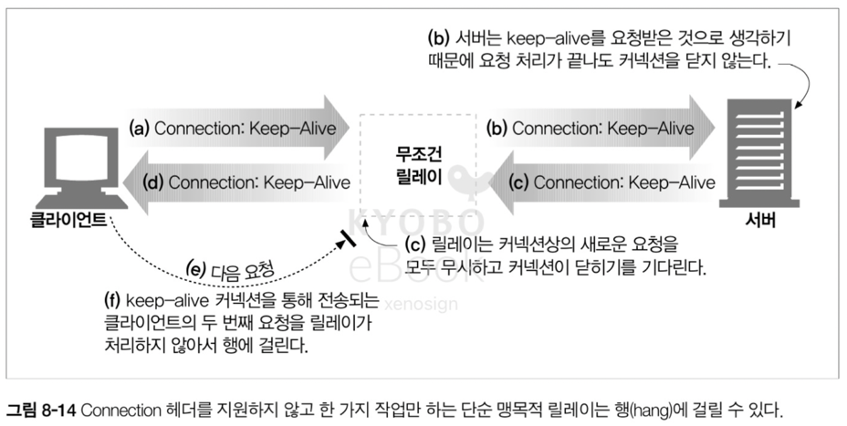

# 08. 통합점 : 게이트웨이, 터널, 릴레이

- 게이트웨이 : 서로 다른 프로토콜과 애플리케이션 간의 HTTP 인터페이스
- 애플리케이션 인터페이스 : 서로 다른 형식의 웹 애플리케이션이 통신하는데 사용
- 터널 : HTTP 커넥션을 통해서 HTTP 가 아닌 트래픽을 전송하는데 사용
- 릴레이 : 일종의 단순한 HTTP 프락시로, 한 번에 한 개의 홉에 데이터를 전달하는데 사용

## 8.1 게이트웨이

- HTTP 확장과 인터페이스의 발전으로, 웹에 더 복잡한 리소스를 올려야 할 필요가 생기면서 하나의 어플리케이션으로는 모든 요청을 처리할 수 없는 한계가 발생
- 이에 대한 해결책으로 인터프리터와 같이 리소스를 받기 위한 경로 안내를 하는 게이트웨이를 고안
- 게이트웨이는 HTTP 트래픽을 다른 프로토콜로 자동 변환하여, HTTP 클라이언트가 아무런 준비 없이 다른 프로토콜을 사용하는 서버(동적 컨텐츠 생성, 데이터 베이스 등)에 접속할 수 있도록 한다


### 8.1.1 클라이언트 측 게이트웨이와 서버 측 게이트웨이

- 웹 게이트웨이는 한쪽은 HTTP, 다른 한쪽은 HTTP 가 아닌 다른 프로토콜로 통신. 게이트웨이는 상이한 프로토콜을 ` 빗금(/)` 으로 구분하여 기술
- ex) HTTP/FTP

## 8.2 프로토콜 게이트웨이

- 프락시로 바로 HTTP 트래픽을 보내는 것과 같이 게이트웨이로도 HTTP 트래픽을 바로 보낼 수 있다
- 보통은 브라우저에서 명시적으로 게이트웨이를 설정하거나, 게이트웨이를 대리 서버(리버스 프락시)로 설정이 가능



- 일반 HTTP 트래픽은 바로 웹 서버로 전달하고, 특정 URL 요청은 HTTP/FTP 게이트웨이로 전달하는 그림

### 8.2.1 HTTP/*: 서버 측 웹 게이트웨이

- 서버 측 웹 게이트웨이는 클라이언트로 부터의 HTTP 요청이 원 서버로 들어오는 시점에 요청을 다른 프로토콜로 전환하여 요청을 처리한다
- 다른 프로토콜을 통해 처리 된 객체를 게이트웨이로 받아서 HTTP 응답에 실어서 클라이언트로 전송한다

### 8.2.2 HTTP/HTTPS: 서버 측 보안 게이트웨이

- 모든 웹 요청을 암호화하여 개인 정보 보호 및 보안을 제공하는 용도로 게이트 활용이 가능


### 8.2.3 HTTPS/HTTP: 클라이언트 측 보안 가속 게이트웨이

- 클라이언트 측에서 요청을 암호화 하여 게이트웨이에 전달하고, 게이트웨이는 이를 복호화 하여 서버와 통신
- 원 서버와 게이트웨이 통신은 암호화가 되지 않은 트래픽 전송이 일어나므로 게이트웨이와 원 서버 간의 네트워크가 안전한지 확실히 확인 후 사용이 필요

> 해당 부분에서 서브넷을 활용하여 외부 서버(리버스 프록시)는 퍼블릭 서브넷에 위치 시키고, 실제 서버는 프라이빗 서브넷에 위치시켜서 통신하면 안전한 3-Tier-Architecture 구성이 가능
> - 퍼블릭과 프라이빗 서브넷 통신은 HTTP 로 이루어지지만, 외부에서는 프라이빗 서브넷에 있는 서버의 위치와 존재 자체를 모르기 때문에 공격이 어렵고 한다고 해도 AWS 의 방화벽에 의해 막힐 가능성이 높음

## 8.3 리소스 게이트웨이

- 일반적인 형태의 어플리케이션 서버는 각각의 목적지 서버와 게이트웨이를 하나의 서버로 결합한다
- 실제적인 HTTP 통신은 API(Application Programming Interface)를 통해서 요청되고 서버는 해당 요청을 목적지와 연결하는 역할을 한다



- 최초의 API 는 공용 게이트웨이 인터페이스(CGI, Common Gateway Interface) 였으며, 특정 URL 에 대한 HTTP 요청에 따라 프로그램을 실행하고 프로그램의 출력을 수집하여 HTTP 응답으로 회신하는 표준화된 인터페이스의 집합

### 8.3.1 공용 게이트웨이 인터페이스(CGI, Common Gateway Interface)

- CGI 는 다양한 기능(동적 HTML, 결제, 데이터베이스 질의 등)을 제공하며, 서버와 분리되어 다양한 언어(Perl, Tcl, C, Shell)로 구현이 가능. 거의 모든 HTTP 서버에서 지원
- CGI 는 서버와 분리되므로 보안 및 서버 자체에 문제를 일으키지 않는 장점을 제공했지만, 성능 관련 이슈가 발생하였으며 이를 해결하고자 데몬에서 동작하는 Fast CGI 가 개발

### 8.3.2 서버 확장 API

- CGI 프로토콜은 외부 인터프리터가 쉽게 접근할 수 있지만 서버 자체의 동작을 변경하거나 서버 능력을 최대치로 사용하는데는 무리가 존재. 이를 해결하고자 서버 확장 API 를 제공하기 시작
- 확장 API 는 서버 자체의 아키텍처에 의존하기 때문에 서버의 형태에 따라 특화되는 형태로 발전 되었다
- 마이크로소프트의 프론트페이지(FrontPage) 는 프론트 페이지 에디터로 부터 전송되는 원격 프로시져 호출을 통해 서버 기능을 간단히 활용할 수 있는 서버 확장(FPSE, FrontPage Server Extension)을 제공

> FPSE 는 마이크로 소프트에서 제공하는 웹 에디터인 FrontPage(최초의 웹 WYSIWYG 에디터, 1995 ~ 2003) 에서 서버 쪽 기능을 쉽게 활용할 수 있도록 도와주는 서버측 프로그램 모음
> - 기존에는 웹 사이트를 만들고 배포하기 위해서는 직접 html 파일과 CGI 혹은 Perl 스크립트를 짜서 서버에 올려야 했지만, FrontPage 는 에디터로 작성한 페이지를 게시 버튼만 누르면 연결된 웹 서버에 자동으로 배포하는 기능을 제공   
> - 검색, 방문자 수 체크 등등 동적 기능은 직접 CGI 혹은 Perl 스크립트를 작성해야 했지만, FPSE 는 프론트 페이지 웹 에디터에서 간단한 클릭으로 추가가 가능하도록 지원






## 8.4 어플리케이션 인터페이스와 웹 서비스

- 두 어플리케이션을 연결하는 과정에서 HTTP 에서 제공되는 헤더로는 표현하기 힘든 복잡한 정보(서로 다른 프로토콜 혹은 이종의 언어에서 사용하는 데이터 타입)등을 교환하는 경우 인터페이스를 맞추는 일은 문제를 발생
- 인터넷은 웹 어플리케이션이 서로 통신하는데 사용하는 표준과 프로토콜 집합을 개발하였으며, 이를 웹 서비스라고 칭한다
- 웹 서비스는 HTTP 에 모든 언어에서 해석이 가능하며 다양한 정보를 명확하게 담을 수 있는 XML(eXtensible Markup Language)을 담는 표준인 SOAP(Simple Object Access Protocol)을 적용, XML 을 사용한 명확한 데이터 전송을 구현

> SOAP 이 적용된 XML 양식 보기
> - SOAP 는 과거의 표준화 된 REST API 와 비슷한 개념
> - HTTP 본문에 XML 을 담으며
>   - HTTP Header 에는 `Content-Type: text/xml` 또는 `applicaiton/soap+xml` 을 명시
>   - HTTP 본문에는 XML 형태로 SOAP Envelope > SOAP Header > SOAP Body 의 명확한 구조를 가짐

> 그럼 왜 요즘에는 안쓰일까요?
> - 현대에 들어서는 JS 와의 궁합, 데이터 읽기를 위한 메타 데이터의 크기로 인한 오버헤드, 모든 요청을 POST 로 보내야하는 문제 등으로 인해서 REST 로 대체
> - 단, 엄격한 보안 및 데이터 정합성이 필요한 사이트(금융/증권/항공)의 레거시 시스템은 아직 SOAP 를 사용

```xml
<!-- HTTP 헤더 -->
POST /StockQuote HTTP/1.1
Host: www.stockquoteserver.com
Content-Type: text/xml; charset="utf-8"

<!-- HTTP 본문에 담긴 SOAP 양식의 XML -->
<soap:Envelope xmlns:soap="http://schemas.xmlsoap.org/soap/envelope/">  
  <soap:Header>
    <AuthToken>xyz-123-token</AuthToken>
  </soap:Header>

  <soap:Body>
    <GetStockPrice>
      <StockName>Samsung Electronics</StockName>
    </GetStockPrice>
  </soap:Body>
</soap:Envelope>
```

## 8.5 터널

- 웹 터널은 HTTP 커넥션을 통해 다른 프로토콜을 HTTP 위에 올릴 수 있으며, 이 방법을 사용하여 HTTP 프로토콜을 지원하지 않는 애플리케이션에 HTTP 프로토콜을 사용하여 접근하는 방법을 제공

### 8.5.1 CONNECT 로 HTTP 터널 커넥션 맺기

- 웹 터널은 HTTP/1.1 의 CONNECT 메서드를 이용해서 커넥션을 연결하며, 임의의 목적 서버의 포트와 TCP 커넥션을 맺고 서버 간에 오는 데이터를 무조건 전달하기를 요청
- CONNECT 메서드의 동작 순서
  - 클라이언트는 목적 서버에 CONNECT 요청을 전송
  - TCP 커넥션 수립 -> 게이트웨이는 클라이언트에 `200 Connection Established` 응답을 전송
  - 해당 시점에 터널이 연결되며 HTTP 터널은 클라이언트와 서버간 모든 데이터를 TCP 커넥션을 통해 전달



#### CONNECT 요청
- CONNECT 문법은 시작줄을 제외하고 HTTP 요청과 같으며, 시작줄 다음에는 추가적인 HTTP 요청 헤더가 포함 된다

```http request
CONNECT gg.com HTTP/1.0
User-Agent: Mozilla/4.0
```

#### CONNECT 응답
- 클라이언트는 CONNECT 요청을 전송 후 응답을 대기
- 응답은 일반 HTTP 메시지와 같이 200 코드로 반환되지만, 데이터는 바이트를 그대로 전달하는 만큼 Content-Type 헤더는 사용되지 않는다 
- 

```http response
HTTP/1.0 200 Connection Established
Proxy-agent: Netcape-Proxy/1.1
```

### 8.5.2 데이터 터널링, 시간, 커넥션 관리

- 터널을 통해 흘러가는 데이터는 게이트웨이에서 패킷의 흐름이나 순서도 확인이 불가능
- 클라이언트는 성능을 높이기 위해 CONNECT 요청 후, 응답을 받기전에 터널에 대한 정보 데이터를 서버에 전송하여 데이터 전송을 더 빠르게 할 수 있다
- 클라이언트는 터널을 통해 200 외의 응답이 왔을 경우, 다시 데이터를 보낼 준비가 되어있어야 한다
- 커넥션이 끊어지면 한쪽에서 아직 전송되지 못한 데이터는 버려진다

### 8.5.3 SSL 터널링

- 웹 터널은 암호화된 SSL 트래픽을 웹 방화벽을 통해 전달하기 위해 개발
- SSL 같이 암호화 된 프로토콜은 HTTP/1.0 을 쓰는 낡은 프락시에서는 처리가 불가능. 이 때 터널을 사용하면 SSL 트래픽을 HTTP 만을 허용하는 방화벽을 통과시켜 전송이 가능
- 따라서 터널은 HTTP 가 아닌 트래픽이 포트를 제한하는 방화벽(HTTP 트래픽만 허용하는 80 포트만 허용)을 통과할 수 있게 해주는 역할을 하지만, 악의적 트래픽이 방화벽을 뚫는 문제도 발생 가능




### 8.5.4 SSL 터널링 vs HTTP/HTTPS 게이트웨이

- HTTP/HTTPS 게이트웨이는 HTTP 클라이언트와 HTTPS 서버를 연결하는 게이트웨이를 두고 해당 게이트웨이에서 SSL 세션을 수행하는 구조를 가진다
  - 해당 구조의 경우 클라이언트와 게이트웨이 사이의 통신은 HTTP 로 처리되어 보안상의 문제 발생
  - 프락시가 인증을 담당하기 때문에 클라이언트는 직접 원격 서버에 SSL 인증이 불가능
  - 게이트웨이는 항상 SSL 를 완벽히 지원(복호화)
- 위와 같은 상황에서 SSL 터널링을 사용하면 프락시에 SSL 을 구현할 필요 없이 프락시(or 게이트웨이)는 암호화된 데이터를 그대로 터널링 하면 되므로 문제가 없음


### 8.5.5 터널 인증

- HTTP 의 다른 기능들도 터널과 함께 적절히 사용이 가능하며, 특히 프락시 인증 기능은 클라이언트가 터널을 사용할 수 있는 권한이 있는지 용도로 사용 가능
  - 게이트웨이가 프락시 서버 처럼 인증에 대한 역할을 수행해야 가능 



### 8.5.6 터널 보안에 대한 고려사항들

- 터널이 수립되고 터널에서 전송되는 트래픽에 대한 검사가 불가능하므로 잘 알려진 특정 포트(HTTPS 433)만 터널링 할 수 있도록 허용하는 편이 좋다

## 8.6 릴레이

- HTTP 릴레이는 HTTP 명세를 완전히 준수하지 않는 간단한 HTTP 프락시로, 커넥션을 맺기 위한 HTTP 통신을 한 다음 바이트를 맹목적으로 전달
- HTTP 는 모든 헤더와 메서드 로직을 수행하는 구조적 복잡함으로 인해 맹목적으로 트래픽을 전달하여 간단한 필터링이나 콘텐츠 변환 기능을 하는 프락시는 유용하게 사용이 가능
- 단순 맹목적 릴레이의 경우 `Connection` 헤더를 제대로 처리하지 못해서 `keep-alive` 커넥션에 행(hang)이 걸리는 문제가 쉽게 발생. `멍청한 릴레이 이슈, Blind Relay`
  - 해당 문제는 릴레이가 `Connection: Keep-Alive` 헤더를 이해하지 못하는 문제로 부터 발생
  - 릴레이는 클라이언트로 부터 받은 `Connection: Keep-Alive` 를 서버에 전달
  - 서버는 `Connection: Keep-Alive` 를 이해하므로 릴레이와 커넥션을 유지하면서 `Connection: Keep-Alive` 헤더를 응답에 담아 릴레이로 전달
  - 릴레이는 서버로 부터 받은 `Connection: Keep-Alive` 헤더가 담긴 응답을 클라이언트로 전달.
  - 하지만 릴레이는 `Connection: Keep-Alive` 헤더를 이해하지 못하므로 클라이언트로부터 커넥션이 닫히기를 대기
  - 클라이언트는 `Connection: Keep-Alive` 응답을 받고 커넥션이 수립되었다고 판단, 기존 커넥션으로 실제 요청을 보내지만 릴레이는 해당 요청을 서버로 전달하지 않으면서 행(hang)이 발생  
  - 해당 문제의 해결을 위해서는 HTTP/1.1 을 제대로 준수하는 `똑똑한 프락시`를 사용하는게 좋음



> 멍청한 릴레이의 해결책은 어떤 것이 있을까요?
> - 릴레이가 HTTP/1.1 을 아는 `똑똑한 프락시`로 구성되면 해결
>   - 홉 별(Hop by Hop) 헤더를 삭제하고 해당 헤더를 이해하는 똑똑한 프락시는 필요한 헤더를 다시 추가하여 서버로 전송 -> 프락시에 의한 개입 없이 클라이언트의 의도가 명확히 서버로 전달 
> - 넷스케이프의 임시 방편 해결책
>   - `Proxy-Connection` 라는 비표준 헤더를 생성
>   - 멍청한 릴레이는 어짜피 해당 헤더를 서버로 전송. 하지만 서버도 해당 헤더를 모르므로 요청에 대한 응답을 보내고 커넥션을 끊음 -> 무한 대기하는 행(hang) 상태는 예방 가능
>   - 똑똑한 릴레이는 해당 헤더를 `Connection: Keep-Alive` 로 바꿔서 전송. 클라이언트 - 릴레이 - 서버가 모두 커넥션을 유지하며 통신 가능
