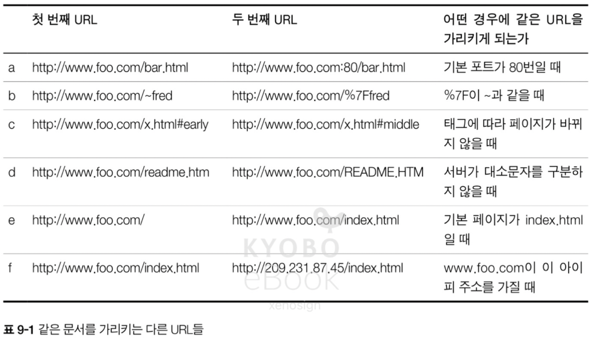
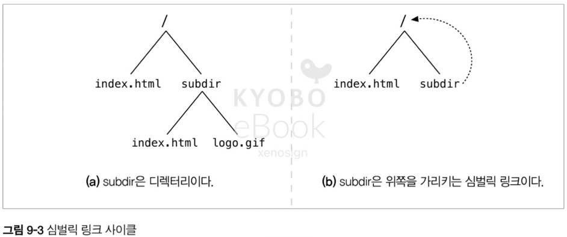
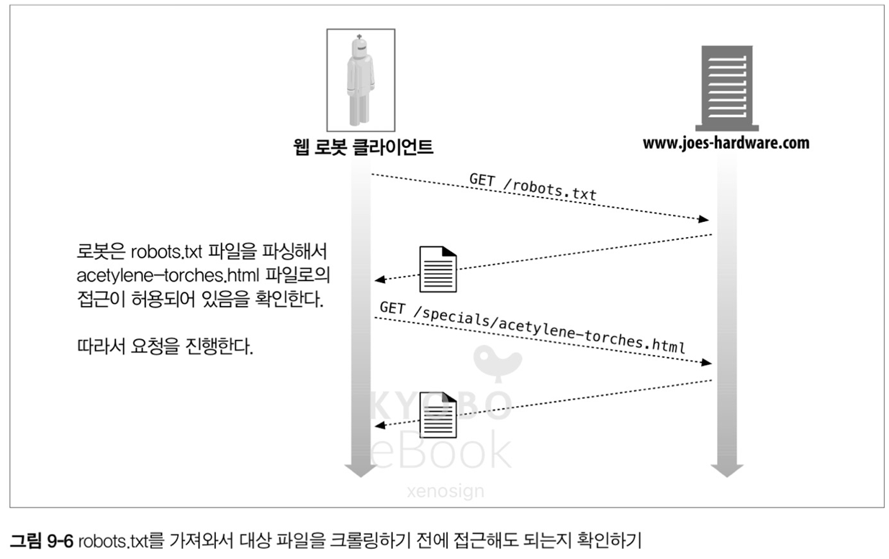

# 09. 웹 로봇

- 웹 로봇은 사람과 상호 작용 없이 연속된 웹 트랜잭션들을 자동으로 수행하는 소프트웨어 프로그램
- 그 방식에 따라 `크롤러`, `스파이더`, `웜`, `봇` 등 다양하게 불린다

## 9.1 크롤러와 크롤링

- 웹 크롤러는 웹 페이지를 한 개 가져오고, 그 페이지가 가리키는 모든 웹페이지를 다시 가져오는 일을 재귀적으로 반복하는 방식으로 웹을 순회하는 로봇
- HTML 로 만들어진 웹을 따라 `기어다니기(crawl)` 때문

### 9.1.1 어디에서 시작하는가: '루트 집합'

- 크롤러가 방문을 시작하는 초기 집합을 루트 집합(root set)이라고 부르며, 적절한 조합을 바탕을 최적의 루트 수를 통해 모든 페이지를 크롤링하는 케이스가 좋다

### 9.1.2 링크 추출과 상대 링크 정상화

- 크롤러들은 크롤링하는 HTML 파싱을 통해 이들 링크를 추출하고 상대 링크를 절대 링크로 변환할 필요가 있다

### 9.1.3 순환 피하기

- 로봇들은 순환을 피하기 위해서 그들이 어디를 방문했는지 반드시 기록해야 한다

### 9.1.4 루프와 중복

- 순환이 발생하면 크롤러 자체가 루프에 빠져서 동일한 결과만 반복(loops)하거나, 동일한 결과물(dups)만 생성하며 서버에 부담을 주는 문제를 발생 시킨다

### 9.1.5 빵 부스러기의 흔적

- 순환을 피하기 위해서는 효율적인 URL 목록 자료 구조가 필요하며, 해당 자료 구조는 빠른 검색 속도와 메모리 효율성이 요구된다

#### 트리와 해시 테이블
- 빠른 검색을 위해서 트리 O(logN ~ N) 혹은 해시 테이블 O(1 ~ N) 을 사용

#### 느슨한 존재 비트맵
- 공간 활용을 최소화하기 위해 대규모 크롤러들은 존재 비트 배열(presence bit array)과 가은 느슨한 자료 구조를 사용
- URL 은 해시 함수에 의해 고정된 크기 숫자로 변환, 해당 숫자 배열에 대응하는 존재 비트를 가지고 해당 값을 바탕으로 빠른 검색 및 크롤링 여부를 간주

> 느슨한 존재 비트맵 예시
> - 느슨한 존재 비트맵을 활용한 URL 크롤링 알고리즘의 간단 예시
>   - 약 3개의 hash 함수(h1, h2, h3)를 준비, 해당 hash 함수는 특정 url 을 0 ~ 9 의 숫자로 변환하는 함수라고 가정
>   - http://naver.com 을 각각의 h1, h2, h3 를 통과 -> 2, 7, 9 라는 결과를 얻음
>   - 인덱스 2, 7, 9 에 해당하는 비트를 1 로 설정 -> 0 0 1 0 0 0 0 1 0 1
>   - http://google.com 을 각각의 해시 함수를 통과 -> 2, 4, 8 이라는 결과를 얻음 -> 인덱스 2, 4, 8 에 해당하는 비트를 확인 -> 2 는 겹치지만 4, 8 은 겹치지 않음 -> 해당 URL 은 검색이 안되었음을 가정하고 크롤링
>   - 4, 8 번째 비트 업데이트 -> 0 0 1 1 0 0 0 1 1 1
> - 이러한 방식으로 URL 을 준비한 해시 함수로 변환한 결과와 비트에 저장된 값이 전부 1인 케이스를 제외하고 크롤링을 진행
> - 기존 true/false 를 저장하는 제일 작은 데이터 타입인 Boolean 타입이 1byte(8bit) 를 차지하는 반면 존재 비트맵은 1bit 만 사용하므로 8배의 공간을 절약 가능
> - 해당 url 을 방문 했는지 안했는지를 정확하게 파악은 불가능하지만, 방문을 2번하는 케이스는 명확하게 걸러낼 수 있으므로 효율적
> - 비트 연산을 통한 빠른 하드웨어 처리 속도 + O(1) 의 검색 속도로 인하여 일반적인 O(1) 의 케이스 보다 빠른 속도를 보여줌 

#### 체크 포인트
- 크롤링의 갑작스러운 중단을 대비, 방문한 URL 목록을 저장하는지 확인

#### 파티셔닝
- 인터넷은 방대하므로 크롤러는 여러 웹 로봇이 동시에 일하는 `농장(farm)` 을 이용하고, 여러 로봇은 인터넷의 특정 부분을 할당하고 해당 부분을 책임지는 형태로 수행

### 9.1.6 별침(alias)과 로봇 순환

- URL 이 별칭을 가질 수 있는 이상 다른 URL 이라도 같은 리소스를 가르킬수 있다



### 9.1.7 URL 정규화 하기

- 대부분의 웹 로복은 URL 들을 표준 형식으로 '정규화 하여, 다른 URL 이 같은 리소스를 가르키고 있는 것들을 제거하려 시도한다
  - 포트가 없는 경우면 `:80` 포트 추가
  - 이스케이핑된 문자는 대응되는 문자로 추가
  - `#` 태그 제거
- 하지만 이러한 정규화를 통해서도 제거할 수 없는 URL 별칭이 존재

### 9.1.8 파일 시스템의 링크 순환

- 파일 시스템의 심벌릭 링크는 사실상 아무것도 존재하지 않으면서 끝없이 깊은 디렉터리 계층을 만들 수 있으며, 악의적으로 활용되기도 한다



- (b) 의 케이스는 subdir 은 위쪽을 가르키는 심벌릭 링크이지만 URL 은 다르게 보이기 때문에 웹 로봇에게 루프를 일으킬 수 있다

### 9.1.9 동적 가상 웹 공간

- 악의적인 웹 마스터들은 가상의 URL 을 포함한 HTML 을 임의로 생성하여 웹 로봇에게 순환을 일으킬 수 있다
- 물론 악의적 웹 마스터가 아니더라도 달력을 만들어주는 페이지의 경우 웹 로봇이 무한히 다음 달을 누르며 순회하는 문제를 일으킬 가능성을 제공 가능하다

### 9.1.10 루프와 중복 피하기

- 모든 순환을 피하는 완벽한 방법은 없으므로, 웹 로봇들은 순환을 피하기 위해 아래와 같은 휴리스틱 집합을 필요로 한다

#### URL 정규화
- URL 을 표준 형태로 변환하여, 같은 리소스를 가르키는 다른 URL 이 생기는 것을 일부 회피

#### 너비 우선 크롤링
- URL 의 집합을 순회할 때 너비 우선으로 탐색을 스케쥴링하여 순환이 발생하는 확률을 줄이는 방법

#### 스로틀링
- 일정 시간 동안 가져올 수 있는 페이지 숫자를 제한하거나, 특정 서버에 대한 접근 횟수에 대한 제한을 통해 해결

#### URL 크기 제한
- 순환으로 계속 길어지는 URL 을 차단하기 위해 일정 크기(1KB) 이상의 URL 은 크롤링을 거부
- 대신 해당 휴리스틱의 적용으로 못 가져오는 문서가 발생할 가능성 존재
- 크기 제한을 걸고, 해당 크기 이상의 URL 이 발생하면 해당 에러 로그를 남김으로서 보완이 가능

> 현재의 URL 에서 1KB 는 몇 글자일까요?
> - ASCII 문자는 1글자 - 1Byte
> - 다국어가 들어가면 UTF-8 인코딩에의해 1글자 - 3Byte
> - 따라서, 341 ~ 1024 글자 사이

#### URL/사이트 블랙 리스트
- 문제나 순환을 일으키는 악의적인 사이트를 발견할 때 마다 블랙리스트에 추가하고 해당 블랙 리스트를 제외하고 크롤링

#### 패턴 발견
- 순환으로 인한 URL 상의 반복 패턴을 감지하여 크롤링을 거절

#### 콘텐츠 지문(Fingerprint)
- 크롤링 된 페이지에서 몊 바이트를 얻어내어 체크섬을 계산하고, 이후에 동일한 체크섬을 가진 페이지가 발견되면 해당 링크는 크롤링을 제한

#### 사람의 모니터링
- 아무리 좋은 휴리스틱을 적용해도 사람이 직접 확인하는 모니터링을 통해 의존하는 편이 좋다

## 9.2 로봇의 HTTP

- 로봇들도 다른 HTTP 클라이언트과 동일하며, HTTP/1.1 을 사용할 경우 복잡한 HTTP 헤더를 직접 만들고 요청해야하는 만큼 많은 로봇들은 HTTP/1.0 을 사용

### 9.2.1 요청 헤더 식별하기

- 로봇들은 서버에게 자신의 신원을 식별하기 위해 아래와 같은 헤더를 전달하는 편이 좋다
- User-Agent
  - 서버에게 로봇의 이름을 전달
- From
  - 로봇의 사용자/관리자의 이메일 주소를 제공
- Accept
  - 서버에게 어떤 미디어 타입을 보내도 되는지 전달
- Referer
  - 현재의 요청 URL 을 토함한 문서의 URL 을 제공

### 9.2.2 가상 호스팅

- 가상 호스팅이 널리 퍼진 웹 환경에서 로봇 구현자들은 Host 헤더를 지원할 필요가 있으며, 헤당 헤더를 지원하지 않을 경우 로봇이 특정 URL 에 대해 잘못된 콘텐츠를 찾게 만들 수 있다
- 하나의 서버에서 2개 이상의 URL 의 서비스를 운영하는 경우, 로봇은 1번 URL 에서 받은 콘텐츠를 2번 URL 에서 받은 것으로 착각할 수 있으며 이는 크롤링 결과에 큰 영향을 미칠 수 있다

### 9.2.3 조건부 요청

- 로봇들이 항상 웹 정보를 전부 받아오는 것은 큰 낭비이므로, 마지막으로 받아간 버전 이후 업데이트가 있는지를 확인하는 조건부 HTTP 요청을 사용할 수 있다

### 9.2.4 응답 다루기

- 조건부 요청과 같은 몇몇 기능이나, 좀 더 고도의 결과를 원하는 로봇의 경우 GET 이외의 여러 종류에 대한 HTTP 응답을 다룰 필요가 있다

#### 상태 코드
- 상태 코드 기반의 응답을 이해할 수 있어야 하며, 서버가 항상 옳은 형태의 코드를 반환하는것이 아닌 만큼 예외에 대한 대비도 필요하다

#### 엔터티
- `http-equiv` 과 같은 HTML 메타 태그는 언터티에 포함 된 리소스를 바탕으로 HTTP 헤더를 덮어 씌울 수 있는 만큼 해당 정보에 대한 파싱 기능이 필요할 수 있다

### 9.2.5 User-Agent 타겟팅

- 사이트 관리자들은 로봇에 대한 응답도 고려하여 로봇이 서버에서 아무것도 얻지 못하는 상황에 대비가 필요

## 9.3 부적절하게 동작하는 로봇들

#### 폭주하는 로봇
- 로봇이 논리적인 에러로 인해 순환에 빠지는 경우 서버에 극심한 부담을 초래하므로, 로봇 개발자는 이러한 상황에 고려하여 설계해야 한다

#### 오래된 URL
- 몇몇 로봇들은 URL 목록을 따라 방문하므로, 오래되거나 삭제된 URL 에 대한 관리가 필요

#### 길고 잘못된 URL
- 순환이나 개발상의 오류로 크고 의미 없는 URL 에 방문하는 경우 서버에 부하, 로그 혼선, 에러 유발이 가능하므로 주의 필요

#### 호기심이 지나친 로봇
- 서버에서 노출하기 원하지 않는 민감한 정보를 요구하는 로봇은 큰 문제를 일으킬 수 있으므로 이에대한 설계가 필요

#### 동적 게이트웨이 접근
- 로봇은 게이트웨이 어플리케이션의 콘텐츠에 대한 URL 요청이 가능하지만, 해당 데이터의 경우 특수 목적을 위한 것일 확률이 높고 처리 비용이 많이 들게 된다. 따라서 이에 대한 고려도 필요

## 9.4 로봇 차단하기

- 1994년 로봇에 의해 서버에서 원치 않은 동작을 하거나 민감한 정보에 접근하는 등의 문제가 생길 수 있으므로 `Robots Exclusion Standard` 라는 표준이 만들어짐. 현재는 `robots.txt` 로 통용
- 로봇은 서버에서 우선 해당 서버의 `robots.txt` 를 요청하고 해당 문서에 작성된 권한을 기반으로 작업을 수행



### 9.4.1 로봇 차단 표준

- 로봇 차단 표준은 임시 방편으로 마련된 표준이며, 업체들이 작성한 표준의 부분 집합을 사용한다
-  v2.0 은 복잡함의 문제로 대부분은 v0.0 이나 v1.0 을 채택


> 현 시점에서도 아직 공식 표준은 없지만 robots.txt 를 사용하는 REP(Robots Exclusion Protocol)가 구글, 마이크로소프트, 야후 등 주요 검색 엔진 및 크롤러 제작사들이 사용하면서 사실상의 표준(De facto standard)으로 자리 잡음

### 9.4.2 웹사이트와 robots.txt 파일들

- 로봇이 웹 어떤 URL 을 방문하기 전에 해당 사이트의 `robots.txt` 파일을 확인 후, 해당 파일을 처리해야만 한다
- 가상 호스팅 상황에서 각각 도메인에 따른 `robots.txt` 를 제공하는 방법은 책이 쓰여진 시점에는 존재하지 않았으므로 서버 관리자는 호스팅 되는 모든 도메인을 위한 종합적 `robots.txt` 를 작성할 책임이 존재

> 현재는 NginX 등을 리버스 프록시로 사용하므로 해당 서버 설정을 통해 도메인별로 상이한 robots.txt 제공이 가능
```shell
# 도메인 A 에 대한 설정
server {
listen 80;
server_name domainA.com www.domainA.com;
root /var/www/domainA;
    location = /robots.txt {
        # domainA에 특화된 robots.txt 파일을 제공
        alias /etc/nginx/robots/domainA_robots.txt; 
    }
}

# 도메인 B 에 대한 설정
server {
listen 80;
server_name domainB.com www.domainB.com;
root /var/www/domainB;
    location = /robots.txt {
        # domainB에 특화된 robots.txt 파일을 제공
        alias /etc/nginx/robots/domainB_robots.txt;
    }
}
```

#### robots.txt 가져오기
- 로봇은 웹 서버의 다른 리소스와 마찬가지로 HTTP GET 메서드를 이용 `robots.txt` 를 요청
- `robots.txt` 이 있으면 해당 내용을 바탕으로 작업을 수행
- `robots.txt` 이 없으면 404 Not Found 등의 응답을 받고 로봇에 설정된 작업을 수행

```http
GET /robots.txt HTTP/1.0
Host: www.gg.com
User-Agent: Slurp/2.0
Date: Wed Oct 3 20:22:48 EST 2001
```

> Slurp/2.0 은 야후에서 만든 검색 엔진 인덱싱 로봇의 이름

#### 응답 코드
- 웹 서버는 로봇의 `robots.txt` 요청에 응답해야 하며 아래와 같은 액션을 가진다
- 서버에 `robots.txt` 가 존재 : 20X 응답 / `robots.txt` 의 규칙을 바탕으로 작업을 수행
- 서버에 `robots.txt` 가 없을 때 : 404 응답 / `robots.txt` 제약 없이 작업을 수행
- 서버에서 401 또는 403 응답 : 크롤링에 대한 접근 권한이 완전히 제한 -> 작업 수행 불가능
- 서버에서 50X 응답 : 현재 서버에 대한 작업은 미뤄야 함
- 서버에서 30X 응답 : 리소스가 발견 될 때 까지 리다이렉트를 수행