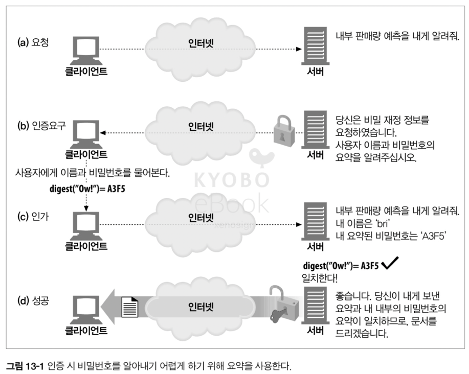
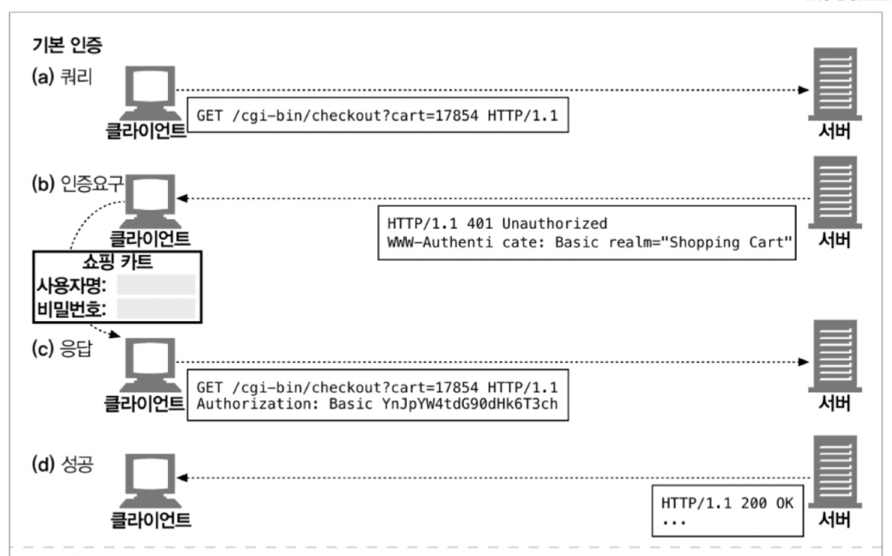
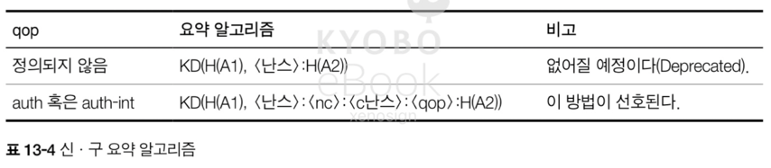
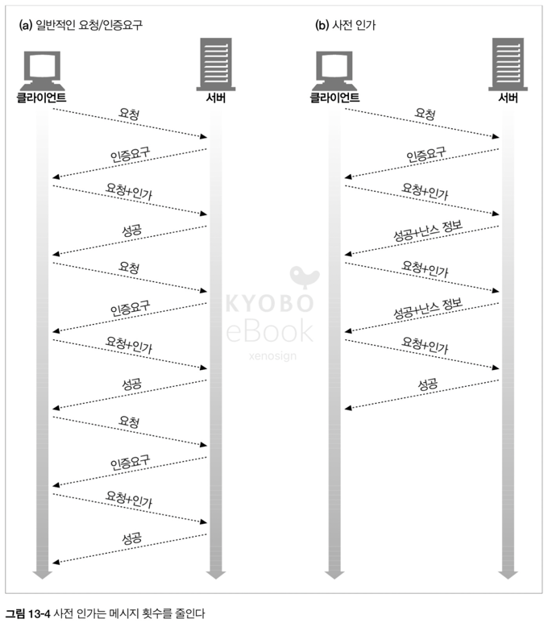

# 13. 다이제스트 인증

- 기본 인증은 편리하고 유연하지만 안전하게 이용하는 유일한 방법은 SSL 과 결합해서 사용하는 것

## 13.1 다이제스트 인증의 개선점

- 다이제스트 인증은 기본 인증의 가장 심각한 결함을 수정한 HTTP 인증 방식
- 다이제스트 인증의 특징
  - 비밀번호를 절대로 네트워크 상의 평문으로 전송하지 않음
  - 인증 체결을 가로채서 재현하려는 악의적인 시도를 차단
  - 구현에 따라 다르지만 메시지 내용 위조 방지 가능
  - 잘 알려진 형태의 공격을 막음
- 단, 다이제스트 인증이 가장 안전한 프로토콜은 아니며, 보안을 위해서는 전송 계층 보안(TLS)과 HTTPS 가 더 적합한 프로토콜이다
- 또한, 2000년대 초반에 대중화 시도가 있었으나 널리 사용은 안되었음

> 2000년대 중반 이후, HTTPS 의 보편화로 인하여 현재는 사용이 안되고 있음

### 13.1.1 비밀번호를 안전하게 지키기 위해 요약 사용하기

- 다이제스트 인증의 좌우명, `절대로 비밀번호를 네트워크를 통해 보내지 않는다`
- 다이제스트 인증은 비밀번호를 보내는 대신 비밀번호를 비가역적으로 뒤섞은 `지문(fingerprint)` 혹은 `요약(digest)`를 보낸다
- 서버와 클라이언트는 원래 비밀번호를 아는 상태이므로 해당 비밀번호에 대응되는 지문 혹은 요약인지 검사가 가능



### 13.1.2 단방향 요약

- 다이제스트 인증에서 사용하는 요약은 `정보 본문의 압축` 이며, 단방향 함수이며 무한의 입력값을 유한한 범위의 압축으로 변환하여 처리한다
- 주로 사용되는 `MD5` 는 임의의 바이트 배열을 원래 길이와 상관 없이 128 비트 요약으로 변환
  - 128 비트를 사용하므로 2 ^ 128 = 3.403 x 10 ^ 38 수의 다른 압축이 가능
- 따라서 원문을 모를 경우 해당 수 만큼의 반복을 통해 해당 원문을 알아내야 하므로, 중요 정보를 평문으로 그대로 보내는 보안적 문제를 보완

> MD5(Message-Digest Algorithm 5) 는 1991년 로널드 라이베스트에 의해서 개발
>
> - 입력 메시지의 길이를 512 비트의 배수가 되도록 패딩하고, 각각 512 비트의 메시지를 초기화 버퍼와 4개의 라운드(16번의 연산)를 거쳐서 변환
> - 최종적으로 4개의 32 비트 레지스터에 남은 값을 128 비트 해시 값으로 압축하여 출력하는 알고리즘
> - 하지만, 입력 가능한 데이터는 무한하지만 압축된 결과는 3.403 x 10 ^ 38 개라는 한계가 존재하여 서로 다른 값이지만 동일한 압축 값을 가질 수 있는 비둘기 집 원리에 의한 충돌 위험성이 존재
> - 실제로 충돌 공격에 의한 위험성이 입증되어 현재는 보안의 목적으로 사용되지 않음

> 현재의 암호화 전략
>
> - 128 비트보다 더 많은 수를 압축이 가능한 SHA-1(160 비트), SHA-256(256 비트), SHA-512(512 비트)를 알고리즘을 사용. 또한, SHA 의 경우 MD 보다 복잡하고 안전한 내부 구조를 가짐
> - 단, SHA-1 의 경우 2017 년에 충돌이 발견되어 공식적으로 종료. 이를, 해결하고자 SHA-2(256, 512)가 개발
> - 결국 SHA 도 비밀 키를 사용하지 않으므로 충돌 공격에 따른 위험성이 있으므로, 송신자와 수신자만이 공유하는 비밀 키를 사용하는 HMAC(Hash-Based Message Authentication Code) 를 사용
> - 현재는 HMAC 내부에 SHA-256 을 사용하는 HMAC-SHA256 이 표준적으로 사용

### 13.1.3 재전송 방지를 위한 난스(nonce) 사용

- 비밀번호를 암호화 하여 전달하여도 공격자에 의해 요청 또는 요약이 탈취 당하는 경우, 비밀번호 자체를 탈취 당하는 것과 다를 바 없으므로 이에 대한 보완이 필요
- 이러한 탈취와 재전송 공격을 방지하기 위해서 서버에서는 `난스`라고 불리는 일회용 증표를 클라이언트에 전달. 서버는 요청의 난스를 비교하여 요청이 적합성을 판단
  - 난스는 만료 시간(약한 보안) 또는 사용 여부 확인(강한 보안)에 따라 적합성을 판단
- `난스`는 WWW-Authenticate 인증 요구에 담겨서 서버에서 클라이언트로 넘겨진다

### 13.1.4 다이제스트 인증 핸드셰이크

- HTTP 다이제스트 인증 프로토콜은 기본 인증에서 사용하는 헤더에 몇몇 새 옵션이 추가되었으며, 선택 헤더인 `Authorization-info` 가 추가된 강화 버전의 인증이다


- 기본 인증과 다이제스트 인증 과정 비교




> 과정의 Step 은 동일하나, 서버와 클라이언트간의 `난스` 확인 작업과, 비밀번호 등이 암호화되어 요약으로 전달(암호화된 문자열, 암호화 알고리즘 등)되는 것에 차이가 존재

## 13.2 요약 계산

- 다이제스트 인증은 단방향 요약 메세지가 핵심이며, 해당 요약에는 공개된 정보, 비밀 정보, 시한부 난스 값을 조합하여 계산

### 13.2.1 요약 알고리즘 입력 데이터

- 요약은 다음의 세 요소로 부터 계산
- 단방향 해시 함수 H(d) 와 요약 함수 KD(s, d) 이며, s 는 비밀(secret)을 d 는 데이터(data) 를 의미
- 비밀번호 등 보안 정보를 담고 있는 데이터 덩어리는 A1 이라 칭한다
- 요청 메시지의 비밀이 아닌 속성을 담고 있는 데이터 덩어리는 A2 라 칭한다

### 13.2.2 H(d) 와 KD(s, d) 알고리즘

- 다이제스트 인증은 여러가지 요약 알고리즘이 선택 가능하며, RFC 2617 에서 제안된 두 알고리즘은 MD5 와 MD5-sess(ion) 이며 기본은 MD5
- 요약은 아래의 식에 의하여 계산 된다

```
H(<데이터>) = MD5(<데이터>)
KD(<비밀>, <데이터>) = H(연결(<비밀>:<데이터>))
```

### 13.2.3 보안 관련 데이터 (A1)

- A1 이라 불리는 데이터 덩어리는 사용자 이름, 비밀번호, 보호 영역, 난스와 같은 비밀 보호 정보로 구성
- RFC 2617 은 A1 을 계산할 수 있는 2가지 알고리즘을 정의

#### MD5

- 모든 요청마다 단방향 해시를 실행
- `A1 = <사용자>:<영역>:<비밀번호>`

#### MD5-sess

- 사용자 이름, 영역, 비밀번호에 대한 해시를 계산한 결과 뒤에 현재 난스와 클라이언트의 난스(c난스)를 붙인 것이 A1 이 되는 알고리즘
- 계산에 CPU 가 많이 사용되는 만큼 WWW-Authenticate 핸드셰이크를 할 때 한 번만 수행
- `A1 = MD5(<사용자>:<영역>:<비밀번호>):<난스>:<c난스>`

### 13.2.4 메시지 관련 데이터 (A2)

- A2 로 불리는 데이터 덩어리는 URL, 요청 메서드, 메시지 엔터티 본문과 같은 메시지 자체의 정보로 구성
- 메시지 위조를 방지하기 위해 사용
- RFC 2617 에 의해 2 가지 사용법이 정의
  - HTTP 요청 메서드와 URL 만 포함. `qop = "auth"` 일 때 사용
  - 메시지 무결성 검사를 위해 엔터티 본문까지 A2 에 추가, `qop = "auth-int"` 일 때 사용


### 13.2.5 요약 알고리즘 전반

- RFC 2617 은 주어진 H, KD, A1, A2 로 요약을 계산하는 2 가지 방법 정의
- 첫번째 방법, 이전 명세인 RFC 2069 과 호환을 위해, qop 옵션이 빠졌을 때 사용. 단, 없어질 예정
- 두번째 방법, 현대적인 방법으로 난스 횟수 집계 및 대칭 인증 지원을 포함. qop 가 'auth', 'auth-int' 일 때 모두 사용



- 요약 알고리즘을 더 펼친 버전의 표


### 13.2.6 다이제스트 인증 세션

- WWW-Authenticate 인증 요구에 대해서 클라이언트는 인증 세션으로 응답을 하게되며, 다른 서버로부터 또 다른 WWW-Authenticate 를 받을 때까지 지속
- 클라이언트가 인증을 위한 Authorization 헤더를 다시 만들기 위해 사용자 이름, 비밀번호, 난스, 난스 횟수를 기억해야 한다
- 또한, 서버는 낡은 난스 값을 감수하고 Authorization 헤더 정보 값을 받거나 새로운 난스 값과 함께 401 응답을 반환할 수 있다. 혹은, `stale=true` 로 정의하여 새롭게 인증 세션을 열지않고 새로운 난스 값으로 다시 요청을 보내라고 할 수 있다

### 13.2.7 사전(preemptive) 인가

- 클라이언트가 다음 난스를 미리 알고, 올바른 Authorization 헤더를 생성할 수 있다면 요청/인증요구 사이클을 줄일 수 있으며, 이를 사전 인가라 한다



- 다이제스트 인증의 경우 재전송 공격을 막기 위해 난스를 포함한 인증 과정을 거치므로 사전 인가가 더 복잡해진다
- 다이제스트의 안전한 기능을 유지하면서 WWW-Authenticate 인증 요구를 기다리지 않고 올바른 난스를 취득할 수 있는 방법이 존재

#### 다음 난스 미리 생성하기

- 서버에서 미리 다음 난스를 생성하여 Authentication-info 헤더에 다음 난스 값을 미리 제공하여, 클라이언트가 WWW-Authenticate 인증 요구없이 Authorization 헤더를 생성하는 방법
- 요청과 응답에 대한 커넥션을 계속 새롭게 만드는 기존 방식에 대해서는 유효하지만, 다중 요청을 연결을 유지한 상태로 지속 전달하는 파이프라이닝에는 실질적으로 쓸모가 없어지는 방법

#### 제한된 난스 재사용

- 연속된 난스를 계속 만드는 것이 아니라, 난스에 지속시간을 도입하여 일정 시간(ex. 10초) 재사용하도록 하는 방법
- 클라이언트는 이전에 받은 난스를 통해 자유롭게 Authorization 헤더 생성이 가능하므로, 요청을 파이프라이닝 처리가 가능
- 지속 시간이 만료 되면 서버는 401 Unauthorized 인증 요구(stale 옵션을 true 로 전달)를 보내고 다시 난스를 주고 받는 작업을 반복
- 단, 난스의 재사용으로 인해 재전송 공격에 취약한 문제가 발생

#### 동기화된 난스 생성

- 공유된 비밀키에 기반하여 클라이언트와 서버가 순차적으로 동일한 난스를 생성할 수 있는 동기화를 사용하는 방법
- 단, 해당 방법은 다이제스트 인증의 범위를 넘어서는 기술

### 13.2.8 난스 선택

- 난스의 내용은 불투명하고 각각의 구현에 의존적이나 성능과 보안, 편의성에 대한 고려가 필요
- RFC 2617 은 `BASE64(타임스탬프 H(타임스탬프 ":" ETag ":" 개인키))` 라는 난스 공식을 제안
  - 타임스탬프는 요청이 오래된 경우 거절이 가능하며, 난스의 유효 기간을 지정이 가능
  - ETag 는 요청된 엔터티에 대한 ETag 값으로 갱신 된 리소스에 대한 재요청을 방지
  - 개인키는 요청이 탈취 된 경우, 암호 복호화를 막기 위한 용도

### 13.2.9 상호 인증

- 클라이언트가 서버를 인증할 수 있도록 RFC 2617 에서 확장된 기능으로, 클라이언트와 서버가 공유된 비밀 정보에 근거하여 올바른 응답 요약을 생성할 수 있도록 클라이언트 난스(c난스) 값을 제공
- 요청 알고리즘과 마찬가지로 RFC 2069 와의 하위 호환성을 고려하여 qop 지시자에 의해 수행을 결정. 단, 응답이기 때문에 HTTP 메서드가 존재하지 않음


## 13.3 보호 수준(Quality of Protection) 향상

- qop(Quality of Protection) 필드는 다이제스트 인증에서 사용되는 보호 수준을 지정하는 필드
- qop 필드는 요약 헤더의 세 가지 헤더 `WWW-Authenticate`, `Authorization`, `Authentication-Info` 에 모두 존재
- qop 필드는 WWW-Authenticate 헤더에 옵션을 쉼표로 구분된 형태로 전송하며, 클라이언트와 서버가 보호 기법을 어느 수준으로 사용할 것이 협상할 수 있게 해준다
- RFC 2617 은 기본적으로 인증을 의미하는 `auth`, 인증과 메시지 무결성 보호를 의미하는 `auth-int` 를 제공

### 13.3.1 메시지 무결성 보호

- `qop="auth-int"` 에 의해 무결성 보호가 적용 되었을 때 H(엔터티 본문)는, 메시지 본문의 해시가 아닌 엔터티 본문의 해시
- 해당 부분은 전송 인코딩이 적용되기 전에 계산되고, 수진자에 의해 제거

### 13.3.2 다이제스트 인증 헤더

- 기본과 다이제스트 인증 프로토콜은 요청과 응답 모두 `WWW-Authenticate` 헤더에 담겨서 전달되는 인증 요구와 `Authorization` 에 담겨 전달되는 인가 응답을 포함
- 다이제스트 인증은 추가적인 인증을 위한 다음번 난스를 전달하기 위해 `Authentication-Info` 를 추가


## 13.4 실제 상황에 대한 고려

### 13.4.1 다중 인증 요구

- 서버가 클라이언트의 상태를 모르는 경우 기본과 다이제스트 인증 요구를 모두 보낼 수 있으며, 이 때 클라이언트는 자신이 지원할 수 있는 가장 강력한 인증 메커니즘을 선택할 필요가 있음
- 따라서, `WWW-Authenticate` 나 `Proxy-Authenticate` 헤더 필드 값을 분석할 때, 쉼표로 구분된 목록 까지 특별한 주의를 가지고 분석할 필요가 있음

### 13.4.2 오류 처리

- 다이제스트 인증 요구에 적절한 응답이 아닐 경우 `400 Bad Request` 응답을 보낸다
- 서버는 로그인 실패를 기록하거나, 'uri' 지시자가 가르키는 리소스가 요청줄에 명시된 리소스가 같음을 확인하여 공격에 대비해야 한다

### 13.4.3 보호 공간(Protection Space)

- 보호 공간은 다른 다중 인증 요구가 있을 수 있으며, 보호 공간에 대한 구체적인 인증 - 인가 계산은 인증 메커니즘에 달려있다
- 다이제스트 인증에서 `WWW-Authenticate` 의 `domain` 필드는 공간을 보다 엄밀하게 정의하므로 해당 필드의 하위 URI 는 같은 보호 공간에 있는 것으로 가정한다

### 13.4.4 URI 다시 쓰기

- 프락시는 가르키는 리소스의 변경 없이 구문만 고쳐서 URI 를 변경할 수 있는 동시에, 다이제스트 인증은 URI 값에 대한 무결성 검사가 이루어지므로 인증이 실패할 수 있다

### 13.4.5 캐시

- 공유 캐시가 `Authorization` 헤더를 포함한 요청 or 응답을 받은 경우 `Cache-Control` 지시자 중, "must-revalidate" 또는 "public" 지시자가 없는 경우 응답을 반환해서는 안된다
- must-revalidate : 클라이언트가 재검사를 통해 반드시 리소스 갱신을 해야하므로, 원 서버가 새 요청을 인증할 수 있도록 캐시에서 받은 요청의 헤더를 이용해야하는 상황
- public : 어떤 캐시던 저장할 수 있으므로, 그 다음 요청에 대해서 임의의 응답이 가능

## 13.5 보안에 대한 고려 사항

- RFC 2617 은 HTTP 인즌 제도에 내재된 보안 위협의 일부를 정리함

### 13.5.1 헤더 부당 변경

- 헤더 부당 변경에 대해 안전한 시스템을 위해서는 양 종단 암호화(HTTPS) 또는 헤더에 대한 디지털 서명이 필요
- 다이제스트 인증은 쉽게 조작이 어려운 인증 제도를 제공, 단 실제로 전달되는 데이터 까지 보호를 보장하는 것은 아님
- 보호 수준 및 인증 - 인가에 대한 정보는 `WWW-Authenticate`, `Authorization` 헤더에 담겨 있음

> 현대에는 HTTPS 를 통한 양 종단 암호화와 JWT 를 사용한 데이터 보호까지 사용하는 방법이 보편적

### 13.5.2 재전송 공격

- 다이제스트 인증 방법은 난스(클라이언트의 IP 주소, 타임스탬프, ETag, 개인 서버키 등이 포함)를 활용하여 재전송 공격에 대한 대안을 제시
- 단, 클라이언트 IP 가 포함 된 난스를 사용하면 프락시 팜을 사용하기 어려운 등의 문제가 발생
- 재전송 공격을 완전히 대비하기 위해 트랜잭션별로 유일한 난스를 사용하는 방법은 서버의 부하를 가중 시킬 수 있다

> 현재 다이제스트 인증이 사용되지 않는 이유가 포함 된 위의 내용에 대한 자세한 해설
> - 클라이언트 IP 가 포함되는 여러 프락시의 클러스터로 구성 된 프락시 팜을 통과하는 과정에서 IP 가 변경되어 보이는 등의 문제로 인하여 서버에서 원 요청을 거절하는 문제 발생 가능
> - 난스 사용시 서버 부하 이외에도, 응답을 받기 전에 요청을 연속해서 보내는 파이프 라이닝 환경에서는 이전 요청에 담긴 `nextnooce` 를 기다려야 하므로 효율에 큰 문제 발생
> - 결과적으로 2000년 중반 HTTPS 를 사용하는 방식으로 변경 

### 13.5.3 다중 인증 메커니즘

- 서버가 다중 인증 제도를 지원하는 경우 `WWW-Authenticate` 헤더를 통해 선택지를 제공, 클라이언트는 가급적 가장 강한 선택지를 선택하는 것이 좋음
- 단, 현실적으로 불가능한 경우라면 강력한 인증 제도만을 유지하는 프락시를 통해 인증을 처리하는 방법이 존재

### 13.5.4 사전(Dictionary) 공격

- 사용자와 서버가 단순한 비밀번호와 난스를 사용하는 경우 공격자는 쉽게 비밀번호를 찾을 수 있으므로, 적당한 만료 정책과 복잡한 비밀번호 난스의 사용이 필요

### 13.5.5 악의적인 프락시와 중간자 공격(Man-in-the-Middle Attack)

- 악의적인 프락시가 있을 경우 중간자 공격에 의해 엿듣기, 인증 제도를 기본 인증으로 변경 등의 공격에 취약
- 해당 공격에 대한 실질적인 해결책은 없으므로 클라이언트 레벨에서 가장 강한 인증을 항상 선택하는 방법이 좋다
- 실패가 없는 유일한 방법은 SSL 을 사용하는 것

### 13.5.6 선택 평문 공격

- 보안이 허술하거나 악의적인 프락시가 있는 경우라면, 암호화 장치에 공격자가 임의의 평문을 전송하고 해당 결과 해시 값을 기반으로 비밀 키를 유추할 수 있으며 이를 `선택 평문 공격`이라 한다


#### 미리 계산된 사전 공격
- 미리 결정된 난스와 비밀번호 조합인 사전을 만들고, 공격자는 클라이언트에 난스들의 목록을 전송 -> 사전에 등록된 응답을 오면 해당 비밀번호를 유추 가능

#### 자동화된 무차별 대입 공격
- 미리 준비된 사전 없이 무차별 대입을 통해 비밀번호를 유추하는 방법

> 이러한 반복 공격은 난스 카운터, 난스에 타임스탬프를 포함, 일회용 난스등을 통해 공격을 방어 가능

> 현대적인 방법
> - HTTPS + JWT 조합을 사용하여 탈취 자체에 대한 문제를 해결 (인프라 네트워크 계층 / 인증 계층)
> - 타임 스탬프와 1회용 무작위 난스를 발행하여 특정 인증 시도에 대해 1번의 기회만을 열어주고 1회 이상의 요청은 차단 (API 보안 계층)
> - 멱등성 키를 사용하여 공격이 성공해도 실제 트랜잭션 수행은 1번만 수행하도록 처리하는 방법 (서버 아키텍쳐 계층)

### 13.5.7 비밀번호 저장

- 유닉스 장치의 전통적인 비밀 번호 파일과 달리, 다이제스트 인증 비밀번호 파일이 유출되면 인증 - 인가 체계가 뚫리게 되므로 주의가 필요
- 파일 자체를 안전하게 보관하거나, 피해 영역을 최소의 영역으로 국소화 하는 방법등이 필요

