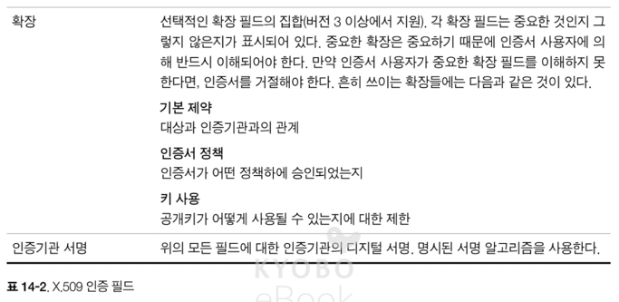
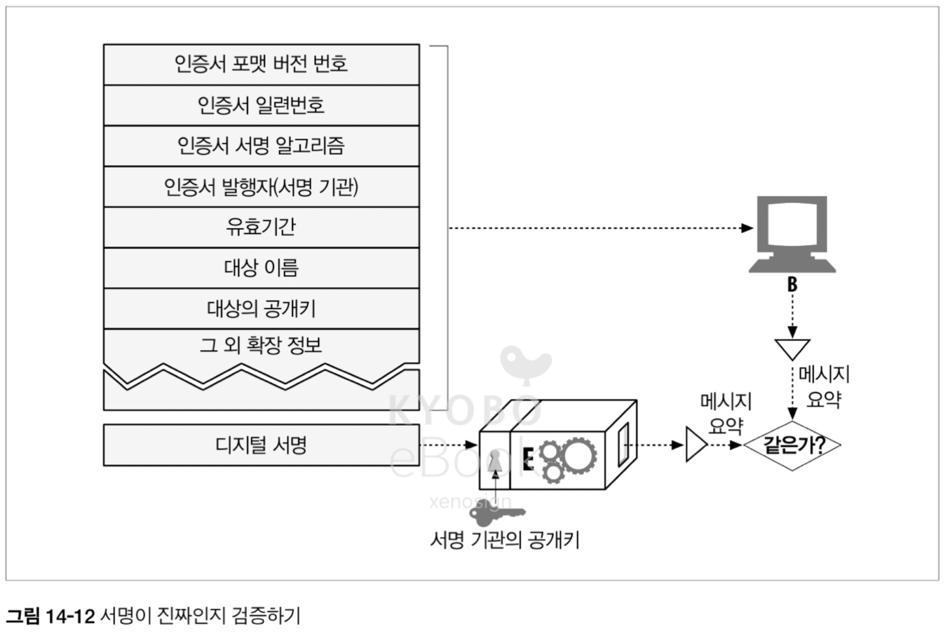
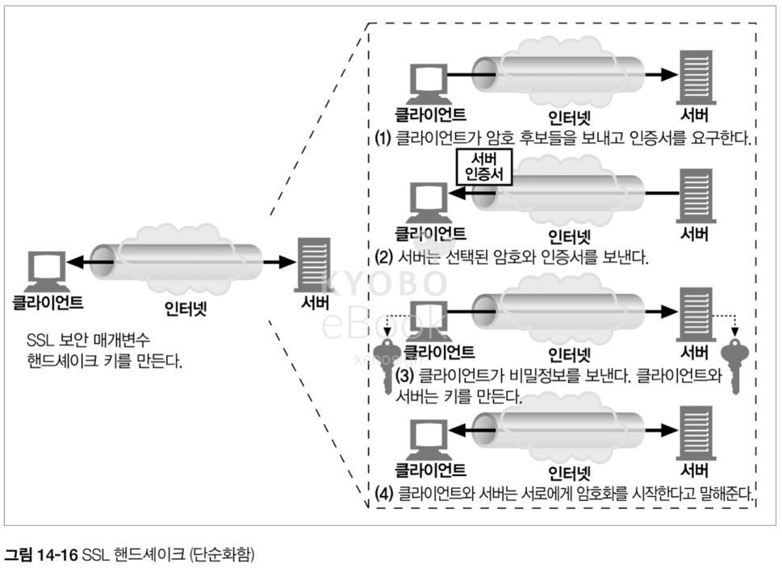
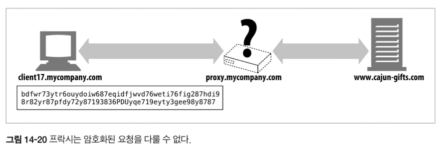

# 14. 보안 HTTP

## 14.1 HTTP 를 안전하게 만들기

- 사람들은 웹 트랜잭션을 중요한 일에 사용하므로, 웹은 안전한 방식의 HTTP 를 필요로 한다
- 웹은 인증을 위해 다이제스트 인증 방식을 제공하지만 해당 방법은 은행 업무 등의 강력한 보안이 필요한 부분에는 충분히 강력하지 않음
- 따라서 웹은 다음을 제공할 수 있는 HTTP 보안 기술이 필요
  - 서버 인증 : 클라이언트는 위조된 서버가 아닌 진짜 서버와 통신 중임을 알아야 함
  - 클라이언트 인증 : 서버는 자신이 가짜가 아닌 진짜 사용자와 이야기 하고 있음을 알아야 함
  - 무결성 : 클라이언트와 서버는 그들의 데이터가 위조되는 것으로부터 안전해야 함
  - 암호화 : 클라아인트와 서버는 도청에 대한 걱정 없이 대화가 가능해야 함
  - 효율 : 저렴한 클라이언트나 서버도 이용할 수 있도록 충분히 빨라야 함
  - 편재성 : 프로토콜은 거의 모든 클라이언트나 서버에서 지원되어야 함
  - 관리상의 확장성 : 누구든, 어디서든 즉각적인 보안 통신이 가능해야 함
  - 적응성 : 현재 알려진 최신의 보안 방법을 제공
  - 사회적 생존성 : 사회의 문화, 정치적 요구를 만족 시켜야 함

### 14.1.1 HTTPS

- HTTPS 는 넷스케이프에 의해서 개척되었으며, 가장 인기있는 보안 방식이다
- HTTPS 를 사용하면 모든 요청과 응답 데이터는 네트워크로 보내지기 전에 암호화 된다
- HTTPS 는 HTTP 하부의 전송 레벨 암호 보안 계층에서 동작하며, 안전 소켓 계층(Secure Sockets Layer, SSL) 혹은 그를 계승한 전송 계층 보안(Transport Layer Security, TLS) 를 이용하여 구현


## 14.2 디지털 암호학

- 암호 : 텍스트를 아무나 읽지 못하도록 인코딩하는 알고리즘
- 키 : 암호의 동작을 변경하는 숫자로 된 매개변수
- 대칭키 암호 체계 : 인코딩과 디코딩에 같은 키를 사용하는 알고리즘
- 비대칭키 암호 체계 : 인코딩과 디코딩에 다른 키를 사용하는 알고리즘
- 공개키 암호법 : 비밀 메시지를 전달하는 수백만 대의 컴퓨터를 만들 수 있는 시스템
- 디지털 서명 : 메시지가 위조 혹은 변조되지 않았음을 입증하는 체크섬
- 디지털 인증서 : 신뢰할 만한 조직에 의해 서명되고 검증된 신원 확인 정보

### 14.2.1 비밀 코드의 기술과 과학

- 암호법(Cryptography)은 수천년간 도청에 대해 메시지를 암호화하는 것뿐 아니라, 메시지의 변조를 방지하기 위해 노력해 왔다

### 14.2.2 암호(Cipher)

- 암호는 메시지를 인코딩하는 특정한 방법과 나중에 비밀 메시지를 디코딩하는 방법으로, 인코딩되기 전의 원본 메시지는 텍스트 혹은 평문이라 불린다
- 과거 율리우스 카이사르는 알파벳을 3 글자 뒤의 글자로 교체하는 순환 암호를 사용

### 14.2.3 암호 기계

- 사람들이 사용하는 암호 알고리즘은 간단하여 쉽게 암호를 해석이 가능, 기술의 진보로 더 복잡한 암호를 위해 기계를 사용하기 시작

### 14.2.4 키가 있는 암호

- 코드 알고리즘 혹은 기계가 적의 손에 들어가더라도 암호의 동작 방식을 변경하는 값을 설정할 수 있었으며, 해당 값(키)이 없으면 암호 해독이 불가능

### 14.2.5 디지털 암호

- 디지털이 도입되면서 암호는 속도 및 기능이 기계 장치의 한계를 벗어나 더욱 복잡한 알고리즘 도입이 가능해졌으며, 매우 큰 키를 지원하여 암호의 해독이 더 어려워 졌다

## 14.3 대칭키 암호법

- 인코딩 키와 디코딩 키가 같은 알고리즘을 사용하는 암호화 방법

### 14.3.1 키 길이와 열거 공격 (Enumeration Attack)

- 대부분의 경우 인코딩-디코딩 알고리즘은 공개되어 있으므로 비밀 키는 누설되면 안된다
- 좋은 암호 알고리즘은 공격자가 코드를 크래킹하기 위해 오랜 시간, 아니면 불가능한 시간의 공격을 하게 만들어야 한다
- 가능한 키 값의 개수는 보통 키의 길에 의존하며, 8 비트 키라면 256 가지의 값이 가능하며 40 비트면 약 1조 가지의 값이 가능하다
- 하지만 점점 빨라지는 연산 속도에 의해 40 비트는 쉽게 크래킹이 가능하므로, 미국 국가안보국(NSA) 에서는 128 비트 키를 권장


### 14.3.2 공유키 발급하기

- 대칭키 암호의 단점은 발송자와 송신자가 공유키를 가져야 한다는 점이며, 각 노드별로 개인키를 발급하고 이를 관리해야 한다 
- N 개의 노드가 있고 각 노드가 상대 N-1 노드와 은밀하게 대화를 하기 위해서는 O(N^2) 의 비밀 키가 필요

> 5(N) 개의 노드가 있다고 가정하면, 각각의 노드는 자신을 제외한 4(N-1) 의 공유키를 가져야만 4(N-1) 개의 노드와 암호를 사용 가능
> - 여기서 A 와 B 는 서로에 대한 공유키를 가지고 있지만, 해당 공유키는 동일하므로 실제로 필요한 키는 2 개가 아닌 1 개
> - 따라서, 공식은 N x (N-1) / 2 = N ^ 2 - N 개의 공유키가 필요하고 빅오 표기법의 의해 O(N^2) 의 키가 필요 

## 14.4 공개키 암호법

- 공개키 암호 방식은 2 개의 비대칭 키를 사용, 인코딩 키는 공개되어 있지만 호스트만이 디코딩 키를 알고 있는 방식이다
- 따라서 호스트는 각 노드에 대한 디코딩 키를 따로 가질 필요가 없으므로 O(N^2) 이 아닌 O(N) 의 키로 완전한 암호화가 가능
- 공개키 암호화 기술은 보안 프로토콜을 전 세계의 모든 컴퓨터 사용자에게 적용하는 것을 가능케 함

### 14.4.1 RSA

- 공개키 암호의 과제는 공개키, 가로챈 암호문, 메시지와 인코딩 된 암호문을 이 3 가지를 알고 있어도 비밀인 개인 키를 계산할 수 없다는 확신을 주는 것이었다
- 이를 해결한 가장 유명한 하나는 RSA 알고리즘

> RSA 는 무엇의 약자일까요?
> - RSA 는 큰 소수의 곱 연산을 통해 큰 수를 만드는 것은 쉽지만, 해당 큰 수가 어떤 소수의 곱셈인지 알아내는 것은 어렵다는 점을 이용
> - RSA 는 공개키와 개인키를 사용
> - 암호화에 사용 시 : 공개키로 암호화 -> 개인키로만 복호화가 가능
>   - 서버가 공개한 공개키로 메시지를 암호화하고 서버에서는 개인키를 이용하여 복호화
> - 전자 서명에 사용 시 : 개인키로 암호화 -> 공개키로 복호화가 가능
>   - 서버에서 개인키로 메시지를 암호화하고 클라이언트는 공개키로 복호화하여 해당 메시지가 서버에서 왔는지 확인이 가능 (HTTPS 인증서의 원리)

### 14.4.2 혼성 암호 채계와 세션 키

- 공개키 암호 방식은 공개키만 알고 있으면 누구나 서버에 안전하게 메시지를 보낼 수 있는 장점이 있지만, 알고리즘 계산이 느린 단점이 존재
- 느리다는 단점 계선을 위해 대칭과 비대칭을 섞은 방식을 사용하여, 채널을 수립할 때는 안전한 공개 키 암호를 사용하고 안전하게 채널이 수립 된 이후에는 계산이 빠른 무작위 대칭키를 서로 교환 후 사용

> 실제로 HTTPS 에서 사용하는 방식으로, RSA 를 통해 Handshake 를 수립하고, 수립 통 통신으로 대칭키(AES)를 교환 후 추후 통신은 AES 를 통해 진행

## 14.5 디지털 서명

- 암호 체계는 암호와 해독 뿐만 아니라, 누가 메시지를 썼는지 알려주고 해당 메시지가 위조 되지 않았음을 증명하기 위한 디지털 서명 기법도 제공

### 14.5.1 서명은 암호 체크섬이다

- 디지털 서명은 메시지에 붙어있는 특별한 암호 체크섬이며, 저자만이 가지고 있는 개인키가 체크섬을 계산할 수 있어서 해당 체크섬은 저자의 개인 `서명`처럼 동작
- 메시지를 수정하게 되면 메시지의 내용과 서명 체크섬이 달라지게 되므로 메시지 위조 확인이 가능


## 14.6 디지털 인증서

### 14.6.1 인증서의 내부

- 디지털 인증서에는 '인증 기관'에 의해 디지털 서명된 정보(대상의 이름, 유효 기간, 인증서 발급자, 인증서 발급자의 디지털 서명)가 담겨 있다
- 또한 사용된 서명 알고리즘에 대한 서술적인 정보와 대상의 공개키도 포함. 따라서 누구나 인증서를 만들 수 있지만 인증서의 정보를 보증하고 인증서를 개인키로 서명할 수 있는 권한을 얻을 수 있는 것은 아니다


### 14.6.2 X.509 v3 인증서

- 디지털 인증서에 대한 전 세계의 단일 표준은 없지만, 대부분은 X.509 라 불리는 표준화된 서식에 저장하고 있다
- X.509 v3 인증서는 인증 정보를 파싱 가능한 필드에 넣어 구조화하는 표준화된 방법을 제공




### 14.6.3 서버 인증을 위해 인증서 사용하기

- 사용자가 HTTPS 를 통한 웹 트랜잭션을 시작할 때, 브라우저는 접속한 서버에서 디지털 인증서를 가져온다
- 서버 인증서는 다음을 포함한 필드를 가진다
  - 웹 사이트의 이름과 호스트 명
  - 웹 사이트의 공개키
  - 서명 기관의 이름
  - 서명 기관의 서명
- 브라우저가 인증서를 받으면 서명 기관을 검사, 기관이 신뢰할만한 곳이라면 이미 공개키를 가지고 있을 확률이 높으며 아닌 경우 서명을 검증
- 서명 기관 자체를 모르는 경우라면 브라우저는 서명 기관을 신뢰하는지 사용자에게 물어보는 절차를 거친다



> 현대 웹 브라우저는 서명 기관 자체를 모르는 경우 강력한 경고를 표시 <br>
> 

## 14.7 HTTPS 의 세부 사항

- HTTPS 는 강력한 보안을 제공하면서도 동시에 매우 유연하고 관리가 쉬워, 어플리케이션 및 웹 기반 전자 상거래 고속 성장의 주력

### 14.7.1 HTTPS 개요

- 14.1.1 HTTPS 내용과 동일

### 14.7.2 HTTPS 스킴

- 보안이 되는 HTTPS 프로토콜 URL 의 스킴 접두사는 https 를 사용. 브라우저는 이를 확인하고 HTTPS 프로토콜인 433 포트로 연결
- SSL 은 바이너리 프로토콜이므로 평문이 전달되는 HTTP 와는 완전히 다르다. 따라서, HTTP 인 80번 포트에 SSL 바이너리 메시지가 도착해도 잘못된 해석이 될 뿐 큰 문제를 일으키지 않는다


### 14.7.3 보안 전송 셋업

- HTTPS 에서 클라이언트는 먼저 웹 서버의 443 포트로 연결, 일단 TCP 연결이 되고 나면 클라이언트와 서버는 암호법 매개변수와 교환 키를 협상하면서 SSL 계층을 초기화
- 핸드셰이크가 완료되면 SSL 초기화는 완료되며, 클라이언트는 보안 계층을 이용하여 메시지를 보내고 해당 메시지는 TCP 로 보내기지 전에 암호화되어 전달 된다


### 14.7.4 SSL 핸드셰이크

- HTTPS 핸드셰이크는 SSL 통신을 시작하기 위해 상당한 양의 핸드셰이트 데이터를 주고 받으며 다음의 과정을 거친다
  - 프로토콜 버전 번호 교환
  - 양쪽이 알고 있는 암호 선택
  - 양쪽의 신원 인증
  - 채널을 암호화하기 위한 임시 세션 키 생성



### 14.7.5 서버 인증서

- SSL 은 서버 인증서를 클라이언트에 전달한 이후 다시 클라이언트 인증서를 서버로 나르는 상호 인증을 지원하지만, 클라이언트 인증서는 거의 사용되지 않는다
- 반면 서버 인증서는 항상 요구되므로 인증기관에 의해 서명된 서버 인증서는 매우 중요하며 X.509 v3 파생된 인증서로, 조직의 이름 / 주소 / 서버 DNS 도메인 이름 및 그외 정보를 담는다


### 14.7.6 사이트 인증서 검사

- SSL 자체는 웹 서버 인증서 검증을 요구하지 않지만, 최신 브라우저들은 인증서에 대한 검사를 진행

#### 날짜 검사
- 인증서의 시작 및 종료 날짜를 검사

#### 서명자 신뢰도 검사
- 브라우저는 자체 내장된 신뢰할 만한 서명 기관의 목록을 바탕으로 서명자 신뢰도를 검사

#### 서명 검사
- 서명 기관이 믿을만하다고 판단하면 브라우저는 서명 기관의 공개키를 서명에 적용하여 체크섬과 비교, 무결성을 검사

#### 사이트 신원 검사
- 인증서를 복사하거나 트래픽 탈취를 방지하기 위해 인증서의 도메인 이름이 대화 중인 서버의 도메인 이름과 맞는지 검사
- 호스트와 인증서의 신원과 다를 경우 클라이언트는 사용자에게 내용을 고지하거나 인증서 에러를 발생시키고 연결을 끊어야 함

> 현대 브라우저의 경우 사이트 신원 검사가 실패할 경우 위세서 보여준 강력한 경고 페이지를 띄우고 즉각 연결을 종료

### 14.7.7 가상 호스팅과 인증서

- 하나의 서버에서 여러 도메인을 운영하는 경우, 인증서의 도메인 이름과 실제 도메인이 다른 문제가 발생 가능
- 이러한 문제를 피하기 위해 실제 호스팅 제공자로 리다이렉트하여 문제를 해결

> 요즘에는 도메인 별로 별도의 인증서를 관리
> - 과거의 TLS(= SSL) 핸드셰이크는 TCP 연결 직후 발생하여 해당 연결이 어떤 도메인으로 가는지 몰랐지만 TLS 이 확장되어 SNI(Server Name Indication) 기능을 제공, 핸드셰이크 시작 시에 도메인의 정보를 알 수 있음
> - 이러한 SNI 등장으로 클라이언트 요청시 'Client Hello' 패킷 내부에 도메인 정보를 보낼 수 있게 되었고, Nginx 와 같은 리버스 프록시는 이를 읽어들이고 해당 요청에 맞는 인증서 제공이 가능

## 14.8 진짜 HTTPS 클라이언트

- SSL 은 복잡한 바이너리 프로토콜이므로 가공되지 않은 SSL 트래픽은 의미가 없으며, 이를 활용하기 위한 상용 혹은 오픈 소스 라이브러리를 활용한다

### 14.8.1 OpenSSL

- OpenSSL 은 SSL 과 TLS 의 가장 인기 있는 오픈 소스 구현으로, SSLeay 라이브러리를 계승하여 구현

### 14.8.2 간단한 HTTPS 클라이언트

- 다음의 C 프로그램은 OpenSSL 를 사용하여 서버와 SSL 커넥션을 맺고, 서버로 부터 가져온 신원 정보를 출력하고, 보안 채널을 통해 GET 요청을 보내고 응답을 받아 처리하는 프로그램
- 해당 프로그램의 과정 정리
  - TCP 및 SSL 지원을 위한 라이브러리 임포트
  - 핸드셰이크에 사용할 매개변수와 SSL 커넥션 추적용 컨텍스트 생성
  - 유닉스의 함수를 이용 호스트명을 IP 주소로 변환
  - 로컬 소켓을 생성하여 443 포트로 TCP 커넥션을 열어서 원격 서버와 연결
  - 연결 된 통신의 TCP 커넥션에 SSL 레이어를 붙이고, SSL 핸드셰이크 수행
  - 선택 된 암호화 암호의 값을 출력
  - 서버가 돌려준 X.509 인증서에 대한 검사를 수행
  - 수립 된 SSL 커넥션에 GET 요청 전달
  - 요청에 대한 응답을 SSL 을 통해 받고 해당 메시지를 출력 (암호화 - 복호화는 SSL 에서 모두 처리)

해당 코드의 JS 버전으로 Node.js 에 OpenSSL 엔진을 사용하는 기본 내장 모듈 tls 를 이용하여 위의 내용을 구현한 코드 
```js
const tls = require('tls');
const https = require('https');

const options = {
  host: 'google.com',
  port: 443,
  servername: 'google.com', // SNI 설정을 위해 필수
};

// 1. 서버 인증서 및 신원 정보 가져오기
const socket = tls.connect(options, () => {
  console.log('--- [1] 서버 신원 정보 (Certificate Info) ---');
  
  const cert = socket.getPeerCertificate();
  if (cert && Object.keys(cert).length > 0) {
    console.log(`사이트 명 (Subject): ${cert.subject.CN}`);
    console.log(`발행 기관 (Issuer): ${cert.issuer.CN}`);
    console.log(`유효 기간: ${cert.valid_from} ~ ${cert.valid_to}`);
    console.log(`공개키 알고리즘: ${cert.fingerprint}`);
  } else {
    console.log('인증서 정보를 가져올 수 없습니다.');
  }

  console.log('\n--- [2] SSL 연결 정보 ---');
  console.log(`프로토콜 버전: ${socket.getProtocol()}`);
  console.log(`사용된 암호화 방식 (Cipher): ${socket.getCipher().name}`);
  
  // 신원 확인 후 소켓 종료 (다음 단계인 GET 요청을 위해)
  socket.destroy();
});

socket.on('secureConnect', () => {
  console.log('보안 채널이 성공적으로 연결되었습니다.\n');
});

// 2. HTTPS 모듈을 사용하여 GET 요청 보내기
socket.on('close', () => {
  console.log('--- [3] GET 요청 및 응답 처리 ---');
  
  https.get(`https://${options.host}/`, (res) => {
    console.log(`상태 코드: ${res.statusCode}`);
    
    let data = '';
    res.on('data', (chunk) => {
      data += chunk;
    });

    res.on('end', () => {
      console.log('응답 데이터 수신 완료 (첫 100자):');
      console.log(data.substring(0, 100) + '...');
    });

  }).on('error', (e) => {
    console.error(`요청 중 오류 발생: ${e.message}`);
  });
});
```

### 14.8.3 우리의 단순한 OpenSSL 클라이언트 실행하기

## 14.9 프락시를 통한 보안 트래픽 터널링

- 클라이언트는 종종 그들을 대신하여 웹 서버에 접근하는 프락시 서버를 이용
- 클라이언트에서 서버로 보낼 데이터를 HTTPS 를 이용하기 위해 암호화 해서 보내게 되면, 프락시는 해당 요청의 헤더를 읽을 수 없므으로 해당 요청의 목적지를 알 수 없게 된다



- 위와 같은 문제 해결을 위해 HTTPS 터널링 프로토콜을 사용
- 클라이언트는 CONNECT 라는 확장 메서드를 이용해서 암호화가 되지 않은 평문으로 자신이 연결하고자 하는 안전한 호스트와 포트를 프락시에게 알려준다

```http request
CONNECT gg.com:443 HTTP/1.0
User-Agent: Mozilla/1.1N
```

- 프락시는 서버와 통신하여 연결에 성공하면 200 Connection Established 응답을 클라이언트로 전송하고, 클라이언트는 이제 원래 보내려던 메시지를 암호화 하여 프락시에 전송을 시작하고 프락시는 메시지에 대한 해석 및 변조 없이 그대로 서버로 전달한다