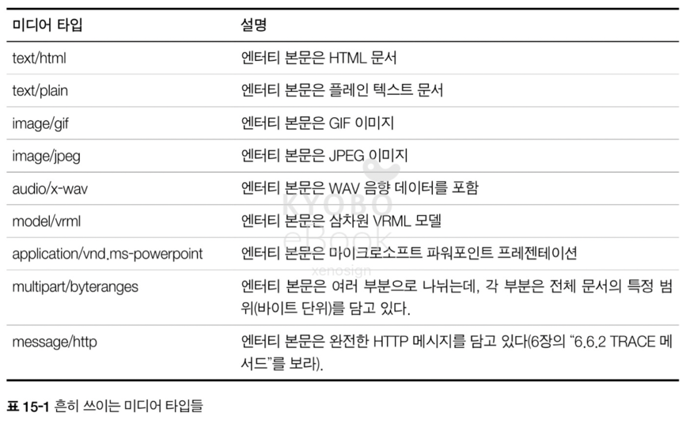
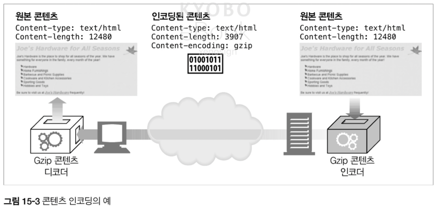

# 15. 엔터티와 인코딩

- HTTP 는 메시지를 올바르게 수성, 식별, 추출, 처리 되는 것을 보장하기 위해 잘 라벨링된 엔터티를 사용하며 이번 장에서는 아래의 내용을 다룬다
- HTTP 데이터를 담는 컨테이너인 HTTP 메시지 엔터티의 포맷과 동작 방식
- 어떻게 HTTP 가 엔터티 본문의 크기를 기술하며, 크기를 측정하기 위해 HTTP 가 무엇을 요구하는지
- 클라이언트가 콘텐츠를 바르게 처리할 수 있도록 제공되는 엔터티 헤더들
- 공간을 적제 차지하고 더 안전하게 만들기 위해 발송자가 콘텐츠 데이터 포맷을 변형할 때 사용하는, 디코딩 가능한 인코딩
- 특정 종류의 콘텐츠의 송수신을 개선하기 위해 HTTP 가 데이터를 실어 나르는 방식을 수정하는 전송 인코딩, 그 중에서도 콘텐츠의 안정적 전송을 위해 쪼개서 전당하는 청크 인코딩
- 클라이언트가 요청한 콘텐츠의 최신 버전을 가져올 수 있도록 도와주는 태그, 라벨, 시간, 체크섬의 모음
- 콘텐츠의 버전 번호처럼 동작하는 검사기들과 객체를 최신으로 유지하기 위해 설계된 HTTP 헤더 필드들
- 중단 되었던 다운로드를 중단된 지점에서부터 재개하고자 할 때 유용한 범위 요청
- 클라리언트가 전에 본 적이 있었던 웹 페이지를 다시 볼 때, 그 때 이후로 변경이 있는 부분만 요청할 수 있게 해주는 HTTP 델타 인코딩 확장
- 엔터티 콘텐츠가 프락시를 지나는 과정에서 변경된 곳이 있지 않은지 탐지하기 위해 사용하는, 엔터티 본문의 체크섬

## 15.1 메시지는 컨테이터, 언터티는 화물

- HTTP 메시지를 인터넷 운송 시스템의 컨테이너라고 생각한다면, HTTP 엔터티는 메시지의 실질적 화물
- HTTP/1.1 은 다음과 같이 10가지 주요 엔터티 헤더 필드를 정의
  - Content-Type : 객체의 종류
  - Content-Length : 메시지의 길이나 크기
  - Content-Language : 객체와 잘 대응되는 자연어
  - Content-Encoding : 객체에 대해 행해진 변형
  - Content-Location : 요청 시점을 기준, 객체의 또 다른 위치
  - Content-Range : 엔터티가 어떤 엔터티의 부분이라면, 전체 부분에서 어느 부분에 해당하는지
  - Content-Md5 : 엔터티 본문 콘텐츠에 대한 체크섬
  - Last-Modified : 서버에서 콘텐츠가 생성 혹은 마지막으로 수정 된 날
  - Expries : 엔터티 데이터가 신선하지 않다고 간주되기 시작하는 날짜와 시각
  - Allow : 리소스에 대해 허용되는 메서드
  - ETag : 이 객체의 버전에 대한 고유한 검사기
  - Cache-Control : 이 문서가 어떻게 캐시 될 수 있는지에 대한 지시자

> ETag 추가 설명
> - 스펙 상 ETag 는 `강한 검사기(strong ETag)` 와 `약한 검사기(weak ETag, W/"..." 형태)` 로 나뉘며, 전자는 바이트 단위로 동일할 때만 같다고 보고, 후자는 의미상 동등할 때 같다고 처리

### 15.1.1 엔터티 본문

- 엔터티 본문은 가공되지 않은 데이터만을 담고 있기에, 엔터티 헤더에는 데이터의 의미에 대해 설명이 필요
- 엔터티 본문은 헤더 필드이 끝을 의미하는 빈 줄(CRLF) 다음 부터 시작


## 15.2 Content-Length: 엔터티의 길이

- Content-Length 헤더는 메시지 엔터티 본문의 크기를 인코딩에 상관 없이 바이트 단위로 표기
- 메시지를 청크로 보내는 것이 아닌 이상, 전송 된 메시지가 완전한지 파악하기 위한 필수 헤더 값

### 15.2.1 잘림 검출

- 과거 HTTP 는 커넥션을 기준으로 메시지가 끝났음을 파악했지만, 현재는 메시지 잘림이나 서버 충돌의 가능성 때문에 Content-Length 를 기반으로 확인
- 캐싱 프락시 서버에서 잘린 메시지를 인식하지 못하면 캐시는 결함이 있는 콘텐츠를 계속해서 제공하는 문제 발생 가능

### 15.2.2 잘못된 Content-Length

- Content-Length 가 잘못된 값을 전달하는 경우 아예 없는 것보다 큰 피해 유발이 가능

### 15.2.3 Content-Length 와 지속 커넥션(Persistent Connection)

- 지속 커넥션은 커넥션이 닫힌 위치를 근거로 메시지의 끝을 인식할 수 없어 Content-Length 가 필수

### 15.2.4 콘텐츠 인코딩

- 콘텐츠 인코딩이 되어있다면 Content-Length 는 원본이 아닌 인코딩 된 본문의 길이를 바이트 단위로 전달
- 잘못된 어플리케이션은 원분의 크기를 보내는 경우가 있는데 이는 심각한 오류를 유발

### 15.2.5 엔터티 본문 길이 판별을 위한 규칙

1. 본문이 없어야 하는 타입(HEAD 요청 등)의 메시지에는 Content-Length 가 무시되며, 부가 정보 정도로만 사용
2. 메시지가 `Transfer-Encoding` 헤더를 포함하고 있다면 엔터티는 `0 바이트 청크` 로 끝나야 한다
3. Content-Length 가 있는 경우 Transfer-Encoding 헤더가 존재하지 않는 이상 해당 헤더는 본문의 길이를 담게 된다
4. 메시지가 `multipart/byteranges` 미디어 타입을 사용하고 Content-Length 로 길이가 정의되지 않았다면, 해당 유형은 스스로 크기를 정의할 수 있는 유일한 유형
5. 위의 규칙에 해당되지 않는다면 엔터티는 커넥션이 닫힐 때 끝난다
6. HTTP/1.0 과의 호환을 위해 엔터티 본문이 있는 HTTP/1.1 은 유효한 Content-Length 를 가져야 한다. 유효한 Content-Length 를 요구하고 싶다면 411 Length Required 응답을 보내면 된다

## 15.3 엔터티 요약

- HTTP 상에서 메시지의 일부분이 전송 중에 변형되는 일이 발생
- 엔터티에 대한 의도하지 않은 변경을 감지하기 위해, 최초 엔터티가 생성될 때 데이터에 대한 체크섬을 생성할 수 있으며 수신자는 기본적으로 체크섬 검사를 수행한다
- `Content-MD5` 헤더는 엔터티 본문에 MD5 알고리즘을 적용한 결과를 보내기 위해 사용되며, 중간에 있는 프락시와 캐시는 `Content-MD5` 헤더를 변경하거나 추가하면 안되며 추가할 경우 종단 간 무결성이 훼손

## 15.4 미디어 타입과 차셋(Charset)

- `Content-Type` 헤더는 엔터티 본문의 MIME 타입을 기술하며, MIME 타입은 전달되는 매체의 기저 형식(HTML, 워드 문서, 비디오 등)을 알려준다
- MIME 는 IANA(Internet Assigned Numbers Authority)에 의해 표준화 된 매체 타입의 이름



### 15.4.1 텍스트 매체를 위한 문자 인코딩

- `Content-Type` 헤더는 내용 유형을 더 자세히 지정하기 위한 매개 변수를 지원하며, charset 이 대표정

```http
Content-Type: text/html; charset=iso-8859-4
```

### 15.4.2 멀티파트 미디어 타입

- MIME 의 `멀티파트` 메세지는 서로 붙어있는 여러 개의 메시지를 포함하는 복합 메세지로 전송

### 15.4.3 멀티파트 폼 제출

- HTTP 폼을 제출하면 가변 길이 텍스트 필드와 업로드 될 객체는 각각 멀티파트 본문을 구성하는 하나의 부분으로 전송
- boundary 는 본문의 서로 다른 부분을 구분하기 위한 구분자로 사용

```http
Content-Type: multipart/form-data; boundary=[adjakldjaklda]
```


- 위의 폼 양식에서 텍스트 필드에 "Sally", 파일로 "essayfile.txt" 를 선택한 경우의 요청


- 사용자가 이미지 파일인 "imagefile.gif" 를 추가한 경우


### 15.4.4 멀티파트 범위 응답

- 범위 요청에 대한 HTTP 응답 또한 멀티파트가 될 수 있으며, `Content-Type: multipart/byteranges` 헤더 및 각각의 `boundary` 값을 포함해서 전달

## 15.5 콘텐츠 인코딩

- HTTP 어플리케이션은 콘텐츠를 보내기 전에 압축, 암호화 또는 별도의 목적을 이유로 인코딩해서 전송이 가능 

### 15.5.1 콘텐츠 인코딩 과정

1. 웹 서버가 원본 Content-Type 과 Content-Length 헤더를 수반한 원본 응답 메시지를 생성
2. 콘텐츠 인코딩 서버(원 서버 or 프락시)가 메시지를 인코딩하여 인코딩 메시지 생성하며, `Content-Encoding` 헤더를 추가. 인코딩에 의해 엔터티 길이가 변하지만 디코딩 시 원본의 길이는 유지되므로 Content-Length 는 변경 X
3. 수신 측은 인코딩 된 메시지를 받아서 디코딩



### 15.5.2 콘텐츠 인코딩 유형

- HTTP 는 몇 가지 표준 인코딩 유형을 정의하고 확장 인코딩 추가를 허용


### 15.5.3 Accept-Encoding 헤더

- 클라이언트가 자신이 지원하는 인코딩의 목록을 전달하기 위해 사용하는 헤더, 해당 내용이 없을 경우 어떤 인코딩이든 받아 들일 수 있는 것으로 간주
- Q(quality) 매개 변수 값(0 ~ 1) 를 통해 선호도 전달도 가능

```http
GET /logo.gif HTTP/1.1
Accept-encoding: gzip;q=1.0, *;q=0.1
```