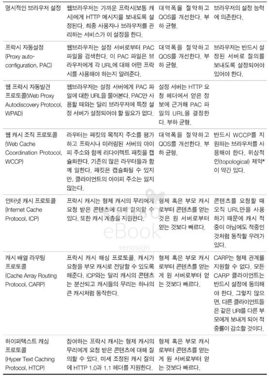
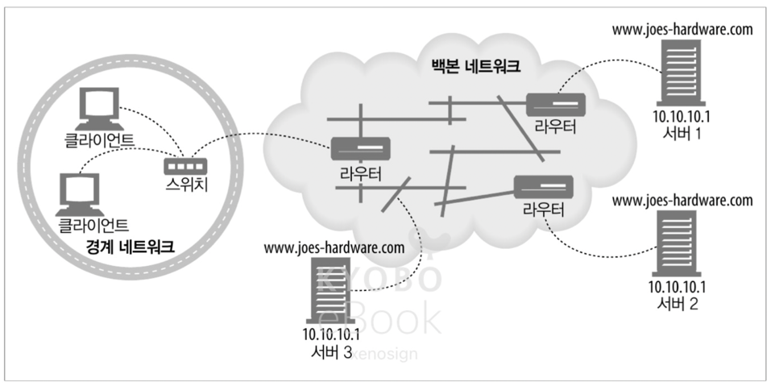
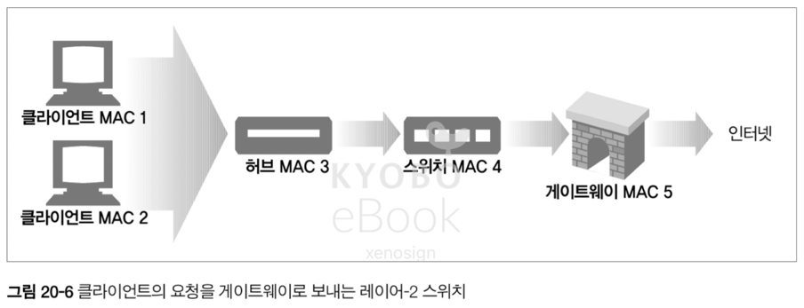
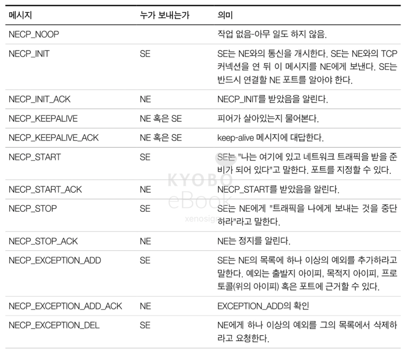

# 20. 리다이렉션과 부하 균형

- 리다이렉션 기술은 HTTP 메시지가 프락시, 캐시, 서버 팜 중에서 어디에서 끝나는지 판별하기 위해 사용되며 부하 균형(Load-balancing) 능력을 가진다

## 20.1 왜 리다이렉트인가?

- HTTP 어플리케이션은 신뢰할 수 있는 `HTTP 트랜잭션 / 지연 최소화 / 네트워크 대역폭 절약` 을 원한다
- 따라서, 웹 컨텐츠는 여러 장소에 배포되어
  - 한 곳이 다운되었을 경우 다른 곳을 이용하여 신뢰성을 개선하고
  - 더 가까운 곳에서 전달되어 지연 속도를 줄이고  
  - 부하 분산을 통해 네트워크 혼잡도 줄인다
- 어떠한 방식의 부하 균형이든 부하를 공유하는 서버들 중 하나에 전달이 되어야 하므로 리다이레션을 포함

## 20.2 리다이렉트 할 곳

- 클라이언트 입장에서는 서버, 프락시, 캐시, 게이트웨이는 사실상 서버로 인식된다
- 리다이렉트는 기본적으로 진입로의트래픽을 근처에 있는 지름길(부하가 적은 서버 or 프락시 or 캐시)로 빨아들이는 것과 같다

## 20.3 리다이렉션 프로토콜의 개요

- 리다이렉션의 목표는 HTTP 메시지를 가용한 웹 서버로 가급적 빨리 보내는 것
- 리다이렉트에 영향을 미치는 것들
  - 브라우저는 클라이언트의 메시지를 프락시 서버로 보내도록 설정
  - DNS 분석자는 클라이언트의 위치에 기반하여 도메인 접근을 가까운 서버의 아이피 주소로 선택
  - 스위치와 라우터들은 패킷의 TCP/IP 주소를 검증 및 라우팅을 결정
  - 웹 서버는 자체적으로 리다이렉트를 사용 HTTP 요청을 다른 서버로 전달 가능

 

## 20.4 일반적인 리다이렉션 방법

### 20.4.1 HTTP 리다이렉션

- 부하가 있을 경우 가용한 서버 중 가장 부하가 적은 컨텐츠 서버를 찾아서 브라우저의 HTTP 요청을 그 서버로 리다이렉트
- 리다이렉트 시에는 서버의 부하 뿐 아니라 브라우저와 서버간의 거리도 계산이 필요
- HTTP 리다이렉션의 단점
  - 어떤 서버로 리다이렉트를 보낼 지 결정하는데 많은 처리가 필요
  - 페이지에 접근 할 때, 결과적으로 2번의 왕복이 필요하여 지연 발생
  - 리다이렉트 서버가 고장나면 사이트 전체가 고장
- 위와 같은 단점으로 인해 HTTP 리다이렉션은 다른 기법과 함께 사용

### 20.4.2 DNS 리다이렉션

- DNS 는 하나의 도메인에 여러 아이피가 결부되는 것을 허용, DNS 에서 부하를 분산 가능
- 단순한 방법으로는 라운드 로빈을 사용하거나 복잡한 방법으로는 서버의 부하를 체크하여 가장 적은 부하의 서버로 보내는 것 까지 다양

#### DNS 라운드 로빈
#### 다중 주소와 라운드 로빈 주소 순환
#### 부하 균형을 위한 DNS 라운드 로빈
- 대부분의 DNS 클라이언트는 다중 주소 집합의 첫 번째 주소를 사용하므로 DNS 서버는 룩업이 끝나면 가용 주소를 순환
- DNS 순환이 이루어지지 않으면 첫번째 서버에 부하가 집중되는 문제가 발생

#### DNS 캐싱의 효과
- DNS 룩업의 결과는 캐싱에 의해 재사용이 가능하기 때문에 DNS 주소 순환에 의한 부하 균형은 완벽하지는 않지만, 부하 총량을 분산하는 것에는 적절한 효과를 보인다

#### 다른 DNS 기반의 리다이렉션 알고리즘
- 부하 균형 알고리즘 : 웹 서버의 로드를 추적하고 가장 로드가 적은 서버를 목록의 제일 위에 올려놓는 방법
- 근접 라우팅 알고리즘 : 지리적으로 분산 된, 웹 서버의 경우 DNS 가 근처의 서버로 보내는 방법
- 결함 마스킹 알고리즘 : DNS 가 서버간 네트워크의 건강 상태를 모니터링해서 라우팅

### 20.4.3 임의캐스트 어드레싱

- 지리적으로 흩어진 웹 서버들은 동일한 IP 를 가지고 있으며, 요청에 대한 처리는 백본 라우터의 최단거리 라우팅 능력에 의지하여 부하를 분산하는 방법
- 백본 네트워크에서 라우터는 특정 지리적 위치로 부터의 요청에서 제일 가까운 라우터임을 광고하고 이에 따라 라우팅을 처리한다

- 단, 서버는 반드시 라우터의 언어로 통신해야 하며 주소 충돌에 대한 처리가 없으면 라우팅 누수라는 치명적 결함 발생이 가능

> 라우팅 누수란?
> - 외부에 알려서는 안되는 경로를 외부 네트워크에 잘못 전달하는 현상
> - 위에서는 백본에서 라우터 처리에 의한 서버 결정 시, 외부에 노출 되어서는 안되는 경로가 노출되는 문제를 지적
> - 실제로는 이러한 라우팅 누수(정확히는 잘못 된 안내에 가까움)로 인해 2019 년에 ISP 의 설정 실수로 모든 요청이 특정 Cloudflare 로 누수, Cloudflare 가 마비

### 20.4.4 아이피 맥 포워딩

- 이더넷 네트워크에서 HTTP 메세지는 아이피 주소와 TCP 포트 번호로 이루어진 L4 주소 및 L2 장비(스위치 or 허브)가 처리하는 미디어 접근 컨트롤(Media Access Control, MAC) 도 가지고 있음
- 위와 같은 구조에서 L4 를 이해하는 스위치는 L4 주소(아이피 및 포트 번호) 검사하여 라우팅이 가능
  - 상황 1 : 캐시가 신선하지 않은 경우 허브(MAC3) 에서의 요청을 그대로 스위치(MAC4) 로 전달
  - 
  - 상황 2 : 캐시가 신선한 경우 스위치(MAC4)가 아닌 캐실 프락시(MAC6)로 포워딩하여 트래픽을 분산
  - 

### 20.4.5 아이피 주소 포워딩

- 아이피 주소 포워딩은 패킷을 맥 주소가 아니라 목적지 아이피 주소에 따라 라우팅, 스위치에서 업스트림의 위치를 판별이 가능하면 L3 에서 올바른 위치로 전송
- 위와 같은 종류의 전달을 네트워크 주소 변환(Network Address Translation, NAT) 이라 한다
- 아이피 주소 포워딩의 경우 스위치는 반드시 커넥션을 통해 클라이언트에게 응답을 돌려줘야 하므로 포워딩 된 요청에 대한 모든 응답을 돌려줘야 하는데 귀환 경로가 복잡해지는 문제가 발생
- 귀환 경로는 제어하는 2가지 방법
  - 완전 NAT : 패킷의 출발지 IP 주소를 스위치의 주소로 변경하여 통신한 다음, 응답 결과를 돌려주는 방식. 서버에서 클라이언트의 주소를 알 수 없어 인증이나 결제 같은 상황에서 문제가 발생 가능
  - 반(half) NAT : 출발지의 IP 주소를 그대로 유지한 상태로 전달하는 방법, 클라이언트와 서버 사이의 네트워크 전체에 통제가 필요

### 20.4.6 네트워크 구성요소 제어 프로토콜(Network Element Control Protocol, NECP)

- NECP 는 네트워크 구성 요소들(NE)이 웹 서버나 프락시 캐시와 같이 서버 구성 요소들(SE)와 대화할 수 있게 만들어준다
- 이를 통해 SE 가 NE 에게 부하 균형 정보를 제공할 수 있도록 하여, NE 가 정보를 바탕으로 부하 균형을 유지
- 이 때 MAC 포워딩, GRE(Generic Routing Encapsulation), NAT 같은 패킷 전달 방법을 사용

> GRE(Generic Routing Encapsulation) 란?
> - 데이터를 안전하고 유연하게 운반하기 위한 '가상 터널' 기술
> - 네트워크 프로토콜 패킷을 다른 프로토콜 패킷 안에 넣어서 캡슐화 한다음, 서로 다른 네트워크 사이를 터널링으로 연결하여 전달
> - 복잡한 경로를 단순화 / 다양한 프로토콜 수용 / 원본 유지 등의 장점을 가짐

#### NECP 메시지

 

## 20.5 프락시 리다이렉션 방법

- 클라이언트가 프락시로 가는 길을 아는 방법에는 명시적인 브라우저 설정 / 동적인 자동 설정 / 자연스로운 가로채기의 3가지 방법이 존재
