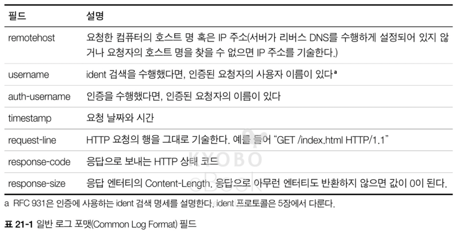
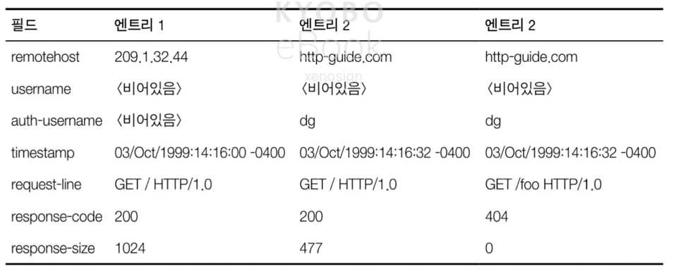
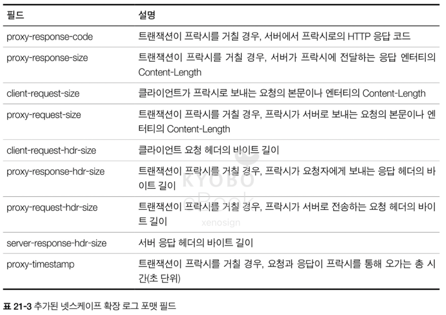
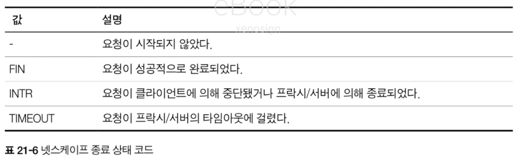
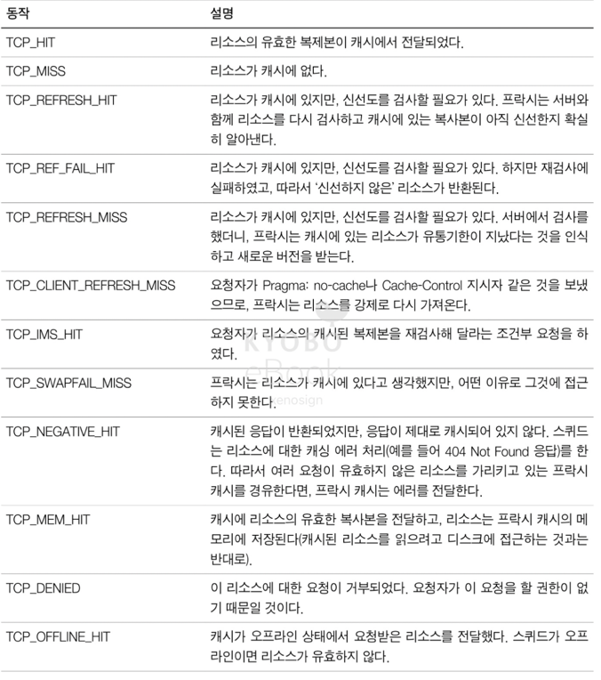
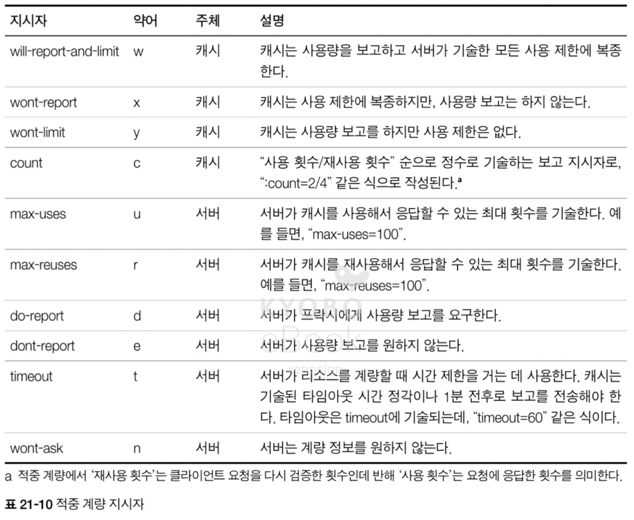

# 21. 로깅과 사용 추적

## 21.1 로그란 무엇인가?

- 로깅을 하는 이유는 서버나 프락시의 문제를 찾거나, 웹 사이트의 접근 통계를 내려고 로깅을 한다
- 이러한 통계는 마케팅, 장비 조달 계획 세우는데 용이하다
- 일반적으로 로깅하는 트랜잭션의 필드들
  - HTTP 메서드
  - 클라이언트와 서버의 HTTP 버전
  - 요청받은 리소스의 URL
  - 응답의 HTTP 상태 코드
  - 요청과 응답 메시지의 크기
  - 트랜잭션이 일어난 시간
  - Referer 와 User-Agent 헤더 값

## 21.2 로그 포맷

### 21.2.1 일반 로그 포맷(Common Log Format)

- NCSA 가 정의 했으며, 일반 로그 포맷 파일을 분석하는 수많은 상용 혹은 오픈 소스 도구가 존재

- 실제 로그 필드 예시

### 21.2.2 혼합 로그 포맷(Combined Log Format)

- 아파치 같은 서버들이 지원하며 일반 로그 포맷과 매우 유사하지만 2가지의 필드(Referer, User-Agent) 가 추가
  - Referer : 요청자가 해당 URL 을 어디서 찾았는지 표기
  - User-Agent : 요청을 만든 클라이언트 어플리케이션의 종류를 표기

### 21.2.3 넷스케이프 확장 로그 포맷

- 넷스케이프에 의해 확장된 필드 7개가 추가된 포맷

### 21.2.4 넷스케이프 확장 2 로그 포맷

- 관리자의 경우 로그에서 얻을 수 있는 정보 중에서 어떤 것이 필요할지 예측이 어렵기 때문에, HTTP 클라이언트와 프락시 간의 통신을 설계하는데 도움을 주기 위해 확장 된 로그 포맷

- 넷스케이프 라우트 코드

- 넷스케이프 종료 코드

- 

- 넷스케이프 캐시 코드

### 21.2.5 스퀴드(Squid) 프락시 로그 포맷

- 스퀴드 프락시 캐시는 1996년에 개발되어 아직까지 일부 사용되는 오픈소스 프락시/캐시 서버
- 스퀴드 프락시 캐시 서버에서 사용하는 로그 포맷

- 스퀴드 결과 코드 표

 

## 21.3 적중 계량하기

- 클라이언트와 서버 사이에는 캐시가 있어서 많은 요청이 서버까지 않고 캐시되어 로그 파일에 누락을 발생
- 따라서 정확한 로그 기록 및 광고 추적을 위해 캐시를 파기하였으나 서버와 네트워크의 부하가 발생
- 적중 계량(Hit Metering)은 위와 같은 문제를 해결하기 위한 HTTP 의 확장으로, 캐시가 정기적으로 캐시 접근 통계를 원 서버에 보고

### 21.3.1 개요

- 적중 계량 규약은 캐시와 서버가 접근 정보를 공유하고, 사용할 수 있는 캐시 리소스의 양을 제어할 수 있는 몇가지 기초적인 기능에 관한 HTTP 확장을 정의
- 적중 계량은 널리 구현되어 있거나 완벽한 해결책은 아님

### 21.3.2 Meter 헤더

- 적중 계량 확장은 Meter 헤더를 추가하여, 해당 헤더에 사용량이나 보고에 관한 지시자를 기술할 수 있도록 함
- 프락시가 보내는 요청과 서버의 응답에 Meter 헤더를 통해, 프락시는 적중 계량 수행 여부를 서버에 알리고 서버는 적중 횟수를 요구하는 형식으로 진행 

## 21.4 개인 정보 보호에 대해

- 웹 서버와 프락시는 최종 사용자의 개인 정보를 보호하는데 신경을 많이 써야 한다

> 현대에서의 로그와 사용 추적의 의미
> - 로그 포맷
>   - 여전히 Nginx, Apache 등에서 사용
>   - 단, JSON 을 도입하여 구조화된 로깅을 사용하며 ELK(Elasticsearch + Logstash + Kibana) 스택을 주로 사용
>     - Elasticsearch : JSON 구조의 로그 데이터 저장
>     - Logstash : 로그 수집 및 분석
>     - Kibana : 시각화 도구
> - 적중 계량의 경우 CDN 분석으로 완전히 대체