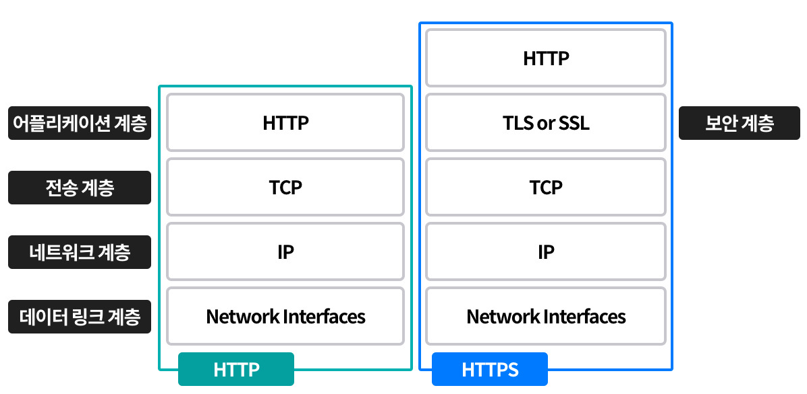

# 02. URL 과 리소스

- URL 문법, 여라 URL 컴포넌트가 어떤 의미를 가지며 무엇을 수행하는지
- 여러 웹 클라이언트가 지원하는 상대 URL 과 확장 URL 같은 단축 URL 에 대해서
- URL 의 인코딩과 문자 규칙
- 여러 인터넷 정보 시스템에 적용되는 공통 URL 스킴
- 기존 이름은 유지하면서 객체들을 다른 장소로 옮기는 것을 가능해주는 URN 을 포함한 URL 의 미래

## 2.1 인터넷의 리소스 탐색하기

- URL 은 `스킴(어떻게) / 서버의 위치(어디에) / 리소스의 경로(무엇을)` 로 구성
- `ex) 스킴://서버위치/경로`

### 2.1.1 URL 이 있기 전 암흑의 시대

- URL 이전에는 어플리케이션에 따라 다른 분류 방식을 사용
- URL 이 도입되어 브라우저에게 정보를 찾는데 필요한 정보를 단순화 & 통일 시킴

## 2.2 URL 문법

- URL 의 컴포넌트 구성
  - `<스킴>://<사용자이름>:<비밀번호>@<호스트>:<포트>/<경로>;<파라미터>?<질의>#<프래그먼트>`
- 각 구성별 역할
  - 스킴 : 리소스를 가져오기 위한 프로토콜
  - 사용자 이름 & 비밀번호 : 보안 위험으로 사용 X, ftp 와 같은 스킴에서 데이터 접근을 위해 사용되나 SFTP 또는 전용 프로그램을 통해 노출 되지 않도록 사용 권장
  - 호스트 : 리소스를 호스팅하는 서버의 호스트 명 or IP 주소
  - 포트 : 호스팅 서버의 포트 번호
  - 경로 : 서버에서 리소스가 위치한 곳의 경로
  - 파라미터 : 입력 파라미터로 **리소스의 일부를 형성**, `;`를 기준으로 여러개를 가질 수 있다
    - `ex) http://www.joes-hardware.com/hammers;sale=false/index.html;graphics=true`
  - 질의 : 쿼리 스트링으로 **리소스에 대한 추가 정보**를 전달, 어플리케이션에 추가 파라미터를 전달하는 용도
  - 프래그먼트 : 리소스의 조각이나 일부분, URL 이 특정 객체를 지칭하는 경우 서버로 전달 X → 클라이언트에서만 사용
- URL 에서 제일 중요한 컴포넌트는 스킴, 호스트, 경로

## 2.3 단축 URL

### 2.3.1 상대 URL

- `./` 로 기저 URL 을 바탕으로 리소스의 집합을 쉽게 변경 가능한 도구
- 기저 URL 은 HTML 코드에 명시 / 현재 리소스의 주소 / 기저 URL 이 없는 경우(오류 상황) 에 따라 해석이 달라진다

### 2.3.2 URL 확장

#### 호스트명 확장

- 브라우저에서 간단한 휴리스틱을 활용 하여 호스트 명을 완성 하는 경우, 단 어플리케이션에 문제 발생이 가능(6장)
- `ex) yahoo -> www.yahoo.com` 으로 확장

#### 히스토리 확장

- 사용자가 이전에 사용했던 URL 기록을 바탕으로 확장

## 2.4 안전하지 않은 문자

- URL 은 다양한 프로토콜로 전송이 가능하면서도 리소스의 위치가 유실되지 않도록 하기 위한 설계가 적용 + 가독성
- 따라서 SMTP 와 같은 프로토콜로 전송 시 제거되거나 변환되는 문자의 사용은 금지
- 알파벳 이외의 문자 전송시에는 이스케이프를 사용하여 안전하게 인코딩이 가능하도록 설계

### 2.4.1 URL 문자 집합

- 기본적으로 US-ASCII 를 사용, 단 이스케이프 문자열(%)을 사용하여 다른 언어 및 특수 문자 인코딩이 가능

### 2.4.2 인코딩 체계 & 2.4.3 문자 제한-

- URL 문법에 사용되는 예약된 문자는 이스케이프로 반드시 인코딩이 필요
- URL 이스케이프 문자 예시
  - 공백 : 공백은 다음과 같이 인코딩 / `%20`
  - URL 문법에 사용되는 문자(?, &, /, %, ;) : `? -> %3F` / `& -> 26F` / `/ -> %2F` / `% -> %25` / `; -> %3B`
  - 한글 : UTF-8 로 인코딩 / `%EA%B0%80`

### 2.4.4 좀 더 알아보기

## 2.5 스킴의 바다

- http : HyperText Transfer Protocol, 기본 포트는 80 이며 생략 가능
- https : SSL(Secure Sockets Layers) 를 사용하여 HTTP 의 양 끝단을 암호화한 프로토콜
  - SSL(TLS) : HTTP 와 TCP/IP 사이에 보안을 위해 추가된 계층으로 Socket 통신로를 확립하고 해당 Socket 의 암호화 / 인증 / 무결성을 보장
- mailto : 이멜을 위한 프로토콜로 URL 과는 상이한 포맷을 가짐 `ex) mailto:joe@joes-hardware.com`
- ftp : File Transfer Protocol, 웹 서버의 파일 접근 및 전송을 위한 프로토콜
- rtsp, rtspu : Real Time Streaming Protocol, 읽을 수 있는 오디오 / 비디오 식별자. U 는 UDP 프로토콜을 사용하는 케이스
- file : 호스트 기기의 파일에 접근하는 프로토콜
- news : 특정 문서나 뉴스 그룹 접근용 프로토콜, RFC 1036 에 정의 / 단, 리소스의 위치를 충분히 포함하지 않는 특성을 가진다

_ex) HTTP 와 HTTPS 계층도_  

## 2.6 미래

- URL 의 경우 리소스 위치가 변경되면 기능을 잃는 문제가 발생, 따라서 URN 의 개념을 도입하려는 표준 작업에 착수
- 해당 문제를 해결하기 위해 PURL(Persistent Uniform Resource Locators) 가 개발, PURL 은 DNS 와 같이 리소스 위치 중개 서버를 두고 리소스를 우회적으로 제공

### 2.6.1 지금이 아니면, 언제?

- 단, URN 으로의 변화를 위해서는 수많은 웹 서비스에 대한 적용이 필요하므로 시간이 걸릴 것으로 예상
