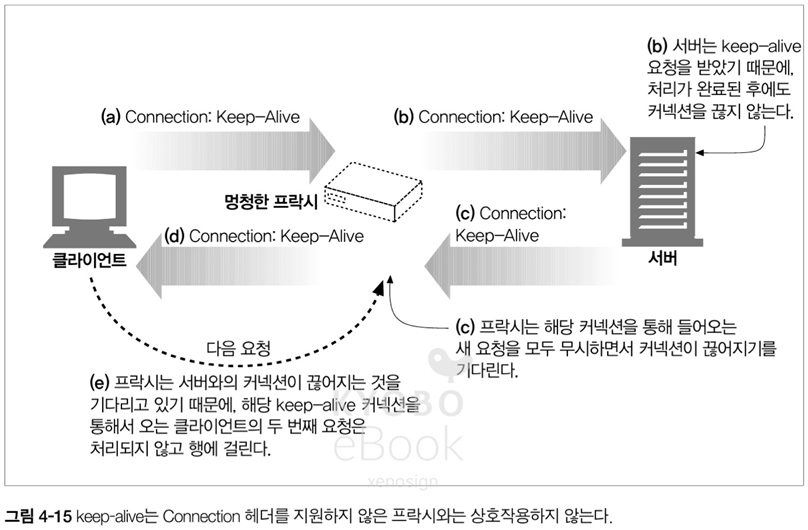

# 04. 커넥션 관리

- HTTP 는 어떻게 TCP 커넥션을 사용하는가
- TCP 커넥션의 지연, 병목, 막힘
- 병렬 커넥션, keep-alive 커넥션, 커넥션 파이프 라인을 활용한 HTTP 의 최적화
- 커넥션 관리를 위해 따라야 할 규칙들

## 4.1 TCP 커넥션

- HTTP 통신은 패킷 교환 네트워크 프로토콜들의 계층화 집합인 TCP/IP 를 통해 이루어 진다
- TCP/IP 커넥션이 수립되면 메시지들은 손실 혹은 손상되거나 순서가 바뀌지 않고 안전하게 전달

#### 커넥션 흐름 정리

1. 브라우저가 특정 호스트 명을 호출
2. 브라우저가 해당 호스트 명에 대한 IP 주소를 찾는다
3. 브라우저가 포트 번호(80)를 얻는다
4. 브라우저가 찾은 IP 주소와 포트 번호를 바탕으로 TCP 커넥션을 생성
5. TCP 커넥션 위에서 HTTP 통신을 수행

### 4.1.1 신뢰할 수 있는 데이터 전송 통로인 TCP

- HTTP 커넥션은 몇몇 규칙을 제외하고 TCP 커넥션에 불과, HTTP 의 신뢰성은 TCP 의 신뢰성에 기반

### 4.1.2 TCP 스트림은 세그먼트로 나뉘어 IP 패킷을 통해 전송된다

- TCP 는 IP 패킷(or 데이터그램)이라 불리는 작은 조각으로 데이터를 전송
- HTTP 가 메시지를 전송하고자 할 때, TCP 커넥션을 통해 메시지의 데이터를 순서대로 전달
- TCP 는 세그먼트 단위로 데이터 스트림을 자르고 세그먼트를 IP 패킷이라는 봉투에 담에서 전달

#### IP 패킷의 구성 요소
- IP 패킷 헤더 (보통 20 Byte) : IP 주소, 크기, 기타 플래그
- TCP 세그먼트 헤더 (보통 20 Byte) : TCP 포트 번호(8 Byte), TCP 제어 플래그(2 Byte), 데이터 순서 및 무결성을 위한 검사 데이터(6 Byte), 기타(4 Byte) 
- TCP 데이터 조각 (0 ~ 65,535 Byte)


### 4.1.3 TCP 커넥션 유지하기

- 컴퓨터는 항상 여러 TCP 커넥션을 포트 번호를 통해서 유지
- TCP 커넥션은 `<발신지 IP 주소, 발신지 포트, 수신지 IP 주소, 수신지 포트>` 로 식별

| 커넥션 |  발신지 IP 주소  | 발신지 포트 |   목적지 IP 주소    | 목적지 포트  |
|:----|:-----------:|:------:|:--------------:|:-------:|
| A   | 209.1.32.34 |  2034  | 204.62.128.58  |  4133   |

### 4.1.4 TCP 소켓 프로그래밍

- 소켓 API 를 통해 TCP 종단의 데이터 구조를 생성 및 데이터 구조를 연결하여 직접 데이터 스트림을 읽고 쓸 수 있다
- 보통 소켓 API 는 저 수준의 OS 인터페이스로서 HTTP 프로그래머로는 언어에서 제공하는 고수준 API 를 사용, 따라서 TCP 와 IP 의 세부사항을 숨기는 역할을 제공
- `ex) 우리는 fetch 를 쓰지만 실제적으로 해당 기능의 내부에는 소켓 API 가 사용`

## 4.2 TCP 의 성능에 대한 고려

- HTTP 의 트랜잭션은 TCP 위에 성립 되므로, TCP 의 성능에 영향을 받음

### 4.2.1 HTTP 트랙잭션 지연


- 트랜잭션을 지연 시키는 원인들
  - 방문한 적 없는 URI 접근 시, DNS 에서 IP 주소를 알아내는데 걸리는 시간
  - HTTP 트랜잭션에서 매번 발생하는 TCP 커넥션 요청을 보내고 응답을 회신하는 커넥션 설정 시간
  - 요청 메시지가 물리적 네트워크를 통해 전달되는 시간
  - 서버에서 응답을 처리하는 시간

### 4.2.2 성능 관련 중요 요소

- TCP 커넥션의 핸드셰이크 설정
- 인터넷 혼잡을 제어하기 위한 TCP 의 느린 시작(slow-start)
- 데이터를 한데 모아 한 번에 전송하기 위한 네이글(nagle) 알고리즘
- TCP 의 편승(piggyback) 확인 응답(acknowledgment)을 위한 확인 응답 지연 알고리즘
- TIME_WAIT 지연과 포트 고갈

### 4.2.3 TCP 커넥션 핸드셰이크 지연

- 새로운 TCP 커넥션을 열 때, 커넥셭을 맺기 위해 연속으로 IP 패킷을 교환하게 되는데 작은 데이터 전송 시 해당 오버헤드로 인한 성능 저하
- 크기가 작은 HTTP 트랜잭션은 50% 이상의 시간을 TCP 구성에 쓰게 되므로, HTTP 는 이미 존재하는 커넥션을 재활용


### 4.2.4 확인 응답 지연

- 인터넷 자체가 패킷 전송을 완벽히 보장하지 않기 때문에, TCP 는 순번과 데이터 무결성을 위한 체크섬을 사용
- 수신자는 확인 응답을 송신자에게 반환하는 매커니즘을 통해 패킷의 무결성을 파악
- 확인 응답을 따로 송신하는 것이 아니라 데이터 패킷에 편승 시키기 위해, 특정 시간(0.1 ~ 0.2s) 동안 버퍼에 저장하고 데이터 패킷이 발생하면 편승 시키는 확인 응답 지연 알고리즘이 사용
- 이러한 알고리즘과 편승할 데이터 패킷이 없는 케이스가 발생하게되면 지연이 발생

### 4.2.5 TCP 느린 시작(slow start)

- TCP 커넥션은 자체적으로 튜닝되어 처음에는 커넥션의 최대 속도를 제한하고 있다가 데이터가 성공적으로 전송 되면 속도 제한을 높임으로 급작스러운 서버 부하와 혼잡을 방지
- 최초에는 1개의 패킷만 전송한 다음, 확인 응답을 받으면 2개, 2개에 대한 확인 응답을 받으면 4개 까지 튜닝
- 위와 같이 튜닝 된 TCP 커넥션의 속도가 더 빠르므로 존재하는 커넥션을 재활용 하는 것이 유리하다

### 4.2.6 네이글(Nagle) 알고리즘과 TCP_NODELAY

- TCP 전송 시에는 약 40바이트 상당의 플래그와 헤더를 보내야하기 때문에 작은 크기의 데이터를 전송할 때마다 통신을하게 되면 네트워크 비효율이 발생
- 네트워크 효율을 위해서 많은 양의 TCP 데이터를 한 개의 덩어리로 합치는 알고리즘을 `네이글(Nagle) 알고리즘`이라고 한다
- 네이글 알고리즘은 세그먼트가 최대 크기(LAN 1,500 바이트 / 인터넷 수백 바이트)가 되지 않으면 전송을 하지 않음. 단, 다른 모든 패킷이 확인 응답을 받은 케이스에서는 최대 크기보다 작은 패킷의 전송을 허락
- 네이글 알고리즘을 사용하는 상황에서 확인 응답 지연이 발생하면 확인 응답에 의한 딜레이 + 패킷을 쌓는 시간이 겹쳐서 큰 비효율이 발생
- 위와 같은 상황 해결을 위해 HTTP 스택에 TCP_NODELAY 파라미터 값을 설정하여 네이글 알고리즘을 비활성화 하기도 함

### 4.2.7 TIME_WAIT 의 누적과 포트 고갈

- 서버는 커넥션 중복에 의한 패킷 충돌을 방지하기 위해 2MSL(약 2분, Two Maximum Segment Lifetimes)를 적용, 이전 접속 포트와 동일한 커넥션이 생성되어 패킷이 전달되는 상황을 방지
- 단, 서버가 `발신지의 최대 가능 포트 수 (60,000개 가정) / 2MSL (약 120초) = 초당 최대 커넥션 수 (약 500개)` 보다 처리 능력이 뛰어날 경우 포트 고갈 문제가 발생 가능

## 4.3 HTTP 커넥션 관리

### 4.3.1 흔히 잘못 이해하는 Connection 헤더

- HTTP 는 서버 사이에 프락시 서버, 캐시 서버 같은 중개 서버를 허용하며 해당 모든 서버를 거치면서 전달
- 해당 과정에서 다음 메시지를 보낸 다음 끊어져야 할 커넥션은 `Connection: close` 라고 명시 가능
- 이를 사용하여 다음 서버에 특정 헤더 필드를 전달하지 않도록 설정이 가능하며, 홉별(hop-by-hop) 헤더 명을 기술하여 Connection 헤더에 명시 된 내용이 전달 되는 것을 방지

### 4.3.2 순차적인 트랙잭션 처리에 의한 지연

- 하나의 웹 페이지에서 각기 다른 트랜잭션의 발생하고 각각의 트랜잭션이 순차적으로 새로운 커넥션을 필요로 한다면, 커넥션 수립 및 느린 시작 등 다양한 이유에 의한 지연이 발생


- 위와 같은 문제를 해결하기 위해서 `병렬 커넥션 / 지속 커넥션 / 파이프라인 커넥션 / 다중 커넥션` 를 사용

## 4.4 병렬 커넥션

- HTTP 클라이언트가 여러 개의 커넥션을 한번에 맺음으로써 여러개의 트랜잭션을 병렬로 처리하는 방식


### 4.4.1 병렬 커넥션은 페이지를 더 빠르게 내려받는다

- 커넥션 제한이 없는 가정에서 모든 병렬 커넥션이 정상 작동할 경우 이미지나 리소스를 병렬로 내려받아 커넥션 지연이 겹치게되어 총 지연 시간이 단축되며, 병렬 처리로 인해 전체 처리 시간도 단축 된다

### 4.4.2 병렬 커넥션이 항상 더 빠르지는 않다

- 네트워크 대역폭이 좁을 때에는 병렬로 받아도 성능상의 장점은 거의 없어짐
- 다수의 커넥션은 메모리를 많이 소모하고, 자체적인 성능 문제도 발생이 가능
- 서버도 다수의 커넥션이 몰리게 되면 과부화로 이어져 서버 성능에도 문제 발생이 가능
- 위와 같은 이유로 브라우저는 실제로 4개 정도의 병렬 커넥션을 사용

> 현 브라우저는 HTTP/1.1 에서는 6개를 사용하며, HTTP/2 이상 환경에서는 1개의 커넥션에 멀티 플렉싱을 사용하여 성능을 획기적으로 개선

### 4.4.4 병렬 커넥션은 더 빠르게 '느껴질 수' 있다

- 병렬 처리로 인해 사용자에게 체감상 빠르게 느껴질 수 있음

## 4.5 지속 커넥션

- HTTP/1.1 버전 부터는 처리가 완료된 이후에도 TCP 커넥션을 유지하여 앞으로 있을 HTTP 요청에 재사용

> 해당 과정에서 얻을 수 있는 이점은?

### 4.5.1 지속 커넥션 vs 병렬 커넥션

- 병렬 커넥션은 매번 새로운 연결 / 느린 시작 문제 / 커넥션 수의 제한이라는 문제가 존재
- 지속 커넥션은 튜닝된 커넥션 유지 / 커넥션 수를 줄여줌의 장점을 가지지만 관리가 잘 안될 경우 커넥션이 쌓여 클라이언트와 서버에 과부화를 유발
- 지속 커넥션은 2가지의 타입이 존재 하며 HTTP/1.0+ 의 `keep-alive` 커넥션과 HTTP/1.1 의 `지속` 커넥션이 존재

### 4.5.2 HTTP/1.0+ 의 Keep-Alive 커넥션

- HTTP/1.0 시절 지속 커넥션을 지원하기 위해 `keep-alive` 커넥션을 지원. 설계상의 문제는 HTTP/1.1 에서 수정
- 지속 커넥션을 사용하여 트랙잭션 별로 커넥션 수립에 필요한 시간 및 느린 시작등의 문제를 해결 가능


### 4.5.3 Keep-Alive 동작

- HTTP/1.0 keep-alive 커넥션을 구현한 클라이언트는 커넥션 유지를 위해 `Connection: Keep-Alive` 헤더를 포함하고 서버 역시 응답에 `Connection: Keep-Alive` 를 포함. `Connection: Keep-Alive` 헤더가 포함 시 커넥션을 유지하며 아닐 경우 커넥션을 종료

### 4.5.4 Keep-Alive 옵션

- `Keep-Alive` 헤더는 커넥션을 유지하기 바라는 요청일 뿐, 서버의 선택에 따라 결정
- `Keep-Alive` 은 선택 사항이며, `Connection: Keep-Alive` 헤더가 있는 경우에만 유효

*ex) 헤더 예시*
```http
Connection: Keep-Alive
Keep-Alive: max=5, timeout=120
```

### 4.5.5 Keep-Alive 커넥션 제한과 규칙

- `Keep-Alive` 는 HTTP/1.0 에서 기본 사용 X, `Connection: Keep-Alive` 필요
- 커넥션을 계속 유지하려면 `Connection: Keep-Alive` 요청 헤더를 보내야 함
- 커넥션 유지를 위해서는 엔터티 본문의 길이를 알 수 있어야만 한다
- 프락시와 게이트웨이는 `Connection 헤더`의 규칙을 철저히 지켜야 한다
- `Keep-Alive` 는 `Connection 헤더`를 이해할 수 없는 프락시 서버와 통신해서는 안된다.
- HTTP/1.0 을 따르는 기기로 부터 오는 `Connection 헤더`는 무시해야 한다. HTTP/1.0 을 사용하는 프락시 서버로부터 실수로 전달이 가능
- 응답 전체를 받기 전에 커넥션이 끊어졌다면 클라이언트는 요청을 다시 보낼 준비가 되어 있어야 한다

### 4.5.6 Keep-Alive 와 멈청한(Dumb) 프락시



- HTTP/1.0 을 사용하는 프락시는 `Connection: Keep-Alive` 를 이해하지 못하고 서버에 전달하고 두 서버는 커넥션을 유지
- 프락시는 서버로 받은 `Connection: Keep-Alive` 이 헤더에 포함된 응답을 클라이언트에 전달하고 클라이언트는 나머지 요청을 전달 시작
- 프락시는 `Connection: Keep-Alive` 를 모르는 상태이므로 이미 종료가 되었어야할 커넥션에서 오는 요청을 무시하고 서버로 전달 X
- 서버는 `Connection: Keep-Alive` 로 인해 만들어진 지속 커넥션 상으로부터 요청을 받지 못하고 서버 타임 아웃을 반환

> 프록시가 HTTP/1.0 이면 지속 커넥션은 불가능 할까요?

### 4.5.7 Proxy-Connection 살펴보기

- 모든 헤더를 무조건 전달하는 문제를 해결하기 위해 `Proxy-Connection` 헤더를 사용하여 해결
- `Proxy-Connection` 을 사용하면 프록시가 HTTP/1.1 을 지원하면 해당 헤더를 `Connection` 헤더로 변환하여 전달하여 문제를 해결


- 그럼에도 전체 흐름에서 멍청한 프락시가 있는 경우 문제는 동일하게 발생한다

### 4.5.8 HTTP/1.1 의 지속 커넥션

- HTTP/1.1 에서는 `keep-alive` 커넥션을 지원하지 않는 대신, 모든 커넥션을 기본으로 지속 커넥션 처리하도록 설계
- 따라서 요청이 끝나고 커넥션을 종료하고 싶을 경우에는 `Connection: close` 헤더를 명시

### 4.5.9 지속 커넥션의 제한과 규칙

- 클라이언트가 요청에 `Connection: close` 헤더를 포함해 보냈으면, 클라이언트는 해당 커넥션으로 추가 요청 불가
- 클라이언트는 해당 커넥션으로 추가 요청을 보내지 않을 경우 `Connection: close` 를 포함
- 커넥션의 모든 메시지는 자신의 길이 정보를 정확히 가지고 있을 때(Content-Length 값 또는 청크 인코딩 필요)에만 커넥션 지속이 가능
- HTTP/1.1 프락시는 클라이언트와 서버 각각에 별도의 지속 커넥션을 맺고 관리 필요
- HTTP/1.1 기기는 `Connection` 헤더의 값과 상관 없이 언제든지 커넥션을 끊을 수 있음
- HTTP/1.1 어플리케이션은 언제든 커넥션을 복구할 수 있어야 함
- 클라이언트는 최대 2개의 지속 커넥션만을 유지해야 한다

## 4.6 파이프라인 커넥션

- HTTP/1.1 은 지속 커넥션을 통해 첫번째 요청이 서버에 전달 후, 나머지 요청들을 파이프라이닝하여 TCP 커넥션 지연을 단축


### 파이프라인 커넥션의 제약 사항
- 클라이언트는 커넥션이 지속 커넥션인지 확인하기 전 까지는 파이프라인을 이어서는 안된다
- HTTP 메시지는 순번이 없어서 순서 정렬이 불가능 하므로, HTTP 응답은 요청 순서와 같게 와야한다
- HTTP 클라이언트는 커넥션이 끊어져도, 파이프라인에 요청이 남아있으면 언제든 다시 요청을 보낼 수 있어야 한다
- POST 요청과 같이 비멱등(nonidempotent) 요청은 파이프라인을 통해 보내면 안된다

> 클라리언트에서 비멱등 요청을 연속해서 보내면 안되겠지만, 백엔드 서버에서 멱등성 처리는 어떤 식으로 하면 좋을까요?

## 4.7 커넥션 끊기에 대한 미스터리

### 4.7.1 '마음대로' 커넥션 끊기

- HTTP 는 구조적으로 언제든지 커넥션을 끊을 수 있지만 문제 발생을 야기한다

### 4.7.2 Content-Length 와 Truncation

- 커넥션이 끊어진 이후, 실제 전달 된 `엔터티의 길이`와 `Content-Length` 를 비교하고 서로 다를 경우 서버에 확인 필요
- 프락시는 `Content-Length` 를 캐시하면 안되고, 메시지를 받은 그대로 전달 해야만 문제 방생을 막을 수 있다

### 4.7.3 커넥션 끊기의 허용, 재시도, 멱등성

- 클라이언트가 트랜잭션을 수행 중에 전송 커넥션이 끊기게 되면 클라이언트는 멱등성이 보장되는 범위에서 커넥션을 다시 맺고 한 번더 요청을 보내야 한다
- 파이프라인 커넥션의 경우 위와 같은 경우에서 더 어려움이 발생
- 여러번 실행되어도 같은 결과를 반환한 멱등성은 GET, HEAD, PUT, DELETE, TRACE, OPTIONS 메서드에서 보장 / POST 메서드는 비보장

### 4.7.4 우하안 커넥션 끊기

#### 전체 끊기와 절반 끊기
- TCP 커넥션은 데이터를 읽거나 쓰기 위한 입력 큐와 출력 큐가 양방향으로 존재
- `close()` 를 호출하면 양방향을 전부 끊으며 `전체 끊기`라고 부른다
- `shutdown()` 을 호출하면 하나를 개별적으로 끊으며 `절반 끊기`라고 부른다

#### TCP 끊기와 리셋 에러
- 단순한 HTTP 커넥션은 `전체 끊기` 만 사용
- 하지만 어플리케이션이 클라이언트 - 서버 - 프락시 등과 파이프라인으로 통신할 때, 예상치 못한 에러는 막기 위해서는 `절반 끊기` 사용 필요
- 입력 채널을 끊게 되면 잘못된 정보가 전달이 가능하며, 서버에 이상 현상을 일으킬 수 있으므로 보통은 출력 채널을 끊는 것이 안전

#### 우아하게 커넥션 끊기
- 최선의 케이슨느 자신의 출력 채널을 끊고 반대편의 기기 출력 채널이 끊기는 것을 기다리는 것. 이렇게 되면 리셋의 위험 없이 커넥션이 완전히 종료
- 단, 상대방이 `절반 끊기`를 구현했다는 보장과 검사를 한다는 보장이 없으므로 상태 검사를 주기적으로 하는 것이 권장