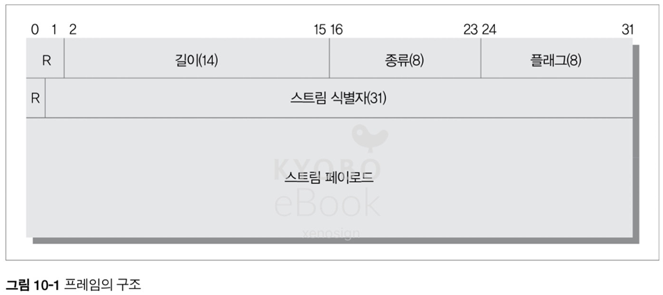

# 10. HTTP/2.0

## 10.1 HTTP/2.0 의 등장 배경

- HTTP/1.1 의 메시지 포맷은 구현의 단순성과 접근성에 주안점을 두고 최적화되어 성능상의 희생이 발생
- 요청 하나를 보내고 응답 하나를 받는 구조는 단순함이라는 장점 대신 응답 이후 다시 요청을 보낼 수 있는 `회전 지연`이 필연적으로 발생
- 이러한 문제를 해결하고자 2009년 구굴에서 `SPDY` 프로토콜을 개발
- `회전 지연`을 줄여서 `SPDY` 는 20ms -> 12.34% / 80ms -> 23.85% / 200ms -> 26.79% 의 성능 향상
- 2013년 기준 HTTP/2.0 은 8번째 초안까지 나온 상태

> 현재는 HTTP/2.0 이 보편적으로 사용되고 있으며 HTTP/3.0 도 일부 사용이 되고 있음
> - HTTP/3.0 은 구글의 `QUIC` 프로토콜 기반 개발
> - HTTP/2.0 의 경우 TCP 레이어에서 선두 요청이 막히면 뒤따르는 패킷이 전부 지연되는 `HOLB(Head-of-Line Blocking)` 현상이 있었는데, HTTP/3.0 은 UDP 를 사용하여 해결
> - 3 ~ 6 번의 왕복이 필요한 연결 수립 과정을 0 ~ 1 왕복으로 단축

## 10.2 개요

- HTTP/2.0 은 TCP 커넥션 위에서 동작하며, 하나의 커넥션 위에서 여러 개의 스트림이 동시에 만들어지며 스트림은 한쌍의 요청과 응답을 처리
- 기존 웹 어플리케이션과의 호환성을 위해서 HTTP/2.0 은 요청과 응답 메시지의 의미를 HTTP/1.1 과 같도록 유지

## 10.3 HTTP/1.1 과의 차이점

### 10.3.1 프레임

- HTTP/1.1 에서 메시지가 일반 텍스트(Plain Text)로 전달 되던 것과 달리 HTTP/2.0 에서 모든 메시지는 프레임에 담겨 전송
- 프레임은 8바이트의 헤더로 시작하며, 최대 16383 바이트 크기의 페이로드가 온다
- HTTP/2.0 은 DATA, HEADERS, PRIORITY, RST_STREAM, SETTINGS, PUSH_PROMISE, PING, GOAWAY, WINDOW_UPDATE, CONTINUATION 의 10가지 프레임을 사용

### 10.3.2 스트림과 멀티 플렉싱

- HTTP/1.1 은 한 TCP 커넥션을 통해 요청을 보냈을 때, 응답을 받은 다음에만 같은 TCP 커넥션으로 다시 요청을 보낼 수 있었음
- HTTP/2.0 의 경우 하나의 커넥션에서 요청과 응답을 처리하는 여러 스트림을 동시에 만들어 보내는 멀티 플렉싱을 통해 문제를 해결
- 서버와 클라이언트는 스트림을 만들 때, 연결 수립에 필요한 지연을 피하기 위해 서로 협상 없이 일방적으로 만든다

### 10.3.3 헤더 압축

- HTTP/1.1 시절에는 헤더는 아무런 압축 없이 전달이 되었지만, 최근의 페이지는 수백번의 요청이 오고가기 때문에 헤더의 압축이 필요
- 헤더는 `HPACK` 명세에 정의된 `압축 콘텍스트`를 사용 압축되어 '헤더 블록 조각'으로 쪼개져서 전송

### 10.3.4 서버 푸시

- HTTP/2.0 은 서버가 하나의 요청에 대한 응답으로 여러개의 리소스를 임의로 푸시할 수 있도록 하여 잦은 요청 및 지연을 줄인다
- 서버는 `PUSH_PROMISE` 프레임을 보내어 클라이언트에게 미리 공지 후, 예약된 상태로 처리가 가능
- 클라이언트에서 거부할 경우에는 `RST_STREAM` 을 보내서 스트림을 닫을 수 있음

## 10.4 알려진 보안 이슈

### 10.4.1 중개자 캡슐화 공격

- HTTP/2.0 의 헤더 필드는 어떤 문자열이든 사용이 가능하여, HTTP/2.0 메시지를 HTTP/1.1 메시지로 변경하는 경우 불법적이거나 위조된 HTTP/1.1 메시지로 변경될 수 있다
- 반대의 경우는 이런 문제가 발생하지 않음

### 10.4.2 긴 커넥션 유지로 인한 개인정보 누출 우려

- HTTP/2.0 은 클라이언트와 서버 사이의 커넥션을 오래 유지할 수 있으므로, 이전 브라우저 사용자의 개인정보 유출에 악용이 가능