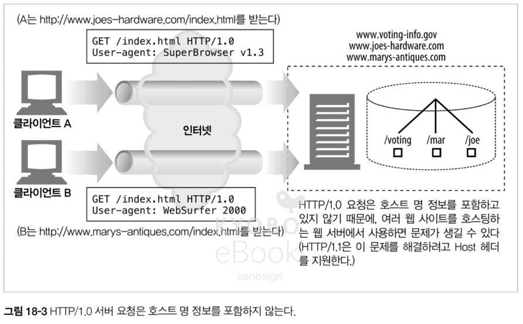
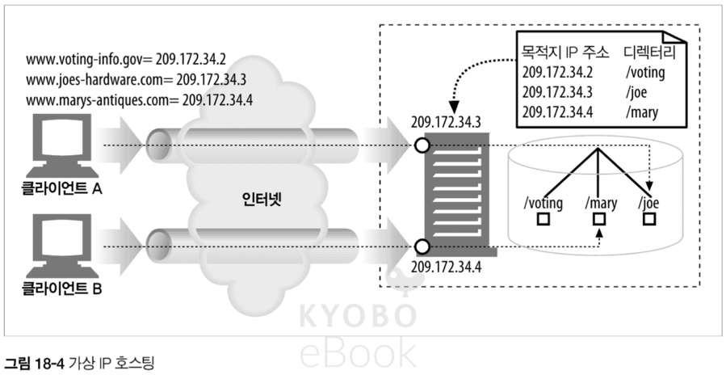
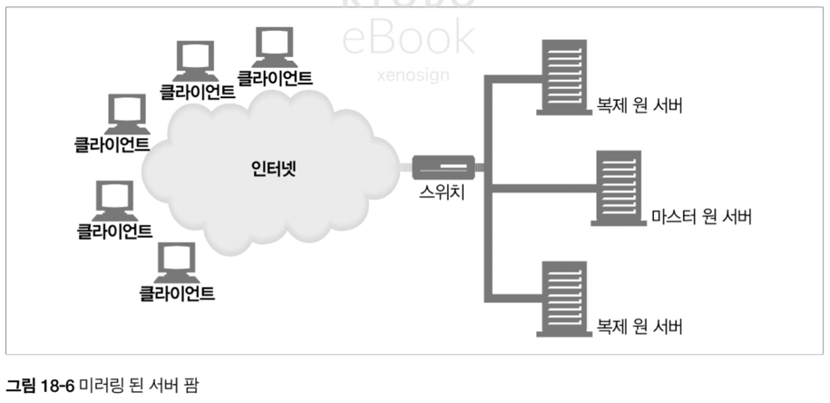

# 18. 웹 호스팅

- 콘텐츠 리소스를 저장, 중개, 관리하는 일을 통틀어 웹 호스팅이고 한다
- 이 장에서 배울 내용
  - 여러 웹 사이트를 같은 서버에 "가상 호스팅" 하는 법, 그리고 그것이 HTTP 에 끼치는 영향
  - 트래픽이 많은 상황에서 안정적인 사이트를 구축하는 방법
  - 웹 사이트 로딩을 더 빠르게 하는 방법

## 18.1 호스팅 서비스

### 18.1.1 간단한 예 : 전용 호스팅

- 사람들은 직접 서버를 구매하고 유지보수하는 대신, ISP(Internet Service Provider)로 부터 전용 웹 서버를 임대해서 사용 가능

## 18.2 가상 호스팅

- 많은 웹 호스팅 업자는 서버 한 대를 여러 고객이 공유하게 해서 저렴한 웹 호스팅 서비스를 제공, 이를 가상 호스팅이라 한다
- 호스팅 업자는 복제 서버 더미(= 서버 팜)를 만들고, 서버 팜에 부하를 분산하는 방식을 사용

### 18.2.1 호스트 정보가 없는 가상 서버 요청

- HTTP/1.0 명세는 하나의 웹 서버가 한 웹 사이트만 호스팅 할 것이라 예측, 공용 웹 서버가 호스팅하고 있는 가상 웹 사이트에 누가 접근하고 있는지 식별하는 기능이 없어 가상 호스팅에 관한 설계 결함이 존재
- ex) `http//gg.com/index.html` 에 접근하려고 하면 `GET /index/html` 을 요청.  같은 서버에서 호스팅되는 `http//gl.com/index.html` 에 접근하려고 해도 `GET /index/html` 요청

## 18.2.2 가상 호스팅 동작하게 하기

- HTTP/1.0 에서도 가상 호스팅을 사용하기 위해서 아래의 4 가지 방법이 탄생

#### URL 경로를 통한 가상 호스팅
- URL 에 특별한 경로 컴포넌트를 추가
- ex) `GET /joe/index.html` 과 `GET /mary/index.html` 과 같이 경로 컴포넌트를 추가

#### 포트 번호를 통한 가상 호스팅
- 각 사이트 별로 다른 포트 번호를 부여
- 단 80번이 아닌 비표준 포트를 사용자가 직접 입력해야 하는 불편함이 존재

#### IP 주소를 통한 가상 호스팅
- 각 사이트에 IP 주소를 할당하고 각각 도메인에 할당 된 IP 를 연결, 모든 IP 주소는 하나의 서버에서 처리
- 시스템이 처리할 수 있는 IP 개수의 제한으로 인해 한계가 발생

#### Host 헤더를 통한 가상 호스팅
- HTTP/1.1 에서는 모든 요청에 호스트명 과 포트를 전달하는 `Host 요청 헤더`를 정의하고, 이를 통해 해결

### 18.2.3 HTTP/1.1 Host 헤더

#### 문법과 사용 방법
- `Host = "Host" ":" 호스트[ ":"포트 ]`
  - ex) Host: www.gg.com
- Host 헤더의 규칙
  - 포트가 기술되어 있지 않으면, 기본 포트(80) 사용
  - URL 에 IP 주소가 있으면, Host 헤더는 같은 주소를 포함
  - URL 에 호스트 명이 기술되어 있으면, Host 헤더는 같은 호스트 명을 포함
  - URL 에 호스트 명이 기술되어 있으면, Host 헤더에는 IP 주소가 포함되서는 안된다 (하나의 IP 에서 여러 도메인을 호스팅 하는 경우에 대비)
  - 프락시 사용시 Host 헤더에는 프락시가 아닌 원 서버의 호스트 명과 포트를 기술
  - 모든 요청 메시지에는 Host 헤더가 필수
  - HTTP/1.1 서버는 Host 헤더가 없는 경우 400 에러를 반환

#### Host 헤더의 누락
- 낡은 클라이언트에서 Host 헤더를 누락해서 보내는 경우, 서버는 사용자를 기본 웹페이지로 보내거나 브라우저 업그레이드를 제안 가능

#### Host 헤더 해석하기
1. HTTP 요청 메시지에 전체 URL 이 있으면 Host 헤더 값 보다는 URL 을 사용
2. 요청 메시지의 URL 에 호스트 명이 없다면 Host 헤더 값에서 호스트 명과 포트를 가져온다
3. 1, 2 를 만족하지 못하면 400 Bad Request 반환

#### Host 헤더와 프락시
- 몇몇 낡은 브라우저의 경우 원서버가 아닌 프락시의 이름을 Host 헤더에 담아 전송하는 문제가 있었음

## 18.3 안정적인 웹 사이트 만들기

- 웹 사이트의 대표적 장애 서버 다운 / 트래픽 폭증 / 네으워크 장애나 손실에 대처하는 방법을 알아보자

### 18.3.1 미러링 된 서버 팜

- 서버 팜에서 한 서버에 문제가 생기면 다른 곳에서 처리할 수 있도록 미러링이 가능
- 네트워크 스위치 등을 사용해서 서버 팜에서 각각 서버에 분산 요청을 보내는 방식을 사용

> 현대적인 방법은 무엇을 사용할까?
> - 물리적 처리(네트워크 스위치)는 가장 하위 레이어에서 사용하고 있으며, 대규모 데이터 센터나 초고속 트래픽 처리가 필요한 경우에 사용.
>   - 전용칩 사용으로 SW 에 의한 처리보다 훨 빠름. 하지만, 클라우드 시스템이 표준화 되어 해당 부분은 클라우드 제공 업체에 맡기는 편
> - 실질적으로는 물리적 처리 + SW 처리가 혼용된 AWS 의 로드 밸런싱 서비스를 사용
>   - GLB(Gateway Load Balancer) : 3계층(IP) 레벨에서 보안 검사 및 방화벽 처리
>   - NLB(Network Load Balancer) : 4계층(TCP/UDP) 레벨에서 IP 기반 라우팅
>   - ALB(Application Load Balancer) : HTTP 요청을 보고 경로/헤더/쿠키 기반의 SW 라우팅

### 18.3.2 콘텐츠 분산 네트워크

- CDN(Content Delivery Network) 는 특정 콘텐츠의 분산을 목적으로 하는 네트워크

### 18.3.3 CDN 의 대리 캐시

- 대시 서버는 미러링 된 웹 서버처럼 콘텐츠에 대한 요청을 받지만, 원 서버의 전체 콘텐츠를 복제하는 것이 아니라 클라이언트가 요청하는 콘텐츠만 저장한다

### 18.3.4 CDN 의 프락시 캐시

- 프락시 캐시는 콘텐츠 요청이 있을 때만 저장이 되므로 미러링 서버와 다른 방식으로 동작하며, 스위치 또는 라우터가 중간에서 웹 트래픽을 가로채서 처리하기도 한다

## 18.4 웹 사이트 빠르게 만들기

- 서버 팜, 분산 프락시 캐시 등은 콘텐츠를 더 가깝게 만들어 주므로 더 빠른 웹 사이트 구축에 도움이 된다
- 또한 콘텐츠 인코딩을 통해서도 웹 사이트 속도를 높일 수 있다

