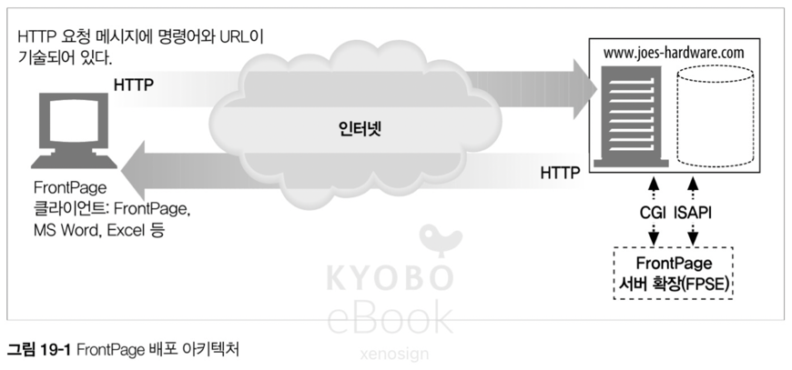
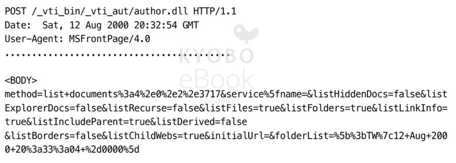
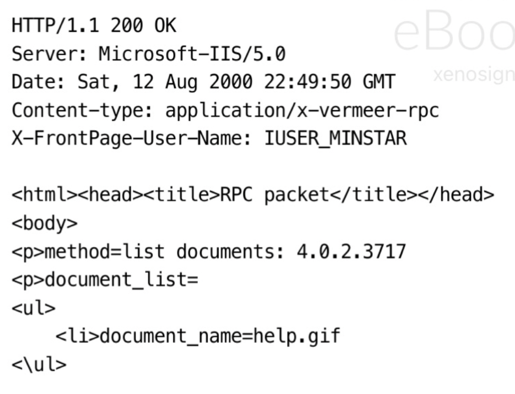
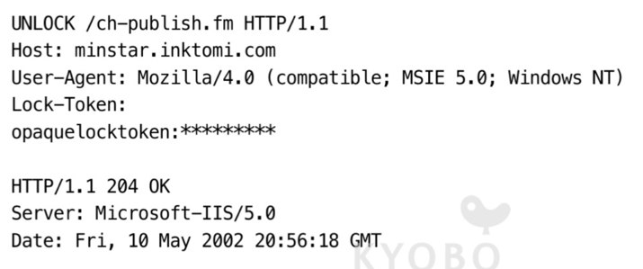
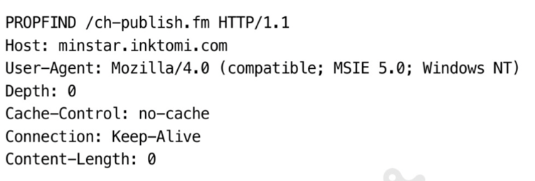
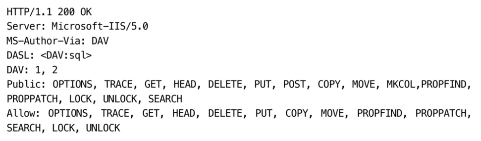

# 19. 배포 시스템

## 19.1 배포 지원을 위한 FrontPage 서버 확장

- FrontPage(FP) 는 다양한 기능을 제공하는 MS 의 웹 개발 및 배포 도구 집합

### 19.1.1 FrontPage 서버 확장

- "어디서든 배포한다" 라는 전략으로 FrontPage Server Extensions(FPSE) 서버측 SW 출시
- FPSE 는 웹 서버와 통합되어 FrontPage 로 작성 된 클라이언트와 서버 사이에 필요한 변환 작업을 수행
- HTTP POST 요청을 기반으로 RPC(Remote Procedure Call) 계층을 구현하여, FP 가 FPSE 를 이용 서버에 명령을 보낼 수 있도록 설계
- MS 의 IIS(Internet Information Services) 서버가 아니면 CGI 구성이 된 서버에서 적용이 가능



> IIS(Internet Information Services) 서버
> - MS 에서 개발한 Windows Server 와 긴밀 하게 통합
> - ASP.NET, PHP, Node.js 등 언어 지원
> - HTTP, HTTPS, FTP, SMTP 등 프로토콜 지원
> - 장점 : Windows 환경에 최적화, GUI 관리, .NET 완벽 지원
> - 단점 : Windows 서버 라이선스 필요, 리눅스 미지원

### 19.1.2 FrontPage 용어

#### 가상 서버
- 물리 서버에 올라간 가상 서버로, 가상 서버 하나당 웹 사이트를 호스팅

#### 루트 웹
- 웹 서버의 최상위 디렉토리

#### 서브 웹
- 루트 웹의 하위 디렉토리 또는 서브 웹의 하위 디렉토리

### 19.1.3 FrontPage RPC 프로토콜

- FP 의 PRC 프로토콜은 POST 요청으로 서버에 있는 대상 프로그램의 이름과 위치를 결정하는 방식으로 동작
- 위치에 있는 파일이 반환 되면 FP 클라이언트는 응답을 읽고 FPShtmlScriptUrl, FPSAuthorScriptUrl, FPSAdminScriptUrl 과 관련된 값을 읽고 처리

```
FPShtmlScriptUrl="_vti_bin/_vti_rpc/shtml.dll" (일반 사용자의 브라우징 명령에 대한 요청을 처리하는 파일)
FPSAuthorScriptUrl="_vti_bin/_vti_rpc/author.dll" (저작 사용자의 명령에 대한 요청을 처리하는 파일)
FPSAdminScriptUrl="_vti_bin/_vti_rpc/admin.dll" (관리 사용자의 명령에 대한 요청을 처리하는 파일)
``` 

#### 요청
- POST 요청의 본문에는 "method=<command>" 형식의 RPC 명령과 함께 필요한 모든 매개 변수가 띄어쓰기는 + 로 나머지는 아스키 펴현으로 인코딩 되어 기술



- 위 이미지의 실제 명령

```
method=list+document:4.0.1.3717
&service_name=
&listHiddenDocs=false
&listExploreDocs=false
``` 

- service_name : 메서드가 수행되어야 하는 웹 사이트의 URL
- listHiddenDocs : 웹의 숨겨진 문서를 보여주는 옵션
- listExploreDocs : "true" 일 경우 태스크 리스트를 나열

#### 응답
- FPSE 가 요청을 처리하고 FP 클라이언트에 반환하는 응답. 일반적으로 성공과 에러가 존재



### 19.1.4 FrontPage 보안 모델

- FPSE 의 보안 모델은 사용자를 관리자 / 저작자 / 일반 사용자로 구분하여 처리
- IIS 서버에서 권한 여부는 주어진 명령의 루트에 대한 ACL 을 보고 검사
- 명령어에 기술 된 동적 링크 라이브러리(Dynamic Link Libraries, DLL) 를 기반으로 권한 검증을 수행
- FPSE 의 경우 관리자가 엉성하게 관리하는 경우 보안에 큰 취약점이 발생

## 19.2 WebDAV(Web Distributed Authoring and Versioning) 와 공동 저작

### 19.2.1 WebDAV 메서드

- WebDAV 는 새로운 HTTP 메서드 집합을 정의하고 HTTP 메서드의 동작 범위를 수정
- PROPFIND(Property Find) : 리소스의 속성을 읽는다
- PROPPATCH(Property Patch) : 리소스에 대해 속성을 설정
- MKCOL : 콜렉션을 생성
- COPY : 원본지에서 목적지로 리소르를 복사
- MOVE : 특정 소소를 목적지에 이동
- LOCK : 리소스를 잠근다
- UNLOCK : 리소스 잠금을 해제

### 19.2.2 WebDAV 와 XML

- HTTP 헤더 만으로는 여러 리소스와 계층을 표현하기 어려워 WebDAV 는 XML(Extensible Markup Language) 를 아래의 용도로 지원
  - 데이터를 어떻게 처리할 것인지 설명
  - 서버의 복잡한 응답을 표현
  - 콜렉션과 리소스를 처리하는 데 사용하는 커스텀 정보의 포맷
  - 데이터 자체를 표현할 수 있는 유연한 포맷
  - 국제화 관련 문제를 해결하기 위한 방안
- WebDAV 는 "DAV:" 라는 XML 전용 Namespace 를 정의

### 19.2.3 WebDAV 헤더

- WebDAV 는 기능을 넓히기 우해 HTTP 헤더를 도입

#### DAV
- WebDAV 를 제공하는 서버와 통신할 때 사용되며, OPTIONS 요청 대한 헤더에 이를 포함해야 함

#### Depth
- 여러 수준의 계층 구조로 분리된 리소스에 WebDAV 를 사용하기 위한 요소

#### Destination
- COPY 나 MOVE 의 목적지 URI 식별용

#### If
- 헤더의 조건 집합을 기술하기 위해 사용되며, 해당 조건이 맞지 않으면 요청이 실패

#### Lock-Token
- LOCK 을 제거하기 위해 UNLOCK 메서드에 사용

#### Overwrite
- 대상을 덮어쓸지 말지를 정하며, COPY 나 MOVE 에 사용

#### Timeout
- 클라이언트가 핑요한 잠금 타임아웃 값을 기술

### 19.2.4 WebDAV 잠금과 덮어쓰기 방지

- WebDAV 는 공동 작업 시, 특정 사용자의 작업이 덮어씌워지는 것을 막기 위해 LOCK 개념을 지원


- 해당 잠금은 리소스나 콜렉션에 대한 배타적 쓰기 잠금 / 공유된 쓰기 잠금, 2가지 버전을 제공
- 배타적 쓰기 잠금은 잠금 소유자만 쓸 수 있게 보장
- 공유된 쓰기 잠금은 여러 사람으로 이루어져 있는 그룹이 하나의 문서에서 작업이 가능하게 가능. 단, git 같은 개념이 아니라서 주의가 필요

### 19.2.5 LOCK 메서드

- WebDAV 에서는 한 개의 LOCK 요청으로 여러 개의 리소스 잠금이 가능

```
LOCK /ch-publish.fm HTTP/1.1
Host: minstar
Content-Type: text/xml
User-Agent: Mozilla/4.0 (compatible; MSIE 5.0; Windows NT)
Content-Length: 201

<?xml version="1.0"?>
<a:lockinfo xmlns:a="DAV:">
    <a:lockscope><a:exlusive /></a:lockscope>
    <a:locktype><a:write/></a:locktype>
    <a:owner><a:href>Author</a:href></a:owner>
</a:lockinfo>
```

- `<locktype>` : 잠금 형식
- `<lockscope>` : 배타적 잠금 / 공유된 잠금 표시
- `<owner>` : 잠금의 소유자 표시


<br />*잠금 요청에 성공한 경우의 응답*

- `<locktoken>` : opaquelocktoken 토큰으로 잠금을 식별하는데 사용
- `<depth>` : Depth 헤더와 같은 값
- `<timeout>` : 잠금에 대한 타임 아웃

#### opaquelocktoken 스킴
- 언제든 모든 리소스에 유일한 토큰을 제공하기 위해 UUID(Universal Unique Identifier)를 사용하여 설계

#### lockdiscovery 요소
- 활성화 되어있는 잠금을 찾는 메커니즘을 제공

#### 잠금 갱신과 Timeout 헤더
- 잠금 갱신을 위해 클라이어트는 if 헤더에 잠금 토큰과 잠금 요청을 보내고, 반환 된 값을 받는데 이때 timeout 값은 이전의 timeout 값과 다르다
- 따라서 클라이언트는 LOCK 요청 안에 필요한 timeout 값을 기술해

### 19.2.6 UNLOCK 메서드

- UNLOCK 메서드는 다이제스트 인증을 성공하고 Lock-Token 헤더에 있는 잠금 토큰이 맞는지 검사하여 잠금을 제거


<br />*LOCK 요청*


<br />*LOCK, UNLOCK 요청에 사용 가능한 상태 코드*

### 19.2.7 속성과 META 데이터

- META 태그에는 리소스의 정보을 담은 속성 값(저작자 이름, 수정 날짜, 내용 등급 등)을 기술
- WebDAV 와 같은 분산 협업 시스템은 META 태그에 더 복잡한 속성을 가진다
  - 저작자와 순간에 따라 달라지는 속성은 'live' 속성으로 부르며, 변하지 않는 Content-Type 같은 속성은 'dead' 속성으로 부른다
- WebDAV 는 속성의 바라견과 수정을 지원하기 위해 PROPFIND, PROPPATCH 라는 메서드를 확장 지원

### 19.2.8 PROPFIND 메서드

- 주어진 파일이나 파일 그룹의 속성을 읽는데 사용하는 메서드



- `<allprop>` : 반환될 모든 속성의 이름과 값을 기술
- `<propname>` : 반환되 속성 이름의 집합을 기술
- `<prop>` : `<propfind>` 요소의 하위 요소, 반환될 값의 속성을 기술. `<a:prop> <a:owner /> </a:prop>` 과 같이 기술

*PROPFIND 요청에 대한 응답*
```
HTTP/1.1 207 Multi-Status
Server: Microsoft-IIS/5.0
..........

<?xml version="1.0"?>
<a:multistatus xmlns:b="urn:uuid:********/" xmlns:c="xml:" xmlns:a="DAV:">
  <a:response>
    <a:href>http://minstar/ch-publish.fm </a:href>
    <a:propstat>
      <a:status>HTTP/1.1 200 OK</a:status>
      <a:prop>
        <a:getcontentlength b:dt="int">1155</a:getcontentlength>
        ...........................
        ...........................
        <a:ishidden b:dt="boolean">0</a:ishidden>
        <a:iscollection b:dt="boolean">0</a:iscollection>
      </a:prop>
    </a:propstat>
  </a:response>
</a:multistatus>
```

- `<multistatus>` : 여러 응답을 담는 컨테이너
- `<href>` : 리소스의 uri
- `<status>` : 특정 요청에 대한 HTTP 상태 코드 기술
- `<propstat>` : status 와 prop 요소 한 개로 이루어진 집합

### 19.2.9 PROPPATCH 메서드

- 리소스의 여러 속성을 설정하거나 제거하는 원자적 메커니즘 제공
- `<set>` : 설정할 속성을 기술
- `<remove>` : 제거할 속성 기술


- 응답은 PROPFIND 와 비슷한 응답을 사용

### 19.2.10 콜렉션과 이름공간 관리

- 콜렉션은 사전에 정의한 계층에 있는 리소스들의 논리적 or 물리적 그룹으로 리소스들의 컨테이너
  - 파일 시스템의 디렉터리 처럼 관리되며, 콜렉션은 다른 콜렉션을 포함
- WebDAV 는 XML 이름공간 메커니즘을 사용하며, DELETE / MKCOL / COPY / PROPFIND 메서드를 제공

### 19.2.11 MKCOL

- MKCOL 메서드는 지정된 URL 에 해당하는 콜렉션을 서버에 생성
- POST 나 PUT 으로도 동일한 작업이 가능하지만, MKCOL 과 같은 중요 작업과 다른 메서드가 겹치는 이슈 및 해당 작업 시 프로토콜을 재정의 하는 문제등으로 인하여 MKCOL 을 사용
- 생성된 콜렉션은 DELETE 로 삭제 가능

### 19.2.12 DELETE 메서드

- DELETE 메서드는 HTTP 와 마찬가지로 지우는 작업을 수행, WebDAV 의 경우 Depth 정보를 바탕으로 지우는 범위 설정이 가능

### 19.2.3 COPY 와 MOVE 메서드

- COPY, MOVE 메서드 역시 GET 으로 리소스 다운 후 PUT 으로 다시 올리는 방식으로 대체가 가능하지만 COPY, MOVE 와 같은 특정적 작업 수행을 대체하기에는 무리가 있었음
- 역시 Depth 에 의해 범위의 영향을 받는다

#### Overwrite 헤더의 영향
- T/F 의 값을 통해 덮어쓰기 여부 결정이 가능

#### COPY/MOVE 의 속성
- 콜렉션이나 요소를 복사하면 기본적으로 그것들의 모든 속성이 복사, 단 몇몇 예외가 존재

#### 잠긴 리소스와 COPY/MOVE
- 잠긴 리소스의 경우 당연하게 COPY/MOVE 가 불가능
- 해당 요청에 대한 응답 표


### 19.2.14 향상된 HTTP/1.1 메서드

#### PUT 메서드
- WebDAV 는 PUT 메서드에 잠금을 제공하기 위해 if 헤더를 추가

#### OPTIONS 메서드
- OPTIONS 메서드를 통해 WebDAV 서버가 제공하는 것들 확인이 가능



### 19.2.15 WebDAV 의 버전 관리

- DAV 중, V(Versioning) 은 나중에 추가 되었으며 수정의 유실을 막기 위해서는 잠근과 버저닝이 필수

### 19.2.16 WebDAV 의 미래

> git 이 없던 시절의 범부여.....