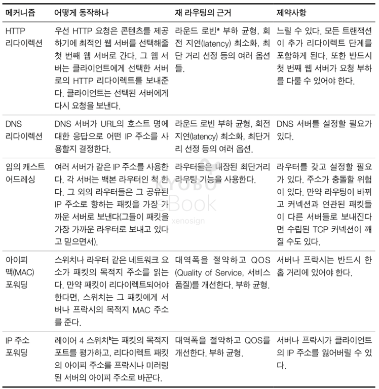
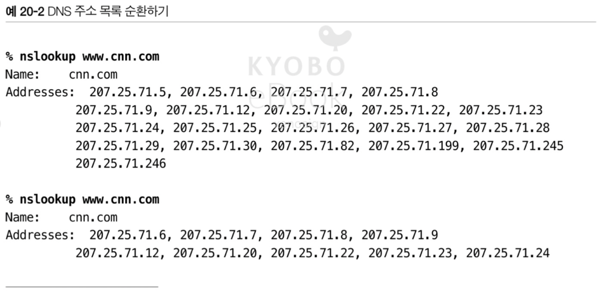
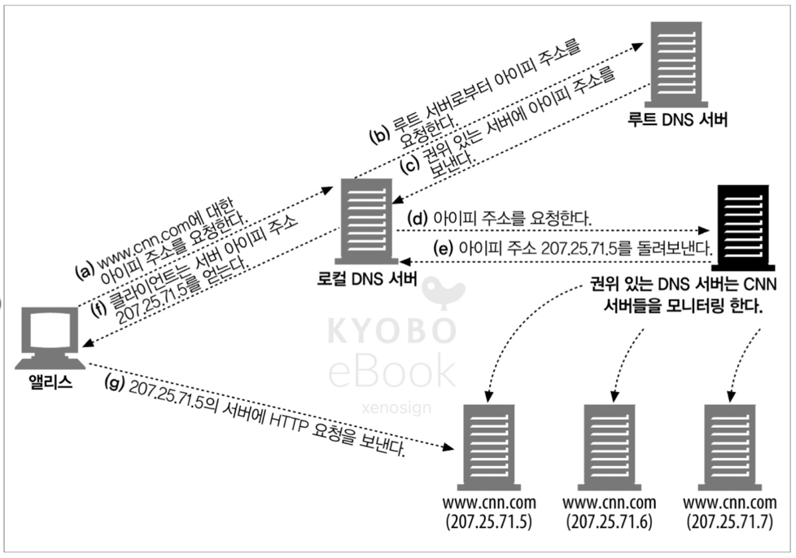
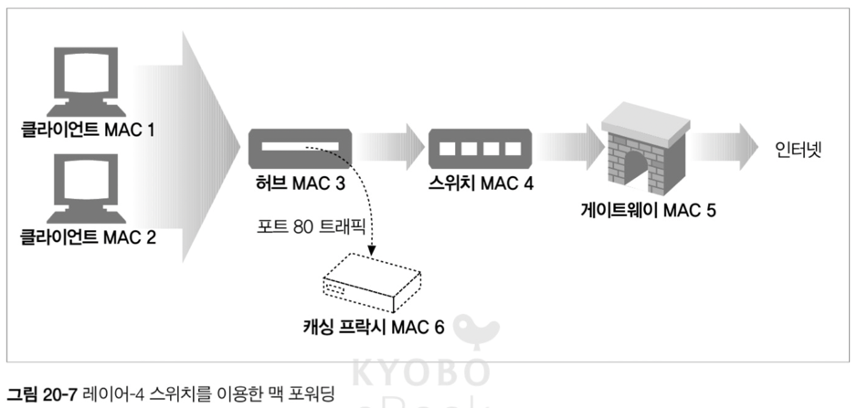
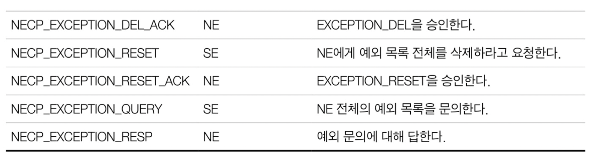
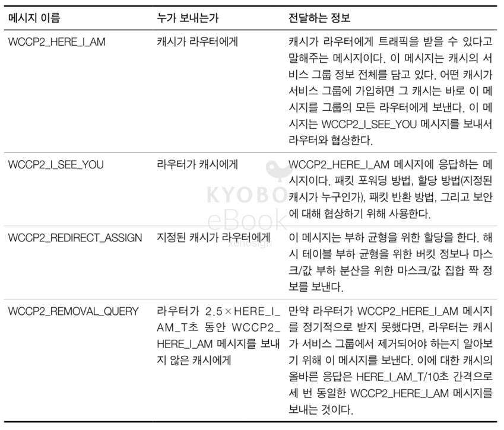
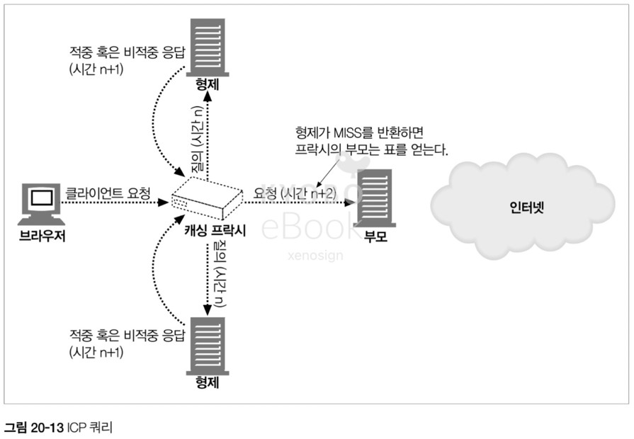
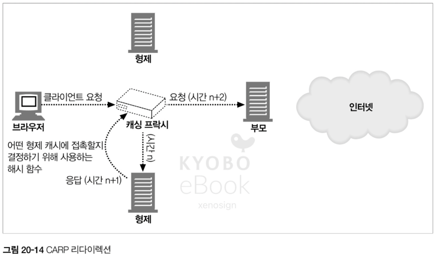
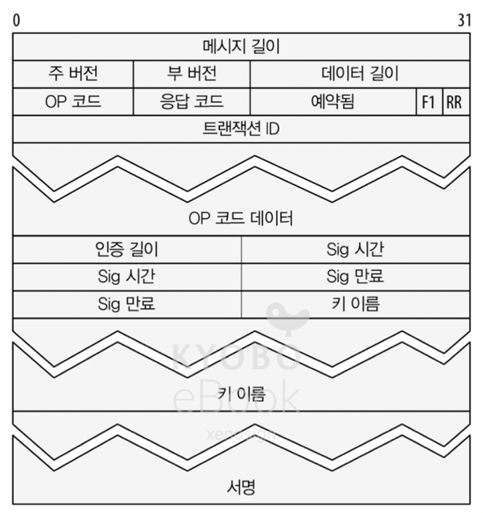
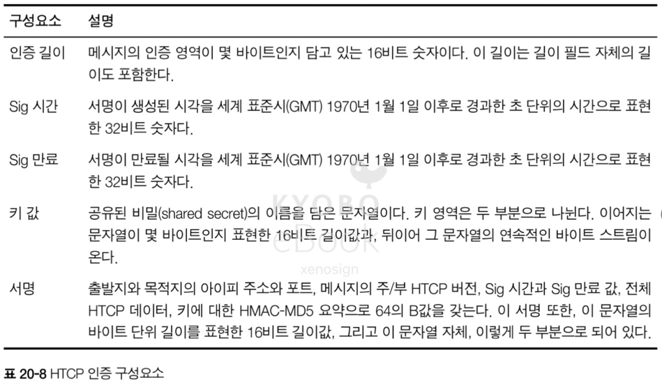

# 20. 리다이렉션과 부하 균형

- 리다이렉션 기술은 HTTP 메시지가 프락시, 캐시, 서버 팜 중에서 어디에서 끝나는지 판별하기 위해 사용되며 부하 균형(Load-balancing) 능력을 가진다

## 20.1 왜 리다이렉트인가?

- HTTP 어플리케이션은 신뢰할 수 있는 `HTTP 트랜잭션 / 지연 최소화 / 네트워크 대역폭 절약` 을 원한다
- 따라서, 웹 컨텐츠는 여러 장소에 배포되어
  - 한 곳이 다운되었을 경우 다른 곳을 이용하여 신뢰성을 개선하고
  - 더 가까운 곳에서 전달되어 지연 속도를 줄이고  
  - 부하 분산을 통해 네트워크 혼잡도 줄인다
- 어떠한 방식의 부하 균형이든 부하를 공유하는 서버들 중 하나에 전달이 되어야 하므로 리다이레션을 포함

## 20.2 리다이렉트 할 곳

- 클라이언트 입장에서는 서버, 프락시, 캐시, 게이트웨이는 사실상 서버로 인식된다
- 리다이렉트는 기본적으로 진입로의트래픽을 근처에 있는 지름길(부하가 적은 서버 or 프락시 or 캐시)로 빨아들이는 것과 같다

## 20.3 리다이렉션 프로토콜의 개요

- 리다이렉션의 목표는 HTTP 메시지를 가용한 웹 서버로 가급적 빨리 보내는 것
- 리다이렉트에 영향을 미치는 것들
  - 브라우저는 클라이언트의 메시지를 프락시 서버로 보내도록 설정
  - DNS 분석자는 클라이언트의 위치에 기반하여 도메인 접근을 가까운 서버의 아이피 주소로 선택
  - 스위치와 라우터들은 패킷의 TCP/IP 주소를 검증 및 라우팅을 결정
  - 웹 서버는 자체적으로 리다이렉트를 사용 HTTP 요청을 다른 서버로 전달 가능

 

## 20.4 일반적인 리다이렉션 방법

### 20.4.1 HTTP 리다이렉션

- 부하가 있을 경우 가용한 서버 중 가장 부하가 적은 컨텐츠 서버를 찾아서 브라우저의 HTTP 요청을 그 서버로 리다이렉트
- 리다이렉트 시에는 서버의 부하 뿐 아니라 브라우저와 서버간의 거리도 계산이 필요
- HTTP 리다이렉션의 단점
  - 어떤 서버로 리다이렉트를 보낼 지 결정하는데 많은 처리가 필요
  - 페이지에 접근 할 때, 결과적으로 2번의 왕복이 필요하여 지연 발생
  - 리다이렉트 서버가 고장나면 사이트 전체가 고장
- 위와 같은 단점으로 인해 HTTP 리다이렉션은 다른 기법과 함께 사용

### 20.4.2 DNS 리다이렉션

- DNS 는 하나의 도메인에 여러 아이피가 결부되는 것을 허용, DNS 에서 부하를 분산 가능
- 단순한 방법으로는 라운드 로빈을 사용하거나 복잡한 방법으로는 서버의 부하를 체크하여 가장 적은 부하의 서버로 보내는 것 까지 다양

#### DNS 라운드 로빈
#### 다중 주소와 라운드 로빈 주소 순환
#### 부하 균형을 위한 DNS 라운드 로빈
- 대부분의 DNS 클라이언트는 다중 주소 집합의 첫 번째 주소를 사용하므로 DNS 서버는 룩업이 끝나면 가용 주소를 순환
- DNS 순환이 이루어지지 않으면 첫번째 서버에 부하가 집중되는 문제가 발생

#### DNS 캐싱의 효과
- DNS 룩업의 결과는 캐싱에 의해 재사용이 가능하기 때문에 DNS 주소 순환에 의한 부하 균형은 완벽하지는 않지만, 부하 총량을 분산하는 것에는 적절한 효과를 보인다

#### 다른 DNS 기반의 리다이렉션 알고리즘
- 부하 균형 알고리즘 : 웹 서버의 로드를 추적하고 가장 로드가 적은 서버를 목록의 제일 위에 올려놓는 방법
- 근접 라우팅 알고리즘 : 지리적으로 분산 된, 웹 서버의 경우 DNS 가 근처의 서버로 보내는 방법
- 결함 마스킹 알고리즘 : DNS 가 서버간 네트워크의 건강 상태를 모니터링해서 라우팅

### 20.4.3 임의캐스트 어드레싱

- 지리적으로 흩어진 웹 서버들은 동일한 IP 를 가지고 있으며, 요청에 대한 처리는 백본 라우터의 최단거리 라우팅 능력에 의지하여 부하를 분산하는 방법
- 백본 네트워크에서 라우터는 특정 지리적 위치로 부터의 요청에서 제일 가까운 라우터임을 광고하고 이에 따라 라우팅을 처리한다

- 단, 서버는 반드시 라우터의 언어로 통신해야 하며 주소 충돌에 대한 처리가 없으면 라우팅 누수라는 치명적 결함 발생이 가능

> 라우팅 누수란?
> - 외부에 알려서는 안되는 경로를 외부 네트워크에 잘못 전달하는 현상
> - 위에서는 백본에서 라우터 처리에 의한 서버 결정 시, 외부에 노출 되어서는 안되는 경로가 노출되는 문제를 지적
> - 실제로는 이러한 라우팅 누수(정확히는 잘못 된 안내에 가까움)로 인해 2019 년에 ISP 의 설정 실수로 모든 요청이 특정 Cloudflare 로 누수, Cloudflare 가 마비

### 20.4.4 아이피 맥 포워딩

- 이더넷 네트워크에서 HTTP 메세지는 아이피 주소와 TCP 포트 번호로 이루어진 L4 주소 및 L2 장비(스위치 or 허브)가 처리하는 미디어 접근 컨트롤(Media Access Control, MAC) 도 가지고 있음
- 위와 같은 구조에서 L4 를 이해하는 스위치는 L4 주소(아이피 및 포트 번호) 검사하여 라우팅이 가능
  - 상황 1 : 캐시가 신선하지 않은 경우 허브(MAC3) 에서의 요청을 그대로 스위치(MAC4) 로 전달
  - 
  - 상황 2 : 캐시가 신선한 경우 스위치(MAC4)가 아닌 캐실 프락시(MAC6)로 포워딩하여 트래픽을 분산
  - 

### 20.4.5 아이피 주소 포워딩

- 아이피 주소 포워딩은 패킷을 맥 주소가 아니라 목적지 아이피 주소에 따라 라우팅, 스위치에서 업스트림의 위치를 판별이 가능하면 L3 에서 올바른 위치로 전송
- 위와 같은 종류의 전달을 네트워크 주소 변환(Network Address Translation, NAT) 이라 한다
- 아이피 주소 포워딩의 경우 스위치는 반드시 커넥션을 통해 클라이언트에게 응답을 돌려줘야 하므로 포워딩 된 요청에 대한 모든 응답을 돌려줘야 하는데 귀환 경로가 복잡해지는 문제가 발생
- 귀환 경로는 제어하는 2가지 방법
  - 완전 NAT : 패킷의 출발지 IP 주소를 스위치의 주소로 변경하여 통신한 다음, 응답 결과를 돌려주는 방식. 서버에서 클라이언트의 주소를 알 수 없어 인증이나 결제 같은 상황에서 문제가 발생 가능
  - 반(half) NAT : 출발지의 IP 주소를 그대로 유지한 상태로 전달하는 방법, 클라이언트와 서버 사이의 네트워크 전체에 통제가 필요

### 20.4.6 네트워크 구성요소 제어 프로토콜(Network Element Control Protocol, NECP)

- NECP 는 네트워크 구성 요소들(NE)이 웹 서버나 프락시 캐시와 같이 서버 구성 요소들(SE)와 대화할 수 있게 만들어준다
- 이를 통해 SE 가 NE 에게 부하 균형 정보를 제공할 수 있도록 하여, NE 가 정보를 바탕으로 부하 균형을 유지
- 이 때 MAC 포워딩, GRE(Generic Routing Encapsulation), NAT 같은 패킷 전달 방법을 사용

> GRE(Generic Routing Encapsulation) 란?
> - 데이터를 안전하고 유연하게 운반하기 위한 '가상 터널' 기술
> - 네트워크 프로토콜 패킷을 다른 프로토콜 패킷 안에 넣어서 캡슐화 한다음, 서로 다른 네트워크 사이를 터널링으로 연결하여 전달
> - 복잡한 경로를 단순화 / 다양한 프로토콜 수용 / 원본 유지 등의 장점을 가짐

#### NECP 메시지

 

## 20.5 프락시 리다이렉션 방법

- 클라이언트가 프락시로 가는 길을 아는 방법에는 명시적인 브라우저 설정 / 동적인 자동 설정 / 자연스로운 가로채기의 3가지 방법이 존재

### 20.5.1 명시적 브라우저 설정

- 대부분의 브라우저는 프락시 서버에 접촉하기 위한 메뉴가 존재
- 명시적 프락시 설정의 경우 원 서버와 접촉하지 않기 때문에 접속 문제, 네트워크 아키텍쳐 변경에 제한이 발생 가능

### 20.5.2 프락시 자동 설정

- 명시적 프락시 설정과 달리 브라우저가 동적으로 프락시를 설정하는(PAC, Proxy Auto-Configuration) 프로토콜이 존재
- 프락시 자동 설저은 지정 된 서버에 접촉하여 PAC 파일을 가져온 뒤, JS 로 구성 된 `FindProxForURL` 메서드를 실행하여 자신이 접촉해야할 프록시의 주소를 획득하여 프락시로 접속

### 20.5.3. 웹 프락시 자동발견 프로토콜(WPAD, Web Proxy Autodiscovery Protocol)

#### PAC(PAC, Proxy Auto-Configuration) 파일 자동 발견
- WPAD 를 사용하여 PAC 파일이 존재하는 CURL(Client URL) 을 찾는 과정을 의미
- 얻은 URL 에서 찾은 PAC 파일에서 프락시 서버의 주소를 다시 얻고, 해당 주소로 HTTP 를 요청

#### WPAD 알고리즘
- WPAD 는 아래의 순서대로 PAC 파일을 획득하기 위해 프로세스를 수행한다
  - 동적 호스트 설정 프로토콜(DHCP, Dynamic Host Configuration Protocol)
  - 서비스 위치 프로토콜(SLP, Service Location Protocol)
  - DNS 에게 잘 알려진 호스트명
  - DNS 의 SRV(=Service) 레코드
  - TXT 레코드의 DNS 서비스 URL 들

> 일반적으로 PAC 파일을 찾기 위해서 해당 도메인 앞에 wpad 를 붙여서 요청한다
> - gg.com 의 경우 wpad.gg.com 으로 PAC 파일 요청

#### DHCP 를 이용한 CURL 발견
- WAPD 가 질의하는 DHCP 서버는 CURL 을 반드시 저장하고 있어야 하며, 해당 질의를 통해 PAC 파일의 위치를 저장하는 URL 을 반환

#### DNS A 레코드 룩업
- 알맞은 프락시 서버의 IP 주소들이 WPAD 클라언트들이 질의할 수 있는 DNS 서버에 반드시 저장되어 있어야 한다
- WAPD 클라이언트는 A 레코드 룩업을 DNS 서버로 보내 PAC 파일이 존재하는 CURL 을 얻는다

#### PAC 파일 가져오기
- 위의 과정을 통해 CURL 이 생성되면, CURL 로 GET 요청을 보내 PAC파일을 가져온다
- 해당 CURL 의 응답이 리다이렉트라면 리다이렉트 된 주소에서 PAC 파일을 가져온다

#### 언제 WPAD 를 실행하는가
- 웹 클라이언트가 시작될 때, PAC 파일의 만료 여부에 따라 발견 사이클을 시도

#### WPAD 스푸핑(Spoofing)
- WPAD 프로토콜의 경우 기존 도메인의 앞에 wpad 를 추가하는 방식으로 동작하므로, 해당 주소에 악의적 PAC 파일을 심어 보안의 위협이 가능 (IE 5.01 이후 해결)

#### 타임 아웃
- WPAD 는 여러 발견 단계를 거치는 만큼 각각의 단계에 적절한 타임 아웃이 필요

#### 관리자를 위한 고려사항
- 클라이언트들이 WPAD 호환을 위해 반드시 구현해야 하는 것은 DHCP 와 DNS A 레코드 검색
- 관리자들은 클라이언트가 WPAD 를 수행하는데 더 적은 시간이 걸리도록 근접성에 대해 다양한 가능성 고려가 가능
  - DHCP 는 서브넷에 따라 다른 응답을 보내기
  - DNS 서버는 도메인 접미사에 따라 다른 레코드를 반환
  - CURL 서버는 위치 기반의 결정
  - PAC 서버의 네트워크 건강도 측정

## 20.6 캐시 리다이렉션 방법

### 20.6.1 WCCP(Web Cache Communication Protocol) 리다이렉션

- WCCP 그룹은 어떤 트래픽이 어디로 보내지는지, 부하가 어디로 분산되어야 하는지 명시
- HTTP 요청이 WCCP 서비스 그룹에 도착했을 때, 라우터는 그 요청을 서비스 그룹의 캐시 중에 하나로 보낸다
- 요청을 캐시가 처리 불가능하다면 패킷은 라우터로 돌아와 평범하게 포워딩되어 원 서버로 전달
- 서비스 그룹의 구성원들은 다른 구성원들의 가용성을 확인하기 위해 하트비트(정상 작동 여부) 메시지를 교환

> WCCP(Web Cache Communication Protocol) 란?
> - 시스코(Cisco)에서 개발한 프로토콜. 네트워크 스위치나 라우터 같은 장비가 웹 트래픽(HTTP 등)을 가로채서 웹 캐시 서버(프락시 서버)로 자동으로 Redirect 해주는 프로토콜

#### WCCP2 메시지들

#### 메시지 구성 요소
- 각 WCCP2 메시지는 헤더(메시지의 종류, WCCP2 버전, 헤더를 제외한 메시지의 길이)와 구성 요소로 구성

#### 서비스 그룹
- 서비스 그룹은 WCCP 메세지를 교환할 수 있는 라우터와 캐시들의 집합으로 구성, 서로 Here I Am 과 I See You 메시지를 이용해서 서비스 그룹 설정 정보를 교환

#### GRE 패킷 캡슐화
- WCCP 를 지원하는 라우터들은 HTTP 패킷을 특정 서버의 IP 주소와 함께 캡슐화하며, GRE(Generic Router Encapsulation) 임을 나타내는 IP 헤더 Proto 필드를 포함

#### WCCP 부하 균형
- 그룹 내부에서 주고받는 하트비트 메시지를 기반으로 서로의 상태를 체크하고, 특정 노드의 하트비트가 전달이 안되는 경우 메시지를 그대로 원 서버로 전송

## 20.7 인터넷 캐시 프로토콜(ICP, Internet Cache Protocol)

- HTTP 메시지에서 요청한 컨텐츠를 캐시가 가지고 있지 않을 경우, 원 서버가 아닌 주변의 캐시로 부터 전송되는 것이 비용이 더 적을 것으로 예상하여 주변 캐시에게 컨텐츠 소유 여부를 체크하여 컨텐츠를 반환하는 프로토콜
- 결과적으로 HTTP 메시지 요청이 원서버가 아니 캐시의 주변 캐시로 가게되므로 일종의 리다이렉션 프로토콜
- 캐시들은 컨텐츠 소유 여부를 간단히 `HIT/MISS` 로 응답하고 이에 따라 처리
- ICP 메시지는 32 바이트로 단순하고 가벼우며, 효율을 위해 UDP 로 전송
- 단, UDP 이기에 메시지의 완전성 보장이 안되므로 타임아웃이 필요
- ICP 의 각 부분
  - OP 코드 : ICP 메시지의 의미를 서술
  - 버전 : ICP 프로토콜의 버전
  - 메시지 길이 : ICP 메시지의 총 길이를 서술
  - 요청 번호 : 동시에 여러 요청과 응답이 오고가므로 추적을 위해 요청 번호 사용
  - 옵션 : ICP 동작을 결정하는 플래그
  - 옵션 데이터 : 원 서버까지 왕복 시간 측정값, 선택적
  - 발송자 호스트 주소 : 메시지 발송자의 IP 주소. 실제로 사용 X
  - 페이로드 : 페이로드의 크기, 실제 데이터

## 20.8 캐시 배열 라우팅 프로토콜

- 프락시는 원서버로 향하는 부하를 줄여주지만, 대량의 트래픽은 프락시 서버에 과도한 부하를 줄 수 있다
- 프락시에 대한 부하를 분산하는 방법으로 프락시를 여러 대로 늘리는 캐시 배열 라우팅 프로토콜(CARP, Cache Arranged Routing Protocol)은 캐시의 배열을 하나의 논리적 캐시처럼 보이게 하는 기술이다
- CARP 는 ICP 의 대안으로, 주변의 모든 캐시에게 컨텐츠의 유무를 확인하는 ICP 와 달리 CARP 는 해시 함수를 기반으로 특정 컨텐츠를 특정 프락시 서버에 매핑하여 한 번의 검색으로 컨텐츠의 위치를 결정할 수 있어 시간 및 비용을 단축
- 단, CARP 를 지원하지 않는 프락시 서버에는 사용이 불가능하며, 캐시 적중을 위한 해시 함수를 위한 높은 비용과 컨텐츠의 위치가 변경되거나 서버의 정보가 달라지면 바로 해시 함수를 수정해야하는 단점이 존재

** ICP 의 케이스 ** 

 
** CARP 의 케이스 ** 

## 20.9 하이퍼텍스트 캐싱 프로토콜(HTCP, Hyper Text Caching Protocol)

- ICP 는 HTTP/0.9 를 염두에 두고 설계되어 리소스 존재 여부를 URL 로만 판단하지만 HTTP/1.0 이후의 버전은 헤더에 문서 매칭을 위한 더 많은 정보를 담을 수 있어 URL 만으로는 정확한 응답이 불가능
- HTCP 는 형제들이 URL 과 모든 요청 및 응답 헤더를 사용하여 서로에게 컨텐츠 존재 여부에 대한 질의가 가능하도록 만들어 준다
- 또한, 서로의 캐시 안에 있는 문서의 추가, 삭제 모니터링 및 요청을 가능하게 하고 서로의 캐싱 정책 변경도 변경도 가능
- 따라서 HTCP 는 ICP 보다 더 상세한 캐시 처리가 가능

** HTCP 메시지 포맷 ** 

### 20.9.1 HTCP 인증

- HTCP 메시지의 인증은 선택적

### 20.9.2 캐싱 정책 설정

- SET 메시지로 캐시된 무선에 대한 정책 변경이 가능

> 과연 현재에도 이러하 기술이 사용 될 것인가?
> - 각 기술별 사용 여부
>   - WPAD : 보안 이슈로 인해 퍼블릭이 아닌 회사 내부의 사설망 등에서만 사용
>   - WCCP : 시스코 장비 한정으로 쓰임, 단 현재는 CDN 이 대부분 대체
>   - ICP : UDP 기반이라 신뢰성 문제로 인해 안쓰임 + HTTPS 사용으로 커넥션 수립이 안된 상태에서 특정 파일의 존재 여부를 URL 로 묻는것이 어려워짐, CDN 이 완전히 대체
>   - CARP : CDN 이 완전히 대체
>   - HTCP : CDN 이 완전히 대체
> - 그럼 지금은?
>   - 캐싱 관련 기술 : 대형 회사들의 CDN 서비스가 대부분 대체
>   - 부하 관련 기술 : AWS 와 같은 클라우드 서비스 공급 업체의 로드 밸런싱 및 Nginx 를 이용한 리버스 프록시로 해결
